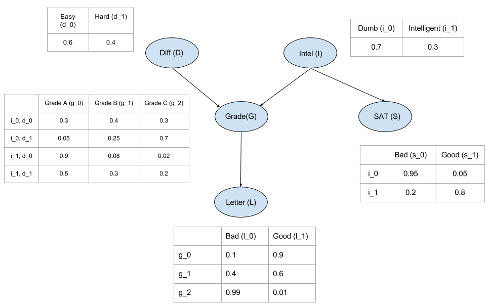

# Probabilistic Graphical Models


```python
import pgmpy as pgm
print(pgm.__version__)

from pgmpy.models import BayesianModel
from pgmpy.factors.discrete import TabularCPD
```

    0.1.17


* **Joint Probability Distribution**: Probabilities are distributed simultaneously. All variables related to one another occur in the same time, so you need to specify all variables behavior to get an answer.
* **Conditional Probability Distribution**: Probabilities of A are distributed given a certain value for probability B.
* **Marginal Probability Distribution**: Average out the probability of A when A and B are related.




```python
model = BayesianModel([('Diff', 'Grade'), ('Intel', 'Grade'), ('Grade', 'Letter'), ('Intel', 'SAT')])


cpd_d = TabularCPD(variable='Diff', variable_card=2, values=[[0.6], [0.4]])
cpd_i = TabularCPD(variable='Intel', variable_card=2, values=[[0.7], [0.3]])
``


```python
cpd_g = TabularCPD(variable='Grade', variable_card=3,
                   values=[[0.3, 0.05, 0.9, 0.5],
                          [0.4, 0.25, 0.08, 0.3],
                          [0.3, 0.7, 0.02, 0.2]],
                  evidence = ['Intel', 'Diff'],
                   evidence_card=[2, 2])

cpd_l = TabularCPD(variable='Letter', variable_card=2,
                   values=[[0.1, 0.4, 0.99],
                          [0.9, 0.6, 0.01]],
                  evidence = ['Grade'],
                   evidence_card=[3])

cpd_s = TabularCPD(variable='SAT', variable_card=2,
                   values=[[0.95, 0.2],
                          [0.05, 0.8]],
                  evidence = ['Intel'],
                   evidence_card=[2])
```


```python
model.add_cpds(cpd_d, cpd_i, cpd_g, cpd_l, cpd_s)
```


```python
model.check_model()
```


    True


```python
print(cpd_g)
```

    +----------+----------+----------+----------+----------+
    | Intel    | Intel(0) | Intel(0) | Intel(1) | Intel(1) |
    +----------+----------+----------+----------+----------+
    | Diff     | Diff(0)  | Diff(1)  | Diff(0)  | Diff(1)  |
    +----------+----------+----------+----------+----------+
    | Grade(0) | 0.3      | 0.05     | 0.9      | 0.5      |
    +----------+----------+----------+----------+----------+
    | Grade(1) | 0.4      | 0.25     | 0.08     | 0.3      |
    +----------+----------+----------+----------+----------+
    | Grade(2) | 0.3      | 0.7      | 0.02     | 0.2      |
    +----------+----------+----------+----------+----------+


```python
print(model.get_cpds('Grade'))
```

    +----------+----------+----------+----------+----------+
    | Intel    | Intel(0) | Intel(0) | Intel(1) | Intel(1) |
    +----------+----------+----------+----------+----------+
    | Diff     | Diff(0)  | Diff(1)  | Diff(0)  | Diff(1)  |
    +----------+----------+----------+----------+----------+
    | Grade(0) | 0.3      | 0.05     | 0.9      | 0.5      |
    +----------+----------+----------+----------+----------+
    | Grade(1) | 0.4      | 0.25     | 0.08     | 0.3      |
    +----------+----------+----------+----------+----------+
    | Grade(2) | 0.3      | 0.7      | 0.02     | 0.2      |
    +----------+----------+----------+----------+----------+


```python
model.get_cpds()
```


    [<TabularCPD representing P(Diff:2) at 0x7f95f35ab190>,
     <TabularCPD representing P(Intel:2) at 0x7f95f878a910>,
     <TabularCPD representing P(Grade:3 | Intel:2, Diff:2) at 0x7f95f8ef8910>,
     <TabularCPD representing P(Letter:2 | Grade:3) at 0x7f95f8ef88d0>,
     <TabularCPD representing P(SAT:2 | Intel:2) at 0x7f95f8ede610>]


```python
cpd_d_sn = TabularCPD(variable='Diff', variable_card=2, values=[[0.6], [0.4]], 
                      state_names={'Diff': ['Easy', 'Hard']})
cpd_i_sn = TabularCPD(variable='Intel', variable_card=2, values=[[0.7], [0.3]], 
                      state_names={'Intel': ['Dumb', 'Intelligent']})
cpd_g_sn = TabularCPD(variable='Grade', variable_card=3, 
                      values=[[0.3, 0.05, 0.9,  0.5],
                              [0.4, 0.25, 0.08, 0.3],
                              [0.3, 0.7,  0.02, 0.2]],
                      evidence=['Intel', 'Diff'],
                      evidence_card=[2, 2],
                      state_names={'Grade': ['A', 'B', 'C'],
                                   'Intel': ['Dumb', 'Intelligent'],
                                   'Diff': ['Easy', 'Hard']})

cpd_l_sn = TabularCPD(variable='Letter', variable_card=2, 
                      values=[[0.1, 0.4, 0.99],
                              [0.9, 0.6, 0.01]],
                      evidence=['Grade'],
                      evidence_card=[3],
                      state_names={'Letter': ['Bad', 'Good'],
                                   'Grade': ['A', 'B', 'C']})

cpd_s_sn = TabularCPD(variable='SAT', variable_card=2,
                      values=[[0.95, 0.2],
                              [0.05, 0.8]],
                      evidence=['Intel'],
                      evidence_card=[2],
                      state_names={'SAT': ['Bad', 'Good'],
                                   'Intel': ['Dumb', 'Intelligent']})
```


```python
model.add_cpds(cpd_d_sn, cpd_i_sn, cpd_g_sn, cpd_l_sn, cpd_s_sn)
model.check_model()
```


    True


```python
print(model.get_cpds('Grade'))
```

    +----------+-------------+-----+--------------------+
    | Intel    | Intel(Dumb) | ... | Intel(Intelligent) |
    +----------+-------------+-----+--------------------+
    | Diff     | Diff(Easy)  | ... | Diff(Hard)         |
    +----------+-------------+-----+--------------------+
    | Grade(A) | 0.3         | ... | 0.5                |
    +----------+-------------+-----+--------------------+
    | Grade(B) | 0.4         | ... | 0.3                |
    +----------+-------------+-----+--------------------+
    | Grade(C) | 0.3         | ... | 0.2                |
    +----------+-------------+-----+--------------------+


```python
# Getting the local independencies of a variable.
model.local_independencies('Grade')
```


    (Grade ⟂ SAT | Intel, Diff)


```python
# Getting all the local independencies in the network.
model.local_independencies(['Diff', 'Intel', 'SAT', 'Grade', 'Letter'])
```


    (Diff ⟂ SAT, Intel)
    (Intel ⟂ Diff)
    (SAT ⟂ Letter, Grade, Diff | Intel)
    (Grade ⟂ SAT | Intel, Diff)
    (Letter ⟂ SAT, Intel, Diff | Grade)


```python
model.active_trail_nodes('Diff')
```


    {'Diff': {'Diff', 'Grade', 'Letter'}}


```python
model.active_trail_nodes('Diff', observed='Grade')
```


    {'Diff': {'Diff', 'Intel', 'SAT'}}


```python
model.get_parents('Grade')
```


    ['Diff', 'Intel']


https://pgmpy.org

## Case 1 - Head to Tail

What is the probability of someone getting a Grade A if we know nothing about it?


```python
from pgmpy.inference import VariableElimination

infer = VariableElimination(model)
infG = infer.query(['Grade'])
print(infG)
```


    +----------+--------------+
    | Grade    |   phi(Grade) |
    +==========+==============+
    | Grade(A) |       0.3620 |
    +----------+--------------+
    | Grade(B) |       0.2884 |
    +----------+--------------+
    | Grade(C) |       0.3496 |
    +----------+--------------+


What is the probability of someone getting a Grade A in a particular case?


```python
print(infer.query(['Grade'], evidence={'Diff': 'Easy', 'Intel': 'Intelligent'}))
```


    +----------+--------------+
    | Grade    |   phi(Grade) |
    +==========+==============+
    | Grade(A) |       0.9000 |
    +----------+--------------+
    | Grade(B) |       0.0800 |
    +----------+--------------+
    | Grade(C) |       0.0200 |
    +----------+--------------+


### Highest probability


```python
infer.map_query(['Grade'])
```


    {'Grade': 'A'}


```python
#Highest probability of a particular case
infer.map_query(['Grade'], evidence={'Diff': 'Easy', 'Intel': 'Intelligent'})
```


    {'Grade': 'A'}


What is the highest probability of a Letter given one evidence?


```python
infer.map_query(['Letter'], evidence={'Diff': 'Hard'})
```


    {'Letter': 'Bad'}


## Case 2 - Tail to Tail


```python
print(infer.query(['Grade'], evidence={'Intel': 'Dumb'}))
```


    +----------+--------------+
    | Grade    |   phi(Grade) |
    +==========+==============+
    | Grade(A) |       0.2000 |
    +----------+--------------+
    | Grade(B) |       0.3400 |
    +----------+--------------+
    | Grade(C) |       0.4600 |
    +----------+--------------+


What is the probability of someone getting a Grade A knowing the SAT score?


```python
print(infer.query(['Grade'], evidence={'SAT': 'Bad'}))
```


    +----------+--------------+
    | Grade    |   phi(Grade) |
    +==========+==============+
    | Grade(A) |       0.2447 |
    +----------+--------------+
    | Grade(B) |       0.3258 |
    +----------+--------------+
    | Grade(C) |       0.4295 |
    +----------+--------------+


## Case 3 - Head to Head


```python
print(infer.query(['Diff']))
```


    +------------+-------------+
    | Diff       |   phi(Diff) |
    +============+=============+
    | Diff(Easy) |      0.6000 |
    +------------+-------------+
    | Diff(Hard) |      0.4000 |
    +------------+-------------+


```python
print(infer.query(['Diff'], evidence={'Intel': 'Intelligent'}))
```


    +------------+-------------+
    | Diff       |   phi(Diff) |
    +============+=============+
    | Diff(Easy) |      0.6000 |
    +------------+-------------+
    | Diff(Hard) |      0.4000 |
    +------------+-------------+


```python
grade = infer.map_query(['Grade'], evidence={'Intel': 'Intelligent'})

print(infer.query(['Diff'], evidence={'Grade':grade['Grade'], 'Intel': 'Intelligent'}))
```


    +------------+-------------+
    | Diff       |   phi(Diff) |
    +============+=============+
    | Diff(Easy) |      0.7297 |
    +------------+-------------+
    | Diff(Hard) |      0.2703 |
    +------------+-------------+


```python
from pgmpy.inference import BeliefPropagation

bp = BeliefPropagation(model)
bp.calibrate()
print(bp.query(variables=['Diff', 'Intel', 'SAT', 'Grade', 'Letter']))
```


    +--------------------+-----------+----------+------------+--------------+------------------------------------+
    | Intel              | SAT       | Grade    | Diff       | Letter       |   phi(Intel,SAT,Grade,Diff,Letter) |
    +====================+===========+==========+============+==============+====================================+
    | Intel(Dumb)        | SAT(Bad)  | Grade(A) | Diff(Easy) | Letter(Bad)  |                             0.0120 |
    +--------------------+-----------+----------+------------+--------------+------------------------------------+
    | Intel(Dumb)        | SAT(Bad)  | Grade(A) | Diff(Easy) | Letter(Good) |                             0.1077 |
    +--------------------+-----------+----------+------------+--------------+------------------------------------+
    | Intel(Dumb)        | SAT(Bad)  | Grade(A) | Diff(Hard) | Letter(Bad)  |                             0.0013 |
    +--------------------+-----------+----------+------------+--------------+------------------------------------+
    | Intel(Dumb)        | SAT(Bad)  | Grade(A) | Diff(Hard) | Letter(Good) |                             0.0120 |
    +--------------------+-----------+----------+------------+--------------+------------------------------------+
    | Intel(Dumb)        | SAT(Bad)  | Grade(B) | Diff(Easy) | Letter(Bad)  |                             0.0638 |
    +--------------------+-----------+----------+------------+--------------+------------------------------------+
    | Intel(Dumb)        | SAT(Bad)  | Grade(B) | Diff(Easy) | Letter(Good) |                             0.0958 |
    +--------------------+-----------+----------+------------+--------------+------------------------------------+
    | Intel(Dumb)        | SAT(Bad)  | Grade(B) | Diff(Hard) | Letter(Bad)  |                             0.0266 |
    +--------------------+-----------+----------+------------+--------------+------------------------------------+
    | Intel(Dumb)        | SAT(Bad)  | Grade(B) | Diff(Hard) | Letter(Good) |                             0.0399 |
    +--------------------+-----------+----------+------------+--------------+------------------------------------+
    | Intel(Dumb)        | SAT(Bad)  | Grade(C) | Diff(Easy) | Letter(Bad)  |                             0.1185 |
    +--------------------+-----------+----------+------------+--------------+------------------------------------+
    | Intel(Dumb)        | SAT(Bad)  | Grade(C) | Diff(Easy) | Letter(Good) |                             0.0012 |
    +--------------------+-----------+----------+------------+--------------+------------------------------------+
    | Intel(Dumb)        | SAT(Bad)  | Grade(C) | Diff(Hard) | Letter(Bad)  |                             0.1843 |
    +--------------------+-----------+----------+------------+--------------+------------------------------------+
    | Intel(Dumb)        | SAT(Bad)  | Grade(C) | Diff(Hard) | Letter(Good) |                             0.0019 |
    +--------------------+-----------+----------+------------+--------------+------------------------------------+
    | Intel(Dumb)        | SAT(Good) | Grade(A) | Diff(Easy) | Letter(Bad)  |                             0.0006 |
    +--------------------+-----------+----------+------------+--------------+------------------------------------+
    | Intel(Dumb)        | SAT(Good) | Grade(A) | Diff(Easy) | Letter(Good) |                             0.0057 |
    +--------------------+-----------+----------+------------+--------------+------------------------------------+
    | Intel(Dumb)        | SAT(Good) | Grade(A) | Diff(Hard) | Letter(Bad)  |                             0.0001 |
    +--------------------+-----------+----------+------------+--------------+------------------------------------+
    | Intel(Dumb)        | SAT(Good) | Grade(A) | Diff(Hard) | Letter(Good) |                             0.0006 |
    +--------------------+-----------+----------+------------+--------------+------------------------------------+
    | Intel(Dumb)        | SAT(Good) | Grade(B) | Diff(Easy) | Letter(Bad)  |                             0.0034 |
    +--------------------+-----------+----------+------------+--------------+------------------------------------+
    | Intel(Dumb)        | SAT(Good) | Grade(B) | Diff(Easy) | Letter(Good) |                             0.0050 |
    +--------------------+-----------+----------+------------+--------------+------------------------------------+
    | Intel(Dumb)        | SAT(Good) | Grade(B) | Diff(Hard) | Letter(Bad)  |                             0.0014 |
    +--------------------+-----------+----------+------------+--------------+------------------------------------+
    | Intel(Dumb)        | SAT(Good) | Grade(B) | Diff(Hard) | Letter(Good) |                             0.0021 |
    +--------------------+-----------+----------+------------+--------------+------------------------------------+
    | Intel(Dumb)        | SAT(Good) | Grade(C) | Diff(Easy) | Letter(Bad)  |                             0.0062 |
    +--------------------+-----------+----------+------------+--------------+------------------------------------+
    | Intel(Dumb)        | SAT(Good) | Grade(C) | Diff(Easy) | Letter(Good) |                             0.0001 |
    +--------------------+-----------+----------+------------+--------------+------------------------------------+
    | Intel(Dumb)        | SAT(Good) | Grade(C) | Diff(Hard) | Letter(Bad)  |                             0.0097 |
    +--------------------+-----------+----------+------------+--------------+------------------------------------+
    | Intel(Dumb)        | SAT(Good) | Grade(C) | Diff(Hard) | Letter(Good) |                             0.0001 |
    +--------------------+-----------+----------+------------+--------------+------------------------------------+
    | Intel(Intelligent) | SAT(Bad)  | Grade(A) | Diff(Easy) | Letter(Bad)  |                             0.0032 |
    +--------------------+-----------+----------+------------+--------------+------------------------------------+
    | Intel(Intelligent) | SAT(Bad)  | Grade(A) | Diff(Easy) | Letter(Good) |                             0.0292 |
    +--------------------+-----------+----------+------------+--------------+------------------------------------+
    | Intel(Intelligent) | SAT(Bad)  | Grade(A) | Diff(Hard) | Letter(Bad)  |                             0.0012 |
    +--------------------+-----------+----------+------------+--------------+------------------------------------+
    | Intel(Intelligent) | SAT(Bad)  | Grade(A) | Diff(Hard) | Letter(Good) |                             0.0108 |
    +--------------------+-----------+----------+------------+--------------+------------------------------------+
    | Intel(Intelligent) | SAT(Bad)  | Grade(B) | Diff(Easy) | Letter(Bad)  |                             0.0012 |
    +--------------------+-----------+----------+------------+--------------+------------------------------------+
    | Intel(Intelligent) | SAT(Bad)  | Grade(B) | Diff(Easy) | Letter(Good) |                             0.0017 |
    +--------------------+-----------+----------+------------+--------------+------------------------------------+
    | Intel(Intelligent) | SAT(Bad)  | Grade(B) | Diff(Hard) | Letter(Bad)  |                             0.0029 |
    +--------------------+-----------+----------+------------+--------------+------------------------------------+
    | Intel(Intelligent) | SAT(Bad)  | Grade(B) | Diff(Hard) | Letter(Good) |                             0.0043 |
    +--------------------+-----------+----------+------------+--------------+------------------------------------+
    | Intel(Intelligent) | SAT(Bad)  | Grade(C) | Diff(Easy) | Letter(Bad)  |                             0.0007 |
    +--------------------+-----------+----------+------------+--------------+------------------------------------+
    | Intel(Intelligent) | SAT(Bad)  | Grade(C) | Diff(Easy) | Letter(Good) |                             0.0000 |
    +--------------------+-----------+----------+------------+--------------+------------------------------------+
    | Intel(Intelligent) | SAT(Bad)  | Grade(C) | Diff(Hard) | Letter(Bad)  |                             0.0048 |
    +--------------------+-----------+----------+------------+--------------+------------------------------------+
    | Intel(Intelligent) | SAT(Bad)  | Grade(C) | Diff(Hard) | Letter(Good) |                             0.0000 |
    +--------------------+-----------+----------+------------+--------------+------------------------------------+
    | Intel(Intelligent) | SAT(Good) | Grade(A) | Diff(Easy) | Letter(Bad)  |                             0.0130 |
    +--------------------+-----------+----------+------------+--------------+------------------------------------+
    | Intel(Intelligent) | SAT(Good) | Grade(A) | Diff(Easy) | Letter(Good) |                             0.1166 |
    +--------------------+-----------+----------+------------+--------------+------------------------------------+
    | Intel(Intelligent) | SAT(Good) | Grade(A) | Diff(Hard) | Letter(Bad)  |                             0.0048 |
    +--------------------+-----------+----------+------------+--------------+------------------------------------+
    | Intel(Intelligent) | SAT(Good) | Grade(A) | Diff(Hard) | Letter(Good) |                             0.0432 |
    +--------------------+-----------+----------+------------+--------------+------------------------------------+
    | Intel(Intelligent) | SAT(Good) | Grade(B) | Diff(Easy) | Letter(Bad)  |                             0.0046 |
    +--------------------+-----------+----------+------------+--------------+------------------------------------+
    | Intel(Intelligent) | SAT(Good) | Grade(B) | Diff(Easy) | Letter(Good) |                             0.0069 |
    +--------------------+-----------+----------+------------+--------------+------------------------------------+
    | Intel(Intelligent) | SAT(Good) | Grade(B) | Diff(Hard) | Letter(Bad)  |                             0.0115 |
    +--------------------+-----------+----------+------------+--------------+------------------------------------+
    | Intel(Intelligent) | SAT(Good) | Grade(B) | Diff(Hard) | Letter(Good) |                             0.0173 |
    +--------------------+-----------+----------+------------+--------------+------------------------------------+
    | Intel(Intelligent) | SAT(Good) | Grade(C) | Diff(Easy) | Letter(Bad)  |                             0.0029 |
    +--------------------+-----------+----------+------------+--------------+------------------------------------+
    | Intel(Intelligent) | SAT(Good) | Grade(C) | Diff(Easy) | Letter(Good) |                             0.0000 |
    +--------------------+-----------+----------+------------+--------------+------------------------------------+
    | Intel(Intelligent) | SAT(Good) | Grade(C) | Diff(Hard) | Letter(Bad)  |                             0.0190 |
    +--------------------+-----------+----------+------------+--------------+------------------------------------+
    | Intel(Intelligent) | SAT(Good) | Grade(C) | Diff(Hard) | Letter(Good) |                             0.0002 |
    +--------------------+-----------+----------+------------+--------------+------------------------------------+


### Classification


```python
import pandas as pd
import numpy as np

raw_data = np.random.randint(low=0,high=2,size=(1000, 5))

data = pd.DataFrame(raw_data,columns=["Diff", "Intel", "Grade","Letter", "SAT"])

print(data)
```

         Diff  Intel  Grade  Letter  SAT
    0       0      1      0       0    0
    1       1      0      0       1    0
    2       0      1      1       0    1
    3       1      0      1       1    1
    4       0      0      0       0    1
    ..    ...    ...    ...     ...  ...
    995     1      1      0       0    0
    996     1      0      1       1    0
    997     0      1      1       0    0
    998     0      0      0       0    1
    999     0      0      0       1    1
    
    [1000 rows x 5 columns]


```python
grades = np.random.randint(low=0,high=3,size=(1000, 5))
data['Grade'] = grades

print(data)
```

         Diff  Intel  Grade  Letter  SAT
    0       0      1      2       0    0
    1       1      0      0       1    0
    2       0      1      0       0    1
    3       1      0      1       1    1
    4       0      0      1       0    1
    ..    ...    ...    ...     ...  ...
    995     1      1      0       0    0
    996     1      0      0       1    0
    997     0      1      1       0    0
    998     0      0      2       0    1
    999     0      0      1       1    1
    
    [1000 rows x 5 columns]


```python
train = data[: int(data.shape[0] * 0.75)]

print(train)
```

         Diff  Intel  Grade  Letter  SAT
    0       0      1      2       0    0
    1       1      0      0       1    0
    2       0      1      0       0    1
    3       1      0      1       1    1
    4       0      0      1       0    1
    ..    ...    ...    ...     ...  ...
    745     1      0      2       0    0
    746     0      0      0       1    1
    747     1      1      1       1    0
    748     0      1      1       1    0
    749     0      0      2       1    0
    
    [750 rows x 5 columns]


```python
model.fit(train)
print(model.get_cpds('Diff'))
```

    +---------+----------+
    | Diff(0) | 0.509333 |
    +---------+----------+
    | Diff(1) | 0.490667 |
    +---------+----------+


```python
test = data[int(0.75 * data.shape[0]) : data.shape[0]]

test.drop('Grade', axis=1, inplace=True)

model.predict(test)
```


<div>
<style scoped>
    .dataframe tbody tr th:only-of-type {
        vertical-align: middle;
    }

    .dataframe tbody tr th {
        vertical-align: top;
    }

    .dataframe thead th {
        text-align: right;
    }
</style>
<table border="1" class="dataframe">
  <thead>
    <tr style="text-align: right;">
      <th></th>
      <th>Grade</th>
    </tr>
  </thead>
  <tbody>
    <tr>
      <th>0</th>
      <td>0</td>
    </tr>
    <tr>
      <th>1</th>
      <td>2</td>
    </tr>
    <tr>
      <th>2</th>
      <td>0</td>
    </tr>
    <tr>
      <th>3</th>
      <td>1</td>
    </tr>
    <tr>
      <th>4</th>
      <td>0</td>
    </tr>
    <tr>
      <th>...</th>
      <td>...</td>
    </tr>
    <tr>
      <th>245</th>
      <td>1</td>
    </tr>
    <tr>
      <th>246</th>
      <td>2</td>
    </tr>
    <tr>
      <th>247</th>
      <td>1</td>
    </tr>
    <tr>
      <th>248</th>
      <td>1</td>
    </tr>
    <tr>
      <th>249</th>
      <td>0</td>
    </tr>
  </tbody>
</table>
<p>250 rows × 1 columns</p>
</div>


Naive Bayes assumes that events (or features) are independent so no need for conditional propagation.
