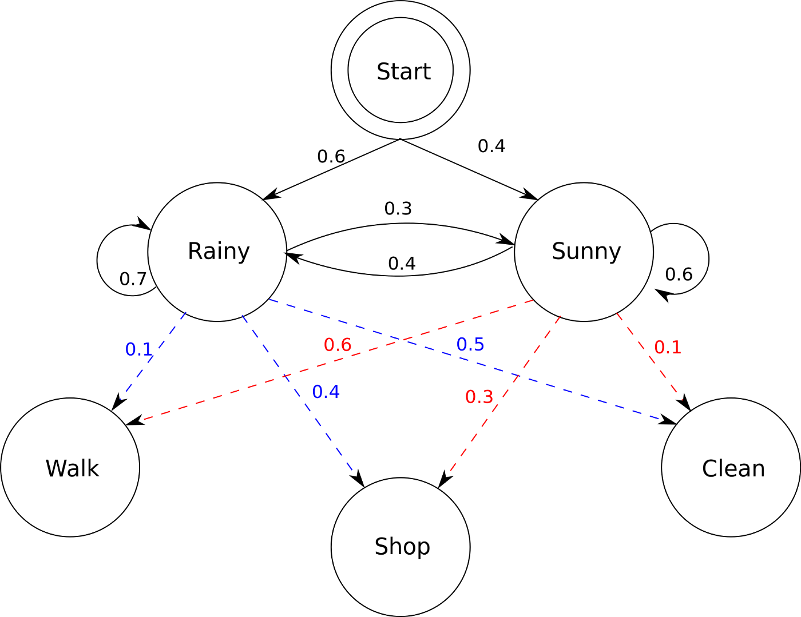
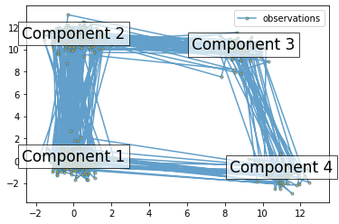
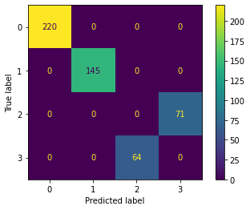
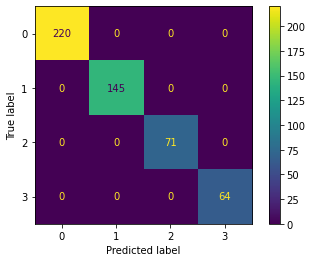

# Hidden Markov Models

There are three fundamental problems for HMMs:

* Given just the observed data, estimate the model parameters.

* Given the model parameters and observed data, calculate the model likelihood.

* Given the model parameters and observed data, estimate the optimal sequence of hidden states.


```python
import numpy as np
from hmmlearn import hmm

from importlib_metadata import version
print(version('hmmlearn'))
```

    0.2.7




States are not usually visible.

They can be specified by the start probability vector   pi and a transition probability matrix A. The emission probability of an observable can be any distribution with parameters theta conditioned on the current hidden state.


```python
startprob = np.array([0.6, 0.3, 0.1, 0.0])

transmat = np.array([[0.7, 0.2, 0.0, 0.1],
                     [0.3, 0.5, 0.2, 0.0],
                     [0.0, 0.3, 0.5, 0.2],
                     [0.2, 0.0, 0.2, 0.6]])

means = np.array([[0.0,  0.0],
                  [0.0, 11.0],
                  [9.0, 10.0],
                  [11.0, -1.0]])

covars = .5 * np.tile(np.identity(2), (4, 1, 1))

model = hmm.GaussianHMM(n_components=4, covariance_type="full")

model.startprob_ = startprob
model.transmat_ = transmat
model.means_ = means
model.covars_ = covars

# Generate samples
X, Y = model.sample(500)

X
```


    array([[-6.64218190e-01,  1.88926523e-01],
           [ 1.24745356e+00, -1.94647170e-01],
           [ 1.09225137e+01, -1.39314993e+00],
           [ 1.15876467e+01, -4.44064486e-01],
           [ 8.90072718e+00,  1.04543566e+01],
           [ 1.08811284e+01, -2.01344092e+00],
           [ 1.00839531e+01, -5.31546646e-01],
           [ 1.24457960e+01, -1.94424258e+00],
           [ 1.19031482e+01, -3.37864481e-01],
           [ 9.24056646e+00,  1.74642253e-01],
           [ 1.13129164e+01, -1.17286956e+00],
           [ 1.14606181e+01, -1.14867061e+00],
           [ 8.35152422e+00,  9.06002861e+00],
           [ 1.14769353e+01, -4.53613995e-01],
           [ 1.09211919e+01, -1.37905934e+00],
           [ 1.03716485e+01, -8.84876922e-01],
           [ 9.04736367e+00,  9.90514437e+00],
           [-4.74468078e-01,  1.05431636e+01],
           [-1.48070431e+00,  5.74417068e-01],
           [ 2.32556085e-01, -4.26524766e-01],
           [ 5.56660458e-01, -3.04345614e-01],
           [ 3.44889889e-01,  1.15851681e+01],
           [-8.52978178e-02,  9.73952884e-01],
           [ 1.30922313e-01,  1.89684796e-01],
           [ 5.14514216e-01,  1.03611649e+01],
           [ 1.54119459e+00,  1.07367246e+01],
           [-5.55770528e-01, -7.09089239e-01],
           [-6.08259529e-03, -8.60319675e-01],
           [-5.96116159e-01, -8.10294152e-01],
           [ 7.03417429e-01,  1.06736601e+01],
           [ 6.47235264e-01,  1.07494124e+01],
           [ 8.27249532e+00,  1.03289229e+01],
           [ 8.07226942e+00,  9.67652482e+00],
           [-1.24414459e+00,  1.16160338e+01],
           [ 9.63767477e-02,  3.05402102e-01],
           [-6.46137142e-01,  5.21483822e-01],
           [ 1.14186332e-02,  6.21174437e-02],
           [ 6.20235346e-01,  1.17822914e+01],
           [-7.88255600e-01,  1.09957987e+01],
           [ 6.97314463e-01,  1.06276793e+01],
           [-4.94187107e-02,  1.07642750e+00],
           [-7.82372228e-01,  1.19656618e+01],
           [-8.39680917e-01,  9.65142094e+00],
           [ 6.64379943e-02,  1.01106963e+01],
           [ 1.96149485e-01,  1.16308681e+01],
           [ 9.55218720e-01,  4.16717979e-01],
           [ 6.95164218e-01,  2.87583410e-01],
           [-1.56391834e+00,  1.08380187e+01],
           [ 4.30757338e-01,  2.77866203e-02],
           [ 3.84012705e-01, -2.28341978e-01],
           [ 1.10774510e-01,  3.76147851e-01],
           [ 2.51475595e-01, -8.50697530e-01],
           [-2.11674245e-01,  9.01223453e-02],
           [ 1.88961509e-01,  1.12845701e+01],
           [-6.49832083e-01,  1.07358159e+00],
           [ 1.34124944e+00,  1.00740631e+01],
           [ 8.64644890e+00,  1.15069772e+01],
           [-1.16588845e+00,  1.05440415e+01],
           [ 6.28553247e-02,  1.82233330e+00],
           [ 2.03954946e-01,  1.16672846e+01],
           [ 3.40069271e-01,  1.01913577e+01],
           [-1.07677526e+00,  1.05665936e+01],
           [-5.90914902e-01,  1.23898870e+00],
           [ 3.95750083e-01,  1.19855291e+01],
           [ 4.67345020e-02,  1.09914033e+00],
           [-8.68775830e-01,  2.47701574e-01],
           [-8.89424548e-01, -3.20362999e-01],
           [-1.62544600e-01, -1.82728577e-02],
           [-2.94646763e-01,  1.12503067e+01],
           [ 3.64946380e-01, -3.71149621e-02],
           [ 1.29870021e+00,  1.11793417e+01],
           [ 7.68052010e-01,  1.13012865e+01],
           [ 1.01731992e+01,  1.00824265e+01],
           [ 1.00782116e+01, -1.40925700e+00],
           [ 1.09221018e+01, -1.97471961e+00],
           [ 1.20706600e+01, -5.76731408e-01],
           [ 1.00307766e+01, -5.65837555e-01],
           [-6.92830536e-01,  5.76117539e-01],
           [ 1.12697719e+01, -1.50634810e+00],
           [ 1.07677012e+01, -1.44259859e+00],
           [ 1.06324787e+01, -5.82201905e-01],
           [ 1.09806760e+01, -2.19456221e+00],
           [ 8.89429443e+00,  1.02244555e+01],
           [ 1.08144058e+00,  1.15324877e+01],
           [ 7.63524157e+00,  1.01515241e+01],
           [ 9.76422666e+00, -1.97041262e-01],
           [ 1.15338353e+01, -2.91610024e+00],
           [ 1.03935344e+01, -1.39918503e+00],
           [-8.18307571e-01, -1.15802558e-01],
           [ 2.69324938e-02,  6.02031767e-02],
           [ 7.15553617e-01, -5.69302749e-01],
           [ 1.33022654e+00,  1.13206942e+01],
           [ 8.20657411e+00,  1.03779211e+01],
           [ 9.33152088e+00,  9.49462564e+00],
           [ 8.38766042e+00,  9.13410493e+00],
           [ 9.42059019e+00,  1.10743274e+01],
           [ 1.13687503e+01, -1.49759383e+00],
           [ 1.03660377e+01, -4.66781811e-01],
           [ 1.12809587e+01, -3.44069094e-01],
           [ 1.17787015e+01, -1.02442897e+00],
           [ 5.08529221e-01, -6.10896640e-01],
           [-3.59894723e-01,  1.71217145e-01],
           [-2.70635891e-01, -1.29444397e-01],
           [-1.27083103e-01,  6.89943993e-01],
           [ 1.78785351e-01, -8.56104018e-01],
           [ 9.72331426e-02, -1.72325960e+00],
           [ 9.78626723e-01, -3.48393392e-01],
           [ 4.68653935e-01,  2.31880444e-01],
           [-5.01826528e-01, -4.68290993e-02],
           [ 4.99841511e-01, -7.16691766e-01],
           [ 2.16656423e-01,  2.91995352e-02],
           [-1.21551425e+00,  1.16863137e+01],
           [ 3.24339868e-01,  1.12104727e+01],
           [ 6.75138702e-01,  1.19462861e+01],
           [ 4.54701797e-01,  1.09342404e+01],
           [ 9.95093672e-01,  1.01689209e+01],
           [-6.69588541e-01,  1.14395120e+01],
           [-8.46942733e-01,  9.54405310e+00],
           [-4.36436158e-01,  1.19537481e+01],
           [ 1.64831303e+00,  1.11123382e+01],
           [-3.58837314e-01, -2.59293495e-01],
           [ 1.30079795e+00,  1.08671949e+01],
           [ 9.52697433e+00,  1.04445944e+01],
           [-4.79467977e-01,  1.17006521e+01],
           [-1.54981411e+00,  1.12306277e+01],
           [ 4.08657425e-01,  1.06981543e+01],
           [-1.94330679e-01,  1.02263135e+01],
           [ 8.61945740e+00,  1.04062502e+01],
           [ 1.09079917e+01,  6.14759852e-01],
           [ 1.04861566e+01, -1.05943614e+00],
           [ 9.90967871e+00, -8.04365505e-01],
           [ 8.98766988e+00,  9.86564656e+00],
           [ 8.27396615e-02,  1.16007922e+01],
           [-1.06893342e+00, -7.76358695e-01],
           [-2.12375238e-01,  4.80233010e-02],
           [ 2.59807615e-01,  4.18836378e-01],
           [-5.25871771e-01,  1.64063214e-01],
           [ 2.66884369e-01,  2.91037416e-01],
           [ 2.35252319e-01,  1.78915161e+00],
           [-4.99291959e-01, -2.36741184e-01],
           [ 6.92143998e-01, -1.19408233e+00],
           [-5.07171475e-01, -4.67638635e-01],
           [-9.27326696e-01, -6.91117077e-01],
           [ 1.62655367e-01, -1.40574932e+00],
           [-1.94977638e-01,  1.14621231e+01],
           [-1.92029427e-01,  1.15421118e+01],
           [ 9.06053818e-01,  3.78208797e-01],
           [ 4.71068104e-01,  1.37700034e-01],
           [-1.61190898e-01, -3.10088734e-01],
           [ 7.69770748e-01, -1.21623931e+00],
           [-4.84685181e-01, -8.00176926e-01],
           [ 4.61063791e-01,  8.92569058e-01],
           [ 1.10320413e-02,  1.11553575e+01],
           [-8.25641505e-02,  1.19347165e+01],
           [ 8.62871278e-01,  1.00429734e+01],
           [ 9.91630811e-02,  1.11682550e+01],
           [ 3.32026880e-01,  1.22801333e+01],
           [ 3.43829664e-01,  1.04652222e+01],
           [-4.62179510e-01,  1.00711734e+01],
           [ 8.76768722e+00,  9.81673457e+00],
           [ 8.24796958e+00,  1.05082677e+01],
           [ 7.81168234e+00,  7.51793332e+00],
           [ 4.78771672e-01,  1.10531516e+01],
           [-2.85817896e-02,  1.14642351e+01],
           [-3.59087421e-02, -4.08017170e-02],
           [-6.51639640e-01,  2.11922811e-01],
           [-3.09945494e-02,  1.12497870e+01],
           [ 9.60932024e-01,  1.22171504e+01],
           [ 8.16095629e-01,  1.15907769e+01],
           [-6.96279846e-01,  1.44655816e-01],
           [ 7.13852813e-01, -1.72342356e+00],
           [-3.61505357e-01,  7.35282443e-01],
           [-2.49070315e-01,  9.99670976e+00],
           [ 3.12934051e-01,  1.18872213e+00],
           [ 2.21895439e+00,  2.58171431e-01],
           [-1.04721209e-01, -5.18554907e-01],
           [ 8.34759948e-01,  3.53357653e-01],
           [ 7.07193063e-01,  1.12894347e-01],
           [ 8.72104561e-01,  1.09270875e+01],
           [ 2.68897494e-01,  1.12386220e+01],
           [-8.78466538e-01, -1.31984778e+00],
           [ 6.70488000e-01,  1.38130961e+00],
           [-7.55134263e-01,  9.69072277e-02],
           [-4.41617422e-01,  3.92504277e-01],
           [ 6.87893970e-02, -6.38406847e-02],
           [ 2.86543974e-01,  1.10920183e+01],
           [ 1.63927664e+00,  1.14469961e+01],
           [ 7.61412494e-01,  6.83890587e-02],
           [-5.60069581e-01,  1.00359286e+00],
           [-2.04471063e-01, -1.31589726e-01],
           [ 1.08860990e+01, -1.38872584e+00],
           [ 1.10051692e+00, -3.82632771e-01],
           [-1.02847449e-01,  1.12964183e+01],
           [-3.59087380e-01,  1.22064443e+01],
           [-9.66683389e-01, -1.69135857e-01],
           [ 1.58738072e+00,  5.29022844e-01],
           [-1.77717640e+00,  4.68174773e-01],
           [ 6.08213372e-01,  1.20527553e+01],
           [-4.14719039e-01,  1.19929844e+01],
           [ 4.31422241e-01,  1.07215614e+01],
           [ 8.21698217e+00,  9.93472210e+00],
           [ 1.18735578e+01, -3.46619282e-01],
           [ 1.18885495e+01, -1.99528172e+00],
           [ 1.19498614e+01, -2.12747434e+00],
           [ 1.22177101e+01, -1.38748541e+00],
           [ 9.90100402e+00,  9.77111440e+00],
           [-2.89960779e-01,  1.15191535e+01],
           [ 5.76057741e-01,  1.11227149e+01],
           [ 2.91851801e-01,  1.68303066e-01],
           [ 1.81777797e-01, -6.57912991e-03],
           [-3.52599455e-01,  1.05634768e+01],
           [-7.46828934e-01,  3.06826848e-02],
           [ 2.95657004e-01, -3.62052973e-01],
           [ 7.33685264e-01, -1.71273396e+00],
           [ 1.03409629e+00, -7.88628590e-02],
           [ 4.08491395e-01, -1.15989151e-01],
           [-3.71702255e-01,  3.03865266e-01],
           [ 5.56521679e-01, -4.07905546e-01],
           [ 4.17717192e-01,  2.59479150e-01],
           [ 6.02671001e-01, -6.51758704e-01],
           [ 1.23701574e+01, -7.82716654e-01],
           [ 1.00514964e+01, -4.31755813e-01],
           [ 8.49847307e+00,  1.00978175e+01],
           [-1.00061240e+00,  1.10792571e+01],
           [ 9.14771803e-01,  1.09571192e+01],
           [-5.65852587e-01,  1.08671323e+01],
           [ 2.01032237e+00,  1.03855697e+01],
           [ 4.67586648e-01,  8.96788759e-01],
           [ 5.94125544e-01,  9.53002637e-01],
           [-1.69842548e-01,  2.69042758e+00],
           [ 7.01314907e-01, -3.43604133e-01],
           [ 3.12105749e-01,  6.04041624e-01],
           [-8.63684499e-01, -1.03332488e+00],
           [ 1.09555706e+00,  9.78498397e+00],
           [ 2.47427691e-01,  1.17758493e+01],
           [ 8.54788873e-01, -5.93029296e-01],
           [ 2.32606744e-01, -5.05917073e-01],
           [ 7.52775968e-02,  5.61324768e-01],
           [ 4.76608572e-02, -6.60410311e-02],
           [ 1.11610507e+01, -4.51341209e-01],
           [ 1.06589096e+01, -2.53545248e+00],
           [ 9.39500586e+00,  1.04781594e+01],
           [ 9.87463597e+00,  9.33895329e+00],
           [-1.06663317e+00,  1.08067513e+01],
           [ 1.50735694e-03,  1.17980332e+01],
           [ 4.80550082e-01, -1.19600570e+00],
           [-7.19767973e-01,  7.64469294e-01],
           [ 1.11041335e+00,  6.76025063e-01],
           [ 9.75002373e-02, -9.07709956e-01],
           [-3.40111416e-01,  8.70921599e+00],
           [-2.54195466e-01,  1.09395101e+01],
           [-1.11878570e+00, -9.99526324e-01],
           [ 4.45409901e-01,  1.14136609e+01],
           [-6.01635588e-01,  3.47087729e-01],
           [-6.53651942e-01,  4.19257719e-01],
           [-4.84345754e-01, -5.71757647e-01],
           [ 5.84595693e-01, -6.08242856e-01],
           [ 1.24711141e+00, -1.54585590e-01],
           [ 5.72857978e-01, -4.20447028e-02],
           [ 6.28996212e-01, -5.77926820e-01],
           [ 3.06617482e-01, -7.11837041e-01],
           [-5.86291655e-01,  2.29937302e-01],
           [ 6.58327163e-01, -1.23374260e+00],
           [-2.20107547e-02,  4.50495217e-01],
           [ 5.19352748e-01,  1.24731019e+01],
           [ 7.32396055e+00,  9.83681063e+00],
           [ 9.56057510e+00,  1.03249590e+01],
           [ 9.14665891e+00,  1.04687058e+01],
           [ 1.13293996e+01, -1.40377322e+00],
           [ 8.60084885e+00,  1.08109004e+01],
           [ 1.16404153e+01, -8.10691296e-01],
           [ 3.44748943e-01,  2.14219187e+00],
           [-6.05072524e-01, -4.54321197e-01],
           [-3.05489173e-01,  1.21614388e+01],
           [ 1.36371769e+00,  1.12744455e+01],
           [ 8.50780801e+00,  8.17848505e+00],
           [-8.10244208e-01,  9.77237294e+00],
           [ 8.51135462e+00,  1.04521634e+01],
           [ 8.48331340e+00,  1.01121980e+01],
           [ 8.21894524e+00,  1.06301292e+01],
           [ 1.06330802e+01,  1.06484016e+01],
           [ 9.03231398e+00,  1.05514999e+01],
           [ 8.89356596e+00,  9.69640076e+00],
           [ 2.64252345e-01,  1.08459509e+01],
           [ 7.79429811e-01,  1.01841440e+01],
           [ 1.92116956e-01,  1.15205686e+01],
           [-2.83784085e-01,  1.14662229e+01],
           [-3.04274133e-01,  1.08730246e+01],
           [ 3.24582898e-01,  1.12651881e+01],
           [ 9.59542319e+00,  9.41502325e+00],
           [ 1.12901716e+01, -2.05534538e+00],
           [ 1.03135590e+01, -1.03383520e+00],
           [ 1.11531272e+01, -1.26528156e+00],
           [ 1.04783830e+01, -1.48142461e+00],
           [ 1.07461193e+01,  1.61557783e-01],
           [ 1.12202528e+01, -1.59474034e+00],
           [-6.11765040e-01,  3.67291901e-01],
           [-2.28868176e-01, -1.62657884e-01],
           [ 2.09625041e-01,  5.28622339e-01],
           [ 1.05548101e+00,  1.07160870e+01],
           [-1.27845826e-01, -1.18564475e+00],
           [-5.00438097e-02,  9.56248386e-02],
           [-2.77343397e-01,  1.68483457e-01],
           [-3.44331200e-01,  6.25993403e-01],
           [ 7.73014458e-01, -2.25594134e-01],
           [-1.58754351e-01, -7.28419564e-01],
           [ 5.19283266e-01, -5.83325079e-01],
           [ 4.39160047e-02,  1.00590470e+01],
           [ 8.47005873e+00,  9.84392655e+00],
           [ 7.66196085e+00,  1.02777295e+01],
           [ 8.23171881e+00,  1.09382684e+01],
           [ 8.35756849e+00,  9.37802680e+00],
           [-3.33464576e-01,  1.14584916e+01],
           [ 8.84514681e+00,  8.99696796e+00],
           [ 1.09800679e+01, -7.43978284e-01],
           [ 1.27685998e+01, -1.49994296e-01],
           [ 1.19166501e+01, -1.11399383e+00],
           [ 8.54600617e+00,  1.01633839e+01],
           [ 8.81740137e+00,  1.00848814e+01],
           [ 8.14769846e+00,  1.00519986e+01],
           [ 8.66448429e+00,  1.10315205e+01],
           [ 8.34633798e+00,  1.04109945e+01],
           [ 8.82745032e+00,  7.86389830e+00],
           [ 9.18955967e+00,  1.06156970e+01],
           [ 9.22564636e+00,  9.76924902e+00],
           [ 1.04869987e+00,  1.09712171e+01],
           [-7.13305071e-01,  1.19159298e+01],
           [ 1.03126585e+01,  8.89984389e+00],
           [ 8.55813438e+00,  7.93449217e+00],
           [-4.21623719e-01,  1.13207086e+01],
           [ 8.43719019e+00,  1.08627638e+01],
           [ 8.60956544e+00,  1.04338361e+01],
           [ 8.82006511e+00,  9.08436952e+00],
           [ 9.82663829e+00,  1.07325835e+01],
           [ 8.37994878e+00,  1.03502909e+01],
           [ 9.76952645e+00,  1.02471759e+01],
           [ 8.67440755e+00,  1.06457346e+01],
           [ 9.17675332e+00,  9.87331844e+00],
           [ 1.07780943e+01, -1.82594386e+00],
           [ 1.18151988e+01, -1.08483013e+00],
           [ 9.78790133e+00,  1.02768960e+01],
           [ 9.80579890e+00,  9.45985490e+00],
           [-2.95110592e-01,  1.31049795e+01],
           [-1.20827652e+00, -1.95281086e-01],
           [ 3.89461565e-01,  3.57565276e-01],
           [ 1.05682269e-01, -3.69955223e-02],
           [ 1.10088986e+01, -1.95902654e+00],
           [ 1.08875073e+01, -1.55573517e+00],
           [ 8.42615083e+00,  1.00413577e+01],
           [ 1.12649222e+01, -4.05850631e-01],
           [ 1.09072922e+01, -2.55765738e+00],
           [ 8.94274098e+00,  9.48116751e+00],
           [ 9.70009694e+00, -1.85720130e+00],
           [-2.01410133e-01,  7.28150745e-01],
           [-9.46279425e-03, -4.13116448e-01],
           [ 2.18333094e-01,  1.24473811e+00],
           [ 2.19347058e-01, -4.48869271e-01],
           [ 2.52255227e-01, -1.71074043e-01],
           [-1.39367476e+00,  1.09879555e+00],
           [-5.69757117e-01, -6.37210707e-01],
           [-4.62645103e-01,  1.18489519e+01],
           [ 1.02165833e+00,  1.40030704e+00],
           [-1.30392428e-01,  9.84562471e+00],
           [-7.67370409e-01,  1.11774436e+01],
           [-6.91707902e-03,  9.74838316e-01],
           [-2.68772013e-01, -2.13909350e-02],
           [-1.51546618e-01, -9.40147895e-01],
           [ 1.15523896e-01,  2.31592287e-02],
           [-4.89405368e-01, -7.16449993e-01],
           [-7.21406282e-01,  1.06835320e+01],
           [ 2.98478160e-02,  1.13467032e+01],
           [-1.39220168e-01,  1.08074786e+01],
           [-7.58525365e-01,  1.12276148e+01],
           [-1.57724739e-01,  1.14631489e+01],
           [-1.12681270e+00,  4.48198789e-01],
           [-1.81856606e-03,  1.03277293e+01],
           [ 1.00485538e+01,  1.01225787e+01],
           [ 9.36042134e+00,  8.99507579e+00],
           [ 7.74266378e+00,  1.12356495e+01],
           [ 8.54575140e+00,  1.00440043e+01],
           [ 3.64376188e-01,  1.11810138e+01],
           [-8.86641508e-01, -4.57226721e-01],
           [-4.48241734e-01, -1.23542187e-02],
           [ 2.96516880e-02,  4.44230999e-01],
           [ 2.99545919e-01,  5.92518736e-01],
           [ 1.02140039e+01, -1.29557383e+00],
           [ 1.04973279e+01, -1.07636526e+00],
           [ 1.17788868e+01, -2.19765074e+00],
           [-8.30935020e-01, -6.68910791e-01],
           [-1.06681185e+00,  1.01545163e+01],
           [-5.09581079e-01, -1.07619986e+00],
           [-2.54212005e-01, -3.11685868e-01],
           [ 1.09251600e+00,  9.72400991e+00],
           [ 7.74144906e+00,  9.62201219e+00],
           [ 4.34920137e-01,  1.01654703e+01],
           [-9.02951356e-01,  1.19403778e+01],
           [-1.73642971e-01, -3.08550357e-01],
           [ 2.21675670e-01,  1.06170690e+01],
           [ 1.37261187e-01,  3.41107568e-01],
           [ 2.21487344e-01,  1.10518887e+01],
           [-3.03243395e-01, -1.91354376e-01],
           [ 6.40500561e-01,  6.33391172e-01],
           [ 7.98067969e-01, -1.09360423e+00],
           [ 5.54447795e-01, -1.04373096e+00],
           [ 9.92239215e-01, -3.16698182e-01],
           [-3.27125822e-02,  1.02024607e+01],
           [ 1.06589213e+00,  1.03256632e+01],
           [ 1.51567802e+00,  1.15445854e+01],
           [ 2.78114021e-01, -6.84131731e-01],
           [ 8.17323465e-01,  6.23337400e-01],
           [ 6.32211724e-01, -7.21739998e-01],
           [ 1.89055103e-01, -3.14871466e-01],
           [-4.09336574e-01,  5.63085357e-01],
           [ 2.49617532e-01,  1.53915144e-01],
           [-5.57293778e-01, -6.15188540e-01],
           [-1.45736689e+00,  6.81225724e-01],
           [ 8.65124674e-02,  8.99694289e-01],
           [ 1.53726049e-02, -5.01265263e-01],
           [ 8.29190870e-01,  1.46111749e-01],
           [ 3.19799740e-02,  3.19763799e-01],
           [ 3.72036400e-01,  3.21451700e-02],
           [ 1.50608110e+00,  1.01456491e+01],
           [ 1.23692551e+00,  1.19027086e+01],
           [ 5.23651830e-01,  1.19558795e+01],
           [-2.64476053e-01,  1.07897416e+00],
           [-5.12386469e-01,  4.88755006e-01],
           [ 1.12811014e+00, -1.05763290e+00],
           [ 2.52050883e-01,  1.12044887e+00],
           [ 2.17306602e-01,  1.30292324e+00],
           [ 1.00815345e+00,  1.03409846e+00],
           [ 1.10989651e+00, -1.57091316e+00],
           [-3.79696404e-01,  9.56674501e-01],
           [-9.28167021e-02, -5.14141158e-01],
           [ 1.13726992e+00, -4.86352403e-01],
           [-7.09935621e-01,  1.07524594e+01],
           [-2.63905872e-01,  4.13895510e-01],
           [ 1.19353927e+01, -1.47972995e+00],
           [-3.53340976e-01, -4.49477285e-01],
           [ 8.17353067e-01, -3.96930404e-01],
           [ 7.32063280e-01,  4.33998119e-01],
           [-4.59752427e-01,  7.71959053e-01],
           [-8.55245961e-01, -1.20821846e+00],
           [-6.55274750e-03,  7.56332177e-01],
           [ 1.10627951e+01, -2.14122927e+00],
           [-1.05075543e+00, -4.93491642e-01],
           [ 5.05417959e-01,  1.19857134e+01],
           [-9.24535924e-01,  1.08640352e+01],
           [-6.95280505e-02,  9.85845626e+00],
           [-8.53488244e-01,  1.09748492e+01],
           [-4.45433992e-02,  1.15897090e+01],
           [-5.28254439e-01,  1.12407827e+01],
           [ 1.42300267e+00, -4.30812792e-01],
           [ 3.04236673e-01, -5.39606836e-01],
           [-2.44710684e-01,  2.68848792e-01],
           [-1.01841150e-01,  1.16981356e+01],
           [-4.94029604e-01,  1.12847288e-02],
           [ 7.38675645e-01,  1.09033964e+01],
           [-2.44533157e-01,  1.05376871e+01],
           [-3.84548981e-01,  1.02742287e+01],
           [-8.88685481e-01,  1.16415291e+01],
           [ 5.45491944e-01,  9.42525327e+00],
           [ 2.15019981e+00,  1.25053560e-01],
           [ 2.01071196e-01,  5.24412824e-01],
           [-8.83335586e-01, -9.57470807e-01],
           [-6.58439860e-01, -9.70732197e-01],
           [ 5.47328680e-01,  1.08171808e+01],
           [-1.01180979e+00, -4.98400764e-01],
           [ 9.54763246e-01,  1.17420365e+01],
           [-8.20577242e-01,  1.11305821e+01],
           [-1.00298647e+00,  1.13822227e+01],
           [-4.14737688e-01,  6.49014737e-01],
           [ 1.45904900e+00,  3.79115623e-01],
           [-4.32568822e-01,  2.82658869e-02],
           [ 3.80378390e-02, -5.16346915e-01],
           [-1.97858196e-01, -5.55357415e-01],
           [-6.01933626e-01,  6.39620743e-01],
           [ 5.94022249e-01,  1.07991910e+01],
           [ 9.13197669e+00,  9.96503888e+00],
           [ 4.94790358e-02,  1.08050785e+01],
           [ 9.78227947e-01,  1.04382818e+01],
           [ 9.93737807e+00,  1.03306082e+01],
           [ 7.75815196e+00,  1.03212585e+01],
           [ 1.10008459e+01, -7.91866260e-01],
           [ 1.12756861e+01, -6.47916840e-01],
           [ 4.25561987e-01,  1.01736055e+00],
           [ 1.66298748e+00,  2.42022895e-02],
           [-5.11440027e-01,  1.04365296e+01],
           [-1.72819853e-04,  1.07214000e+01],
           [ 1.18412962e+00,  1.10845759e+01],
           [-2.33334907e-01,  1.19379286e+01],
           [ 2.85427105e-01, -5.69249402e-01],
           [-1.57836258e-01, -2.37466423e-01],
           [-1.95734393e-01,  3.23957836e-01],
           [-1.99695700e-01,  7.85656482e-01],
           [ 4.47149316e-01,  1.15967485e+01],
           [-3.71187444e-01, -7.55147884e-01],
           [ 2.51257052e-03,  1.13327442e+00],
           [ 5.95778795e-01,  1.24025319e+01],
           [-6.99243191e-01,  6.47503141e-01],
           [-6.36259301e-01,  2.35762143e-01]])


As emission probability is a 2-D gaussian distribution, thus covariance matrix for each state would be a 2-D matrix, thus overall the covariance matrix for all the states would be in the form of (n_components, 2, 2)


```python
Y
```


    array([0, 0, 3, 3, 2, 3, 3, 3, 3, 3, 3, 3, 2, 3, 3, 3, 2, 1, 0, 0, 0, 1,
           0, 0, 1, 1, 0, 0, 0, 1, 1, 2, 2, 1, 0, 0, 0, 1, 1, 1, 0, 1, 1, 1,
           1, 0, 0, 1, 0, 0, 0, 0, 0, 1, 0, 1, 2, 1, 0, 1, 1, 1, 0, 1, 0, 0,
           0, 0, 1, 0, 1, 1, 2, 3, 3, 3, 3, 0, 3, 3, 3, 3, 2, 1, 2, 3, 3, 3,
           0, 0, 0, 1, 2, 2, 2, 2, 3, 3, 3, 3, 0, 0, 0, 0, 0, 0, 0, 0, 0, 0,
           0, 1, 1, 1, 1, 1, 1, 1, 1, 1, 0, 1, 2, 1, 1, 1, 1, 2, 3, 3, 3, 2,
           1, 0, 0, 0, 0, 0, 0, 0, 0, 0, 0, 0, 1, 1, 0, 0, 0, 0, 0, 0, 1, 1,
           1, 1, 1, 1, 1, 2, 2, 2, 1, 1, 0, 0, 1, 1, 1, 0, 0, 0, 1, 0, 0, 0,
           0, 0, 1, 1, 0, 0, 0, 0, 0, 1, 1, 0, 0, 0, 3, 0, 1, 1, 0, 0, 0, 1,
           1, 1, 2, 3, 3, 3, 3, 2, 1, 1, 0, 0, 1, 0, 0, 0, 0, 0, 0, 0, 0, 0,
           3, 3, 2, 1, 1, 1, 1, 0, 0, 0, 0, 0, 0, 1, 1, 0, 0, 0, 0, 3, 3, 2,
           2, 1, 1, 0, 0, 0, 0, 1, 1, 0, 1, 0, 0, 0, 0, 0, 0, 0, 0, 0, 0, 0,
           1, 2, 2, 2, 3, 2, 3, 0, 0, 1, 1, 2, 1, 2, 2, 2, 2, 2, 2, 1, 1, 1,
           1, 1, 1, 2, 3, 3, 3, 3, 3, 3, 0, 0, 0, 1, 0, 0, 0, 0, 0, 0, 0, 1,
           2, 2, 2, 2, 1, 2, 3, 3, 3, 2, 2, 2, 2, 2, 2, 2, 2, 1, 1, 2, 2, 1,
           2, 2, 2, 2, 2, 2, 2, 2, 3, 3, 2, 2, 1, 0, 0, 0, 3, 3, 2, 3, 3, 2,
           3, 0, 0, 0, 0, 0, 0, 0, 1, 0, 1, 1, 0, 0, 0, 0, 0, 1, 1, 1, 1, 1,
           0, 1, 2, 2, 2, 2, 1, 0, 0, 0, 0, 3, 3, 3, 0, 1, 0, 0, 1, 2, 1, 1,
           0, 1, 0, 1, 0, 0, 0, 0, 0, 1, 1, 1, 0, 0, 0, 0, 0, 0, 0, 0, 0, 0,
           0, 0, 0, 1, 1, 1, 0, 0, 0, 0, 0, 0, 0, 0, 0, 0, 1, 0, 3, 0, 0, 0,
           0, 0, 0, 3, 0, 1, 1, 1, 1, 1, 1, 0, 0, 0, 1, 0, 1, 1, 1, 1, 1, 0,
           0, 0, 0, 1, 0, 1, 1, 1, 0, 0, 0, 0, 0, 0, 1, 2, 1, 1, 2, 2, 3, 3,
           0, 0, 1, 1, 1, 1, 0, 0, 0, 0, 1, 0, 0, 1, 0, 0])


```python
import matplotlib.pyplot as plt
# Plot the sampled data
plt.plot(X[:, 0], X[:, 1], ".-", label="observations", ms=6,
         mfc="orange", alpha=0.7)

# Indicate the component numbers
for i, m in enumerate(means):
    plt.text(m[0], m[1], 'Component %i' % (i + 1),
             size=17, horizontalalignment='center',
             bbox=dict(alpha=.7, facecolor='w'))
plt.legend(loc='best')
plt.show()
```


    

    


```python
remodel = hmm.GaussianHMM(n_components=4, covariance_type="full", n_iter=100)
remodel.fit(X)

Y2 = remodel.predict(X)
Y2
```


    array([0, 0, 2, 2, 3, 2, 2, 2, 2, 2, 2, 2, 3, 2, 2, 2, 3, 1, 0, 0, 0, 1,
           0, 0, 1, 1, 0, 0, 0, 1, 1, 3, 3, 1, 0, 0, 0, 1, 1, 1, 0, 1, 1, 1,
           1, 0, 0, 1, 0, 0, 0, 0, 0, 1, 0, 1, 3, 1, 0, 1, 1, 1, 0, 1, 0, 0,
           0, 0, 1, 0, 1, 1, 3, 2, 2, 2, 2, 0, 2, 2, 2, 2, 3, 1, 3, 2, 2, 2,
           0, 0, 0, 1, 3, 3, 3, 3, 2, 2, 2, 2, 0, 0, 0, 0, 0, 0, 0, 0, 0, 0,
           0, 1, 1, 1, 1, 1, 1, 1, 1, 1, 0, 1, 3, 1, 1, 1, 1, 3, 2, 2, 2, 3,
           1, 0, 0, 0, 0, 0, 0, 0, 0, 0, 0, 0, 1, 1, 0, 0, 0, 0, 0, 0, 1, 1,
           1, 1, 1, 1, 1, 3, 3, 3, 1, 1, 0, 0, 1, 1, 1, 0, 0, 0, 1, 0, 0, 0,
           0, 0, 1, 1, 0, 0, 0, 0, 0, 1, 1, 0, 0, 0, 2, 0, 1, 1, 0, 0, 0, 1,
           1, 1, 3, 2, 2, 2, 2, 3, 1, 1, 0, 0, 1, 0, 0, 0, 0, 0, 0, 0, 0, 0,
           2, 2, 3, 1, 1, 1, 1, 0, 0, 0, 0, 0, 0, 1, 1, 0, 0, 0, 0, 2, 2, 3,
           3, 1, 1, 0, 0, 0, 0, 1, 1, 0, 1, 0, 0, 0, 0, 0, 0, 0, 0, 0, 0, 0,
           1, 3, 3, 3, 2, 3, 2, 0, 0, 1, 1, 3, 1, 3, 3, 3, 3, 3, 3, 1, 1, 1,
           1, 1, 1, 3, 2, 2, 2, 2, 2, 2, 0, 0, 0, 1, 0, 0, 0, 0, 0, 0, 0, 1,
           3, 3, 3, 3, 1, 3, 2, 2, 2, 3, 3, 3, 3, 3, 3, 3, 3, 1, 1, 3, 3, 1,
           3, 3, 3, 3, 3, 3, 3, 3, 2, 2, 3, 3, 1, 0, 0, 0, 2, 2, 3, 2, 2, 3,
           2, 0, 0, 0, 0, 0, 0, 0, 1, 0, 1, 1, 0, 0, 0, 0, 0, 1, 1, 1, 1, 1,
           0, 1, 3, 3, 3, 3, 1, 0, 0, 0, 0, 2, 2, 2, 0, 1, 0, 0, 1, 3, 1, 1,
           0, 1, 0, 1, 0, 0, 0, 0, 0, 1, 1, 1, 0, 0, 0, 0, 0, 0, 0, 0, 0, 0,
           0, 0, 0, 1, 1, 1, 0, 0, 0, 0, 0, 0, 0, 0, 0, 0, 1, 0, 2, 0, 0, 0,
           0, 0, 0, 2, 0, 1, 1, 1, 1, 1, 1, 0, 0, 0, 1, 0, 1, 1, 1, 1, 1, 0,
           0, 0, 0, 1, 0, 1, 1, 1, 0, 0, 0, 0, 0, 0, 1, 3, 1, 1, 3, 3, 2, 2,
           0, 0, 1, 1, 1, 1, 0, 0, 0, 0, 1, 0, 0, 1, 0, 0])


```python
from sklearn.metrics import confusion_matrix
cm = confusion_matrix(Y, Y2)

import matplotlib.pyplot as plt
from sklearn.metrics import ConfusionMatrixDisplay

ConfusionMatrixDisplay(cm).plot()

plt.show()
print(remodel.score(X))
```


    

    


    -1501.9710780670782


**Note** since the EM algorithm is a gradient-based optimization method, it will generally get stuck in local optima. You should in general try to run fit with various initializations and select the highest scored model.


```python
acc = 0

for i in range(1000):
    remodel = hmm.GaussianHMM(n_components=4, covariance_type="full", n_iter=100)
    remodel.fit(X)

    pred = remodel.predict(X)
    accuracy = (Y == pred).sum() / len(Y)
    if acc < accuracy:
        finalModel = remodel
        Y2 = pred
        acc = accuracy

cm = confusion_matrix(Y, Y2)
ConfusionMatrixDisplay(cm).plot()

plt.show()
print(acc)
```


    

    


    1.0


```python
finalModel.monitor_
```


    ConvergenceMonitor(
        history=[-3113.336350859911, -2490.7338520387066, -1777.628860369093, -1517.6861031267383, -1501.9710780699652, -1501.9710780670748],
        iter=6,
        n_iter=100,
        tol=0.01,
        verbose=False,
    )


```python
finalModel.monitor_.converged
```


    True


```python
finalModel.decode(X)
```


    (-1501.9710780670782,
     array([0, 0, 3, 3, 2, 3, 3, 3, 3, 3, 3, 3, 2, 3, 3, 3, 2, 1, 0, 0, 0, 1,
            0, 0, 1, 1, 0, 0, 0, 1, 1, 2, 2, 1, 0, 0, 0, 1, 1, 1, 0, 1, 1, 1,
            1, 0, 0, 1, 0, 0, 0, 0, 0, 1, 0, 1, 2, 1, 0, 1, 1, 1, 0, 1, 0, 0,
            0, 0, 1, 0, 1, 1, 2, 3, 3, 3, 3, 0, 3, 3, 3, 3, 2, 1, 2, 3, 3, 3,
            0, 0, 0, 1, 2, 2, 2, 2, 3, 3, 3, 3, 0, 0, 0, 0, 0, 0, 0, 0, 0, 0,
            0, 1, 1, 1, 1, 1, 1, 1, 1, 1, 0, 1, 2, 1, 1, 1, 1, 2, 3, 3, 3, 2,
            1, 0, 0, 0, 0, 0, 0, 0, 0, 0, 0, 0, 1, 1, 0, 0, 0, 0, 0, 0, 1, 1,
            1, 1, 1, 1, 1, 2, 2, 2, 1, 1, 0, 0, 1, 1, 1, 0, 0, 0, 1, 0, 0, 0,
            0, 0, 1, 1, 0, 0, 0, 0, 0, 1, 1, 0, 0, 0, 3, 0, 1, 1, 0, 0, 0, 1,
            1, 1, 2, 3, 3, 3, 3, 2, 1, 1, 0, 0, 1, 0, 0, 0, 0, 0, 0, 0, 0, 0,
            3, 3, 2, 1, 1, 1, 1, 0, 0, 0, 0, 0, 0, 1, 1, 0, 0, 0, 0, 3, 3, 2,
            2, 1, 1, 0, 0, 0, 0, 1, 1, 0, 1, 0, 0, 0, 0, 0, 0, 0, 0, 0, 0, 0,
            1, 2, 2, 2, 3, 2, 3, 0, 0, 1, 1, 2, 1, 2, 2, 2, 2, 2, 2, 1, 1, 1,
            1, 1, 1, 2, 3, 3, 3, 3, 3, 3, 0, 0, 0, 1, 0, 0, 0, 0, 0, 0, 0, 1,
            2, 2, 2, 2, 1, 2, 3, 3, 3, 2, 2, 2, 2, 2, 2, 2, 2, 1, 1, 2, 2, 1,
            2, 2, 2, 2, 2, 2, 2, 2, 3, 3, 2, 2, 1, 0, 0, 0, 3, 3, 2, 3, 3, 2,
            3, 0, 0, 0, 0, 0, 0, 0, 1, 0, 1, 1, 0, 0, 0, 0, 0, 1, 1, 1, 1, 1,
            0, 1, 2, 2, 2, 2, 1, 0, 0, 0, 0, 3, 3, 3, 0, 1, 0, 0, 1, 2, 1, 1,
            0, 1, 0, 1, 0, 0, 0, 0, 0, 1, 1, 1, 0, 0, 0, 0, 0, 0, 0, 0, 0, 0,
            0, 0, 0, 1, 1, 1, 0, 0, 0, 0, 0, 0, 0, 0, 0, 0, 1, 0, 3, 0, 0, 0,
            0, 0, 0, 3, 0, 1, 1, 1, 1, 1, 1, 0, 0, 0, 1, 0, 1, 1, 1, 1, 1, 0,
            0, 0, 0, 1, 0, 1, 1, 1, 0, 0, 0, 0, 0, 0, 1, 2, 1, 1, 2, 2, 3, 3,
            0, 0, 1, 1, 1, 1, 0, 0, 0, 0, 1, 0, 0, 1, 0, 0]))


