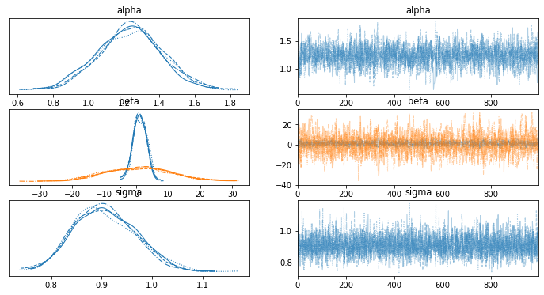

# Markov Chain Monte Carlo

* **Problem**: Calculate the area of a weird shaped object.

* Can count pixel, but let's say the image is huge! Millions of pixels!
* Try hitting the object with a thousand pixels (still a big number, but way smaller).
* Then, the estimate area of the object is the size of the image multiplied by the probability of hitting the object.


$$Area = height * width * P(O)$$

$$480000 = 600 * 800$$


```python
import numpy as np

np.random.seed(27)

alpha, sigma = 1, 1
beta = [1, 2.5]
size = 100
X1 = np.linspace(0, 1, size)
X2 = np.linspace(0,.2, size)
Y = alpha + beta[0]*X1 + beta[1]*X2 + np.random.randn(size)*sigma
```


```python
import pymc3 as pm
print("PyMC3 version: " + pm.__version__)

with pm.Model() as model:
    # Priors for unknown model parameters
    alpha = pm.Normal('alpha', mu=0, sd=10)
    beta = pm.Normal('beta', mu=0, sd=10, shape=2)
    sigma = pm.HalfNormal('sigma', sd=1)

    # Expected value of outcome
    mu = alpha + beta[0]*X1 + beta[1]*X2

    # Likelihood (sampling distribution) of observations
    Y_obs = pm.Normal('Y_obs', mu=mu, sd=sigma, observed=Y)
```

    PyMC3 version: 3.11.4


```python
from scipy import optimize
with model:
    # obtain starting values via MAP
    start = pm.find_MAP(method="powell")
    # instantiate sampler
    step = pm.Slice(vars=[sigma])
    # draw 5000 posterior samples
    trace = pm.sample(5000, start=start, step=step)
```


<div>
    <style>
        /* Turns off some styling */
        progress {
            /* gets rid of default border in Firefox and Opera. */
            border: none;
            /* Needs to be in here for Safari polyfill so background images work as expected. */
            background-size: auto;
        }
        .progress-bar-interrupted, .progress-bar-interrupted::-webkit-progress-bar {
            background: #F44336;
        }
    </style>
  <progress value='272' class='' max='272' style='width:300px; height:20px; vertical-align: middle;'></progress>
  100.00% [272/272 00:00<00:00 logp = -140.74, ||grad|| = 0.23064]
</div>


    /Users/joseluis/opt/anaconda3/lib/python3.7/site-packages/scipy/optimize/_minimize.py:523: RuntimeWarning: Method powell does not use gradient information (jac).
      RuntimeWarning)


    


    /Users/joseluis/opt/anaconda3/lib/python3.7/site-packages/ipykernel_launcher.py:8: FutureWarning: In v4.0, pm.sample will return an `arviz.InferenceData` object instead of a `MultiTrace` by default. You can pass return_inferencedata=True or return_inferencedata=False to be safe and silence this warning.
      
    Multiprocess sampling (4 chains in 4 jobs)
    CompoundStep
    >Slice: [sigma]
    >NUTS: [beta, alpha]


<div>
    <style>
        /* Turns off some styling */
        progress {
            /* gets rid of default border in Firefox and Opera. */
            border: none;
            /* Needs to be in here for Safari polyfill so background images work as expected. */
            background-size: auto;
        }
        .progress-bar-interrupted, .progress-bar-interrupted::-webkit-progress-bar {
            background: #F44336;
        }
    </style>
  <progress value='24000' class='' max='24000' style='width:300px; height:20px; vertical-align: middle;'></progress>
  100.00% [24000/24000 01:31<00:00 Sampling 4 chains, 11 divergences]
</div>


    /Users/joseluis/opt/anaconda3/lib/python3.7/site-packages/scipy/stats/_continuous_distns.py:624: RuntimeWarning: overflow encountered in _beta_ppf
      return _boost._beta_ppf(q, a, b)
    /Users/joseluis/opt/anaconda3/lib/python3.7/site-packages/scipy/stats/_continuous_distns.py:624: RuntimeWarning: overflow encountered in _beta_ppf
      return _boost._beta_ppf(q, a, b)
    /Users/joseluis/opt/anaconda3/lib/python3.7/site-packages/scipy/stats/_continuous_distns.py:624: RuntimeWarning: overflow encountered in _beta_ppf
      return _boost._beta_ppf(q, a, b)
    /Users/joseluis/opt/anaconda3/lib/python3.7/site-packages/scipy/stats/_continuous_distns.py:624: RuntimeWarning: overflow encountered in _beta_ppf
      return _boost._beta_ppf(q, a, b)
    Sampling 4 chains for 1_000 tune and 5_000 draw iterations (4_000 + 20_000 draws total) took 125 seconds.
    There were 8 divergences after tuning. Increase `target_accept` or reparameterize.
    There were 3 divergences after tuning. Increase `target_accept` or reparameterize.


```python
pm.traceplot(trace[4000:])
```

    /Users/joseluis/opt/anaconda3/lib/python3.7/site-packages/ipykernel_launcher.py:1: DeprecationWarning: The function `traceplot` from PyMC3 is just an alias for `plot_trace` from ArviZ. Please switch to `pymc3.plot_trace` or `arviz.plot_trace`.
      """Entry point for launching an IPython kernel.
    Got error No model on context stack. trying to find log_likelihood in translation.
    /Users/joseluis/opt/anaconda3/lib/python3.7/site-packages/arviz/data/io_pymc3_3x.py:102: FutureWarning: Using `from_pymc3` without the model will be deprecated in a future release. Not using the model will return less accurate and less useful results. Make sure you use the model argument or call from_pymc3 within a model context.
      FutureWarning,
    Got error No model on context stack. trying to find log_likelihood in translation.


    array([[<AxesSubplot:title={'center':'alpha'}>,
            <AxesSubplot:title={'center':'alpha'}>],
           [<AxesSubplot:title={'center':'beta'}>,
            <AxesSubplot:title={'center':'beta'}>],
           [<AxesSubplot:title={'center':'sigma'}>,
            <AxesSubplot:title={'center':'sigma'}>]], dtype=object)


    

    


```python
pm.summary(trace[4000:])
```

    Got error No model on context stack. trying to find log_likelihood in translation.
    /Users/joseluis/opt/anaconda3/lib/python3.7/site-packages/arviz/data/io_pymc3_3x.py:102: FutureWarning: Using `from_pymc3` without the model will be deprecated in a future release. Not using the model will return less accurate and less useful results. Make sure you use the model argument or call from_pymc3 within a model context.
      FutureWarning,


<div>
<style scoped>
    .dataframe tbody tr th:only-of-type {
        vertical-align: middle;
    }

    .dataframe tbody tr th {
        vertical-align: top;
    }

    .dataframe thead th {
        text-align: right;
    }
</style>
<table border="1" class="dataframe">
  <thead>
    <tr style="text-align: right;">
      <th></th>
      <th>mean</th>
      <th>sd</th>
      <th>hdi_3%</th>
      <th>hdi_97%</th>
      <th>mcse_mean</th>
      <th>mcse_sd</th>
      <th>ess_bulk</th>
      <th>ess_tail</th>
      <th>r_hat</th>
    </tr>
  </thead>
  <tbody>
    <tr>
      <th>alpha</th>
      <td>1.234</td>
      <td>0.180</td>
      <td>0.888</td>
      <td>1.562</td>
      <td>0.004</td>
      <td>0.003</td>
      <td>1681.0</td>
      <td>1605.0</td>
      <td>1.0</td>
    </tr>
    <tr>
      <th>beta[0]</th>
      <td>1.112</td>
      <td>2.073</td>
      <td>-2.879</td>
      <td>4.827</td>
      <td>0.061</td>
      <td>0.043</td>
      <td>1159.0</td>
      <td>1309.0</td>
      <td>1.0</td>
    </tr>
    <tr>
      <th>beta[1]</th>
      <td>0.601</td>
      <td>10.228</td>
      <td>-19.067</td>
      <td>18.748</td>
      <td>0.298</td>
      <td>0.223</td>
      <td>1185.0</td>
      <td>1239.0</td>
      <td>1.0</td>
    </tr>
    <tr>
      <th>sigma</th>
      <td>0.907</td>
      <td>0.063</td>
      <td>0.795</td>
      <td>1.026</td>
      <td>0.001</td>
      <td>0.001</td>
      <td>3702.0</td>
      <td>2780.0</td>
      <td>1.0</td>
    </tr>
  </tbody>
</table>
</div>


# Latent Dirichlet Allocation

conda install -c conda-forge gensim

conda install -c conda-forge nltk


```python
import gensim
import stop_words
import nltk

print("nltk version: " + nltk.__version__)
print("gensim version: " + gensim.__version__)
from importlib_metadata import version
print("stop_words version: " + version('stop_words'))
```

    /Users/joseluis/opt/anaconda3/lib/python3.7/site-packages/gensim/similarities/__init__.py:15: UserWarning: The gensim.similarities.levenshtein submodule is disabled, because the optional Levenshtein package <https://pypi.org/project/python-Levenshtein/> is unavailable. Install Levenhstein (e.g. `pip install python-Levenshtein`) to suppress this warning.
      warnings.warn(msg)


    nltk version: 3.6.7
    gensim version: 4.0.1
    stop_words version: 2018.7.23


Creating sample documents


```python
doc_a = "Brocolli is good to eat. My brother likes to eat good brocolli, but not my mother."
doc_b = "My mother spends a lot of time driving my brother around to baseball practice."
doc_c = "Some health experts suggest that driving may cause increased tension and blood pressure."
doc_d = "I often feel pressure to perform well at school, but my mother never seems to drive my brother to do better."
doc_e = "Health professionals say that brocolli is good for your health."
```

Compile sample documents into a list


```python
doc_set = [doc_a, doc_b, doc_c, doc_d, doc_e]
doc_set
```


    ['Brocolli is good to eat. My brother likes to eat good brocolli, but not my mother.',
     'My mother spends a lot of time driving my brother around to baseball practice.',
     'Some health experts suggest that driving may cause increased tension and blood pressure.',
     'I often feel pressure to perform well at school, but my mother never seems to drive my brother to do better.',
     'Health professionals say that brocolli is good for your health.']


```python
en_stop = stop_words.get_stop_words('en')
en_stop
```


    ['a',
     'about',
     'above',
     'after',
     'again',
     'against',
     'all',
     'am',
     'an',
     'and',
     'any',
     'are',
     "aren't",
     'as',
     'at',
     'be',
     'because',
     'been',
     'before',
     'being',
     'below',
     'between',
     'both',
     'but',
     'by',
     "can't",
     'cannot',
     'could',
     "couldn't",
     'did',
     "didn't",
     'do',
     'does',
     "doesn't",
     'doing',
     "don't",
     'down',
     'during',
     'each',
     'few',
     'for',
     'from',
     'further',
     'had',
     "hadn't",
     'has',
     "hasn't",
     'have',
     "haven't",
     'having',
     'he',
     "he'd",
     "he'll",
     "he's",
     'her',
     'here',
     "here's",
     'hers',
     'herself',
     'him',
     'himself',
     'his',
     'how',
     "how's",
     'i',
     "i'd",
     "i'll",
     "i'm",
     "i've",
     'if',
     'in',
     'into',
     'is',
     "isn't",
     'it',
     "it's",
     'its',
     'itself',
     "let's",
     'me',
     'more',
     'most',
     "mustn't",
     'my',
     'myself',
     'no',
     'nor',
     'not',
     'of',
     'off',
     'on',
     'once',
     'only',
     'or',
     'other',
     'ought',
     'our',
     'ours',
     'ourselves',
     'out',
     'over',
     'own',
     'same',
     "shan't",
     'she',
     "she'd",
     "she'll",
     "she's",
     'should',
     "shouldn't",
     'so',
     'some',
     'such',
     'than',
     'that',
     "that's",
     'the',
     'their',
     'theirs',
     'them',
     'themselves',
     'then',
     'there',
     "there's",
     'these',
     'they',
     "they'd",
     "they'll",
     "they're",
     "they've",
     'this',
     'those',
     'through',
     'to',
     'too',
     'under',
     'until',
     'up',
     'very',
     'was',
     "wasn't",
     'we',
     "we'd",
     "we'll",
     "we're",
     "we've",
     'were',
     "weren't",
     'what',
     "what's",
     'when',
     "when's",
     'where',
     "where's",
     'which',
     'while',
     'who',
     "who's",
     'whom',
     'why',
     "why's",
     'with',
     "won't",
     'would',
     "wouldn't",
     'you',
     "you'd",
     "you'll",
     "you're",
     "you've",
     'your',
     'yours',
     'yourself',
     'yourselves']


```python
from nltk.tokenize import RegexpTokenizer
from nltk.stem.porter import PorterStemmer

p_stemmer = PorterStemmer()
tokenizer = RegexpTokenizer(r'\w+') # [a..z, A..Z, 0..9]
```


```python
from gensim import corpora
from stop_words import get_stop_words

texts = []

for i in doc_set:
    raw = i.lower()
    tokens = tokenizer.tokenize(raw)
    
    stopped_tokens = [i for i in tokens if not i in en_stop]
    
    stemmed_tokens = [p_stemmer.stem(i) for i in stopped_tokens]
    
    texts.append(stemmed_tokens)
    
dictionary = corpora.Dictionary(texts)

corpus = [dictionary.doc2bow(text) for text in texts]
corpus
```


    [[(0, 2), (1, 1), (2, 2), (3, 2), (4, 1), (5, 1)],
     [(1, 1), (5, 1), (6, 1), (7, 1), (8, 1), (9, 1), (10, 1), (11, 1), (12, 1)],
     [(8, 1),
      (13, 1),
      (14, 1),
      (15, 1),
      (16, 1),
      (17, 1),
      (18, 1),
      (19, 1),
      (20, 1),
      (21, 1)],
     [(1, 1),
      (5, 1),
      (8, 1),
      (19, 1),
      (22, 1),
      (23, 1),
      (24, 1),
      (25, 1),
      (26, 1),
      (27, 1),
      (28, 1),
      (29, 1)],
     [(0, 1), (3, 1), (16, 2), (30, 1), (31, 1)]]


Show words occuring in that topic and its relative weight.


```python
from gensim import models

ldamodel = gensim.models.ldamodel.LdaModel(corpus, num_topics=2, id2word=dictionary, passes=20)
print(ldamodel.print_topics(num_topics=2, num_words=4))
```

    [(0, '0.071*"good" + 0.071*"brocolli" + 0.068*"brother" + 0.068*"mother"'), (1, '0.086*"health" + 0.062*"drive" + 0.037*"caus" + 0.037*"tension"')]


```python
print(ldamodel.print_topics())
```

    [(0, '0.071*"good" + 0.071*"brocolli" + 0.068*"brother" + 0.068*"mother" + 0.067*"eat" + 0.040*"pressur" + 0.040*"drive" + 0.040*"well" + 0.040*"often" + 0.040*"seem"'), (1, '0.086*"health" + 0.062*"drive" + 0.037*"caus" + 0.037*"tension" + 0.037*"increas" + 0.037*"blood" + 0.037*"may" + 0.037*"suggest" + 0.037*"expert" + 0.037*"around"')]


******************************************************************************************************************


```python
import pandas as pd

data = pd.read_csv('abcnews-date-text.csv', error_bad_lines=False);
data_text = data[['headline_text']]
data_text['index'] = data_text.index
documents = data_text
```


```python
print(len(documents))
print(documents[:5])
```

    1082168
                                           headline_text  index
    0  aba decides against community broadcasting lic...      0
    1     act fire witnesses must be aware of defamation      1
    2     a g calls for infrastructure protection summit      2
    3           air nz staff in aust strike for pay rise      3
    4      air nz strike to affect australian travellers      4


```python
import gensim
from gensim.utils import simple_preprocess
from gensim.parsing.preprocessing import STOPWORDS
from nltk.stem import WordNetLemmatizer, SnowballStemmer
from nltk.stem.porter import *
import numpy as np
np.random.seed(2018)
import nltk
nltk.download('wordnet')
nltk.download('omw-1.4')
```

    [nltk_data] Downloading package wordnet to
    [nltk_data]     /Users/joseluis/nltk_data...
    [nltk_data]   Package wordnet is already up-to-date!
    [nltk_data] Downloading package omw-1.4 to
    [nltk_data]     /Users/joseluis/nltk_data...
    [nltk_data]   Package omw-1.4 is already up-to-date!


    True


```python
print(WordNetLemmatizer().lemmatize('went', pos='v'))
```

    go


```python
stemmer = SnowballStemmer('english')
original_words = ['caresses', 'flies', 'dies', 'mules', 'denied','died', 'agreed', 'owned', 
           'humbled', 'sized','meeting', 'stating', 'siezing', 'itemization','sensational', 
           'traditional', 'reference', 'colonizer','plotted']
singles = [stemmer.stem(plural) for plural in original_words]
pd.DataFrame(data = {'original word': original_words, 'stemmed': singles})

# fli -> fly  / flies
```


<div>
<style scoped>
    .dataframe tbody tr th:only-of-type {
        vertical-align: middle;
    }

    .dataframe tbody tr th {
        vertical-align: top;
    }

    .dataframe thead th {
        text-align: right;
    }
</style>
<table border="1" class="dataframe">
  <thead>
    <tr style="text-align: right;">
      <th></th>
      <th>original word</th>
      <th>stemmed</th>
    </tr>
  </thead>
  <tbody>
    <tr>
      <th>0</th>
      <td>caresses</td>
      <td>caress</td>
    </tr>
    <tr>
      <th>1</th>
      <td>flies</td>
      <td>fli</td>
    </tr>
    <tr>
      <th>2</th>
      <td>dies</td>
      <td>die</td>
    </tr>
    <tr>
      <th>3</th>
      <td>mules</td>
      <td>mule</td>
    </tr>
    <tr>
      <th>4</th>
      <td>denied</td>
      <td>deni</td>
    </tr>
    <tr>
      <th>5</th>
      <td>died</td>
      <td>die</td>
    </tr>
    <tr>
      <th>6</th>
      <td>agreed</td>
      <td>agre</td>
    </tr>
    <tr>
      <th>7</th>
      <td>owned</td>
      <td>own</td>
    </tr>
    <tr>
      <th>8</th>
      <td>humbled</td>
      <td>humbl</td>
    </tr>
    <tr>
      <th>9</th>
      <td>sized</td>
      <td>size</td>
    </tr>
    <tr>
      <th>10</th>
      <td>meeting</td>
      <td>meet</td>
    </tr>
    <tr>
      <th>11</th>
      <td>stating</td>
      <td>state</td>
    </tr>
    <tr>
      <th>12</th>
      <td>siezing</td>
      <td>siez</td>
    </tr>
    <tr>
      <th>13</th>
      <td>itemization</td>
      <td>item</td>
    </tr>
    <tr>
      <th>14</th>
      <td>sensational</td>
      <td>sensat</td>
    </tr>
    <tr>
      <th>15</th>
      <td>traditional</td>
      <td>tradit</td>
    </tr>
    <tr>
      <th>16</th>
      <td>reference</td>
      <td>refer</td>
    </tr>
    <tr>
      <th>17</th>
      <td>colonizer</td>
      <td>colon</td>
    </tr>
    <tr>
      <th>18</th>
      <td>plotted</td>
      <td>plot</td>
    </tr>
  </tbody>
</table>
</div>


```python
def lemmatize_stemming(text):
        return SnowballStemmer('english').stem(WordNetLemmatizer().lemmatize(text, pos='v'))

def preprocess(text):
    result = []
    for token in gensim.utils.simple_preprocess(text):
        if token not in gensim.parsing.preprocessing.STOPWORDS and len(token) > 3:
            result.append(lemmatize_stemming(token))
    return result
```


```python
doc_sample = documents[documents['index'] == 4310].values[0][0]
print('original document: ')
words = []
for word in doc_sample.split(' '):
    words.append(word)
print(words)
print('\n\n tokenized and lemmatized document: ')
print(preprocess(doc_sample))
```

    original document: 
    ['rain', 'helps', 'dampen', 'bushfires']
    
    
     tokenized and lemmatized document: 
    ['rain', 'help', 'dampen', 'bushfir']


```python
processed_docs = documents['headline_text'].map(preprocess)
processed_docs[:10]
```


    0            [decid, communiti, broadcast, licenc]
    1                               [wit, awar, defam]
    2           [call, infrastructur, protect, summit]
    3                      [staff, aust, strike, rise]
    4             [strike, affect, australian, travel]
    5               [ambiti, olsson, win, tripl, jump]
    6           [antic, delight, record, break, barca]
    7    [aussi, qualifi, stosur, wast, memphi, match]
    8            [aust, address, secur, council, iraq]
    9                         [australia, lock, timet]
    Name: headline_text, dtype: object


```python
dictionary = gensim.corpora.Dictionary(processed_docs)
count = 0
for k, v in dictionary.iteritems():
    print(k, v)
    count += 1
    if count > 10:
        break
```

    0 broadcast
    1 communiti
    2 decid
    3 licenc
    4 awar
    5 defam
    6 wit
    7 call
    8 infrastructur
    9 protect
    10 summit


```python
dictionary.filter_extremes(no_below=15, no_above=0.5, keep_n=100000)
```


```python
bow_corpus = [dictionary.doc2bow(doc) for doc in processed_docs]
bow_corpus[4310]
```


    [(76, 1), (112, 1), (483, 1), (4009, 1)]


```python
bow_doc_4310 = bow_corpus[4310]
for i in range(len(bow_doc_4310)):
    print("Word {} (\"{}\") appears {} time.".format(bow_doc_4310[i][0], 
                                               dictionary[bow_doc_4310[i][0]], 
bow_doc_4310[i][1]))
```

    Word 76 ("bushfir") appears 1 time.
    Word 112 ("help") appears 1 time.
    Word 483 ("rain") appears 1 time.
    Word 4009 ("dampen") appears 1 time.


```python
from gensim import corpora, models
tfidf = models.TfidfModel(bow_corpus)
corpus_tfidf = tfidf[bow_corpus]

from pprint import pprint
for doc in corpus_tfidf:
    pprint(doc)
    break
```

    [(0, 0.5902626795041239),
     (1, 0.3892065020004992),
     (2, 0.4955704490710528),
     (3, 0.5044979662918994)]


```python
lda_model = gensim.models.LdaMulticore(bow_corpus, num_topics=10, id2word=dictionary, passes=2, workers=2)
```


```python
for idx, topic in lda_model.print_topics(-1):
    print('Topic: {} \nWords: {}'.format(idx, topic))
```

    Topic: 0 
    Words: 0.027*"elect" + 0.024*"south" + 0.017*"women" + 0.016*"say" + 0.014*"labor" + 0.013*"break" + 0.011*"minist" + 0.009*"parti" + 0.009*"royal" + 0.009*"senat"
    Topic: 1 
    Words: 0.023*"plan" + 0.017*"council" + 0.017*"canberra" + 0.017*"rural" + 0.017*"fund" + 0.015*"health" + 0.014*"nation" + 0.014*"school" + 0.012*"servic" + 0.011*"concern"
    Topic: 2 
    Words: 0.036*"year" + 0.029*"queensland" + 0.023*"countri" + 0.019*"live" + 0.016*"west" + 0.016*"chang" + 0.011*"record" + 0.011*"green" + 0.009*"violenc" + 0.009*"take"
    Topic: 3 
    Words: 0.028*"charg" + 0.025*"court" + 0.020*"murder" + 0.017*"crash" + 0.017*"face" + 0.015*"polic" + 0.014*"interview" + 0.014*"jail" + 0.014*"die" + 0.014*"alleg"
    Topic: 4 
    Words: 0.036*"govern" + 0.022*"market" + 0.022*"coast" + 0.020*"north" + 0.016*"rise" + 0.016*"share" + 0.015*"price" + 0.015*"state" + 0.014*"gold" + 0.014*"island"
    Topic: 5 
    Words: 0.022*"hospit" + 0.020*"tasmanian" + 0.020*"hous" + 0.018*"farmer" + 0.016*"feder" + 0.014*"news" + 0.014*"urg" + 0.013*"final" + 0.012*"season" + 0.010*"defend"
    Topic: 6 
    Words: 0.032*"trump" + 0.019*"test" + 0.014*"open" + 0.012*"beat" + 0.011*"week" + 0.011*"polit" + 0.010*"say" + 0.009*"world" + 0.009*"second" + 0.009*"shark"
    Topic: 7 
    Words: 0.024*"kill" + 0.018*"china" + 0.018*"world" + 0.017*"tasmania" + 0.014*"attack" + 0.014*"australian" + 0.013*"worker" + 0.013*"donald" + 0.013*"protest" + 0.010*"look"
    Topic: 8 
    Words: 0.059*"australia" + 0.019*"hour" + 0.017*"win" + 0.014*"time" + 0.014*"melbourn" + 0.013*"lose" + 0.013*"return" + 0.011*"home" + 0.010*"liber" + 0.010*"presid"
    Topic: 9 
    Words: 0.043*"polic" + 0.035*"sydney" + 0.025*"adelaid" + 0.018*"miss" + 0.018*"brisban" + 0.015*"investig" + 0.014*"fight" + 0.014*"children" + 0.014*"deal" + 0.013*"death"


```python
lda_model_tfidf = gensim.models.LdaMulticore(corpus_tfidf, num_topics=10, id2word=dictionary, passes=2, workers=4)
for idx, topic in lda_model_tfidf.print_topics(-1):
    print('Topic: {} Word: {}'.format(idx, topic))
```

    Topic: 0 Word: 0.017*"market" + 0.013*"news" + 0.012*"rural" + 0.009*"share" + 0.008*"busi" + 0.008*"turnbul" + 0.007*"sport" + 0.007*"elect" + 0.007*"nation" + 0.006*"june"
    Topic: 1 Word: 0.018*"charg" + 0.016*"polic" + 0.015*"trump" + 0.014*"murder" + 0.012*"woman" + 0.012*"court" + 0.011*"death" + 0.009*"jail" + 0.009*"assault" + 0.008*"alleg"
    Topic: 2 Word: 0.010*"drum" + 0.010*"final" + 0.008*"leagu" + 0.008*"world" + 0.008*"open" + 0.007*"australia" + 0.007*"win" + 0.007*"royal" + 0.006*"wednesday" + 0.006*"tuesday"
    Topic: 3 Word: 0.008*"john" + 0.008*"victorian" + 0.008*"david" + 0.007*"damag" + 0.007*"monday" + 0.006*"septemb" + 0.006*"price" + 0.006*"stori" + 0.005*"disabl" + 0.005*"social"
    Topic: 4 Word: 0.008*"australia" + 0.008*"peter" + 0.007*"river" + 0.006*"zealand" + 0.006*"updat" + 0.006*"india" + 0.006*"korea" + 0.006*"anim" + 0.005*"fiji" + 0.005*"dump"
    Topic: 5 Word: 0.010*"govern" + 0.009*"health" + 0.009*"fund" + 0.007*"plan" + 0.007*"budget" + 0.006*"school" + 0.006*"council" + 0.006*"servic" + 0.005*"public" + 0.005*"communiti"
    Topic: 6 Word: 0.010*"grandstand" + 0.007*"mother" + 0.006*"andrew" + 0.006*"energi" + 0.006*"wrap" + 0.005*"explain" + 0.005*"syrian" + 0.005*"reform" + 0.005*"carbon" + 0.005*"legal"
    Topic: 7 Word: 0.009*"violenc" + 0.008*"abbott" + 0.008*"plead" + 0.007*"kill" + 0.007*"refuge" + 0.007*"christma" + 0.007*"climat" + 0.007*"novemb" + 0.007*"octob" + 0.007*"polic"
    Topic: 8 Word: 0.026*"countri" + 0.024*"hour" + 0.019*"interview" + 0.013*"podcast" + 0.010*"live" + 0.008*"donald" + 0.008*"hunter" + 0.007*"juli" + 0.007*"cattl" + 0.006*"august"
    Topic: 9 Word: 0.011*"crash" + 0.008*"die" + 0.008*"friday" + 0.007*"truck" + 0.007*"rugbi" + 0.007*"miss" + 0.006*"search" + 0.006*"pacif" + 0.006*"plane" + 0.005*"dead"


```python
processed_docs[4310]
```


    ['rain', 'help', 'dampen', 'bushfir']


```python
for index, score in sorted(lda_model[bow_corpus[4310]], key=lambda tup: -1*tup[1]):
    print("\nScore: {}\t \nTopic: {}".format(score, lda_model.print_topic(index, 10)))
```

    
    Score: 0.5600563883781433	 
    Topic: 0.036*"govern" + 0.022*"market" + 0.022*"coast" + 0.020*"north" + 0.016*"rise" + 0.016*"share" + 0.015*"price" + 0.015*"state" + 0.014*"gold" + 0.014*"island"
    
    Score: 0.2798909544944763	 
    Topic: 0.023*"plan" + 0.017*"council" + 0.017*"canberra" + 0.017*"rural" + 0.017*"fund" + 0.015*"health" + 0.014*"nation" + 0.014*"school" + 0.012*"servic" + 0.011*"concern"
    
    Score: 0.020010828971862793	 
    Topic: 0.036*"year" + 0.029*"queensland" + 0.023*"countri" + 0.019*"live" + 0.016*"west" + 0.016*"chang" + 0.011*"record" + 0.011*"green" + 0.009*"violenc" + 0.009*"take"
    
    Score: 0.0200071819126606	 
    Topic: 0.022*"hospit" + 0.020*"tasmanian" + 0.020*"hous" + 0.018*"farmer" + 0.016*"feder" + 0.014*"news" + 0.014*"urg" + 0.013*"final" + 0.012*"season" + 0.010*"defend"
    
    Score: 0.020006759092211723	 
    Topic: 0.059*"australia" + 0.019*"hour" + 0.017*"win" + 0.014*"time" + 0.014*"melbourn" + 0.013*"lose" + 0.013*"return" + 0.011*"home" + 0.010*"liber" + 0.010*"presid"
    
    Score: 0.02000638283789158	 
    Topic: 0.043*"polic" + 0.035*"sydney" + 0.025*"adelaid" + 0.018*"miss" + 0.018*"brisban" + 0.015*"investig" + 0.014*"fight" + 0.014*"children" + 0.014*"deal" + 0.013*"death"
    
    Score: 0.020005857571959496	 
    Topic: 0.028*"charg" + 0.025*"court" + 0.020*"murder" + 0.017*"crash" + 0.017*"face" + 0.015*"polic" + 0.014*"interview" + 0.014*"jail" + 0.014*"die" + 0.014*"alleg"
    
    Score: 0.020005207508802414	 
    Topic: 0.027*"elect" + 0.024*"south" + 0.017*"women" + 0.016*"say" + 0.014*"labor" + 0.013*"break" + 0.011*"minist" + 0.009*"parti" + 0.009*"royal" + 0.009*"senat"
    
    Score: 0.020005207508802414	 
    Topic: 0.032*"trump" + 0.019*"test" + 0.014*"open" + 0.012*"beat" + 0.011*"week" + 0.011*"polit" + 0.010*"say" + 0.009*"world" + 0.009*"second" + 0.009*"shark"
    
    Score: 0.020005207508802414	 
    Topic: 0.024*"kill" + 0.018*"china" + 0.018*"world" + 0.017*"tasmania" + 0.014*"attack" + 0.014*"australian" + 0.013*"worker" + 0.013*"donald" + 0.013*"protest" + 0.010*"look"


```python
for index, score in sorted(lda_model_tfidf[bow_corpus[4310]], key=lambda tup: -1*tup[1]):
    print("\nScore: {}\t \nTopic: {}".format(score, lda_model_tfidf.print_topic(index, 10)))
```

    
    Score: 0.4821529686450958	 
    Topic: 0.026*"countri" + 0.024*"hour" + 0.019*"interview" + 0.013*"podcast" + 0.010*"live" + 0.008*"donald" + 0.008*"hunter" + 0.007*"juli" + 0.007*"cattl" + 0.006*"august"
    
    Score: 0.35777270793914795	 
    Topic: 0.008*"australia" + 0.008*"peter" + 0.007*"river" + 0.006*"zealand" + 0.006*"updat" + 0.006*"india" + 0.006*"korea" + 0.006*"anim" + 0.005*"fiji" + 0.005*"dump"
    
    Score: 0.020012838765978813	 
    Topic: 0.010*"govern" + 0.009*"health" + 0.009*"fund" + 0.007*"plan" + 0.007*"budget" + 0.006*"school" + 0.006*"council" + 0.006*"servic" + 0.005*"public" + 0.005*"communiti"
    
    Score: 0.020011622458696365	 
    Topic: 0.008*"john" + 0.008*"victorian" + 0.008*"david" + 0.007*"damag" + 0.007*"monday" + 0.006*"septemb" + 0.006*"price" + 0.006*"stori" + 0.005*"disabl" + 0.005*"social"
    
    Score: 0.0200115405023098	 
    Topic: 0.018*"charg" + 0.016*"polic" + 0.015*"trump" + 0.014*"murder" + 0.012*"woman" + 0.012*"court" + 0.011*"death" + 0.009*"jail" + 0.009*"assault" + 0.008*"alleg"
    
    Score: 0.020008310675621033	 
    Topic: 0.010*"drum" + 0.010*"final" + 0.008*"leagu" + 0.008*"world" + 0.008*"open" + 0.007*"australia" + 0.007*"win" + 0.007*"royal" + 0.006*"wednesday" + 0.006*"tuesday"
    
    Score: 0.020008152350783348	 
    Topic: 0.017*"market" + 0.013*"news" + 0.012*"rural" + 0.009*"share" + 0.008*"busi" + 0.008*"turnbul" + 0.007*"sport" + 0.007*"elect" + 0.007*"nation" + 0.006*"june"
    
    Score: 0.020007746294140816	 
    Topic: 0.011*"crash" + 0.008*"die" + 0.008*"friday" + 0.007*"truck" + 0.007*"rugbi" + 0.007*"miss" + 0.006*"search" + 0.006*"pacif" + 0.006*"plane" + 0.005*"dead"
    
    Score: 0.02000747248530388	 
    Topic: 0.009*"violenc" + 0.008*"abbott" + 0.008*"plead" + 0.007*"kill" + 0.007*"refuge" + 0.007*"christma" + 0.007*"climat" + 0.007*"novemb" + 0.007*"octob" + 0.007*"polic"
    
    Score: 0.02000664547085762	 
    Topic: 0.010*"grandstand" + 0.007*"mother" + 0.006*"andrew" + 0.006*"energi" + 0.006*"wrap" + 0.005*"explain" + 0.005*"syrian" + 0.005*"reform" + 0.005*"carbon" + 0.005*"legal"


```python
unseen_document = 'How a Pentagon deal became an identity crisis for Google'
bow_vector = dictionary.doc2bow(preprocess(unseen_document))
for index, score in sorted(lda_model[bow_vector], key=lambda tup: -1*tup[1]):
    print("Score: {}\t Topic: {}".format(score, lda_model.print_topic(index, 5)))
```

    Score: 0.1835053414106369	 Topic: 0.043*"polic" + 0.035*"sydney" + 0.025*"adelaid" + 0.018*"miss" + 0.018*"brisban"
    Score: 0.18346236646175385	 Topic: 0.032*"trump" + 0.019*"test" + 0.014*"open" + 0.012*"beat" + 0.011*"week"
    Score: 0.18337233364582062	 Topic: 0.036*"year" + 0.029*"queensland" + 0.023*"countri" + 0.019*"live" + 0.016*"west"
    Score: 0.18332014977931976	 Topic: 0.028*"charg" + 0.025*"court" + 0.020*"murder" + 0.017*"crash" + 0.017*"face"
    Score: 0.18291866779327393	 Topic: 0.024*"kill" + 0.018*"china" + 0.018*"world" + 0.017*"tasmania" + 0.014*"attack"
    Score: 0.016687652096152306	 Topic: 0.027*"elect" + 0.024*"south" + 0.017*"women" + 0.016*"say" + 0.014*"labor"
    Score: 0.01668337918817997	 Topic: 0.023*"plan" + 0.017*"council" + 0.017*"canberra" + 0.017*"rural" + 0.017*"fund"
    Score: 0.01668337918817997	 Topic: 0.036*"govern" + 0.022*"market" + 0.022*"coast" + 0.020*"north" + 0.016*"rise"
    Score: 0.01668337918817997	 Topic: 0.022*"hospit" + 0.020*"tasmanian" + 0.020*"hous" + 0.018*"farmer" + 0.016*"feder"
    Score: 0.01668337918817997	 Topic: 0.059*"australia" + 0.019*"hour" + 0.017*"win" + 0.014*"time" + 0.014*"melbourn"
