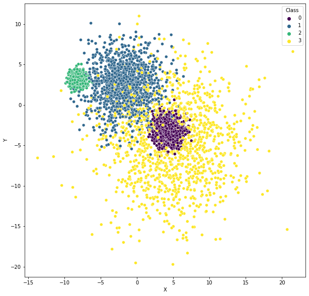
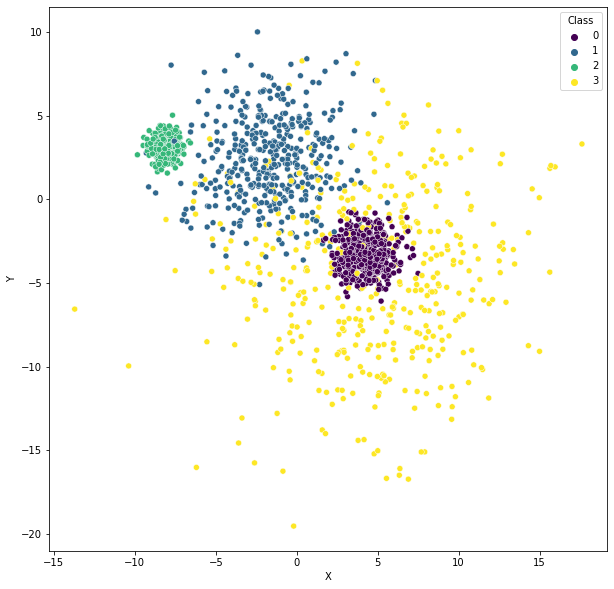
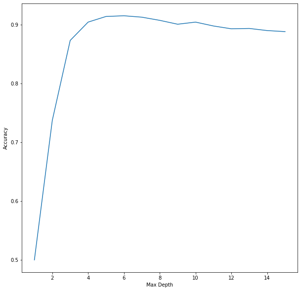
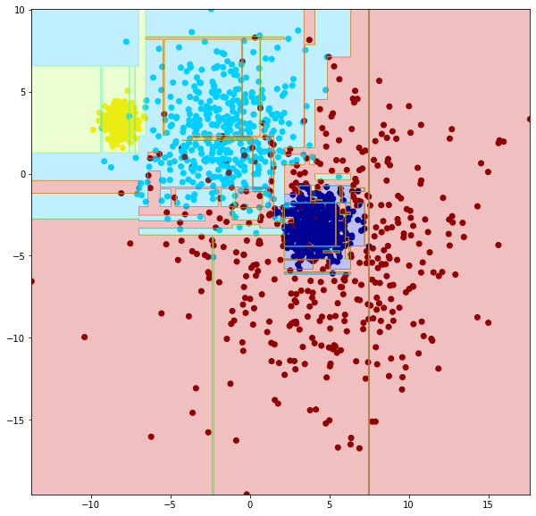
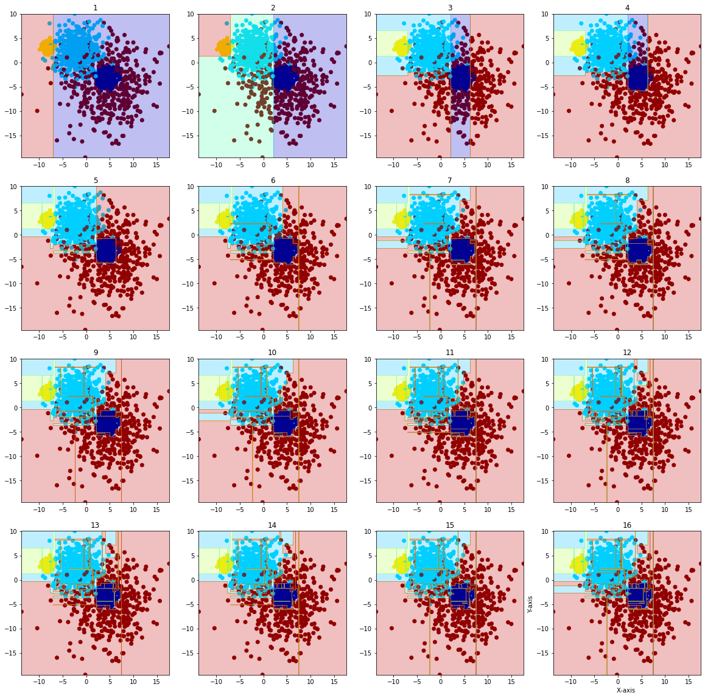
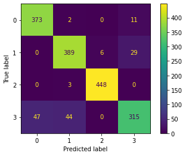
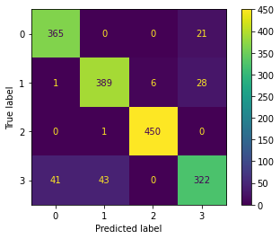
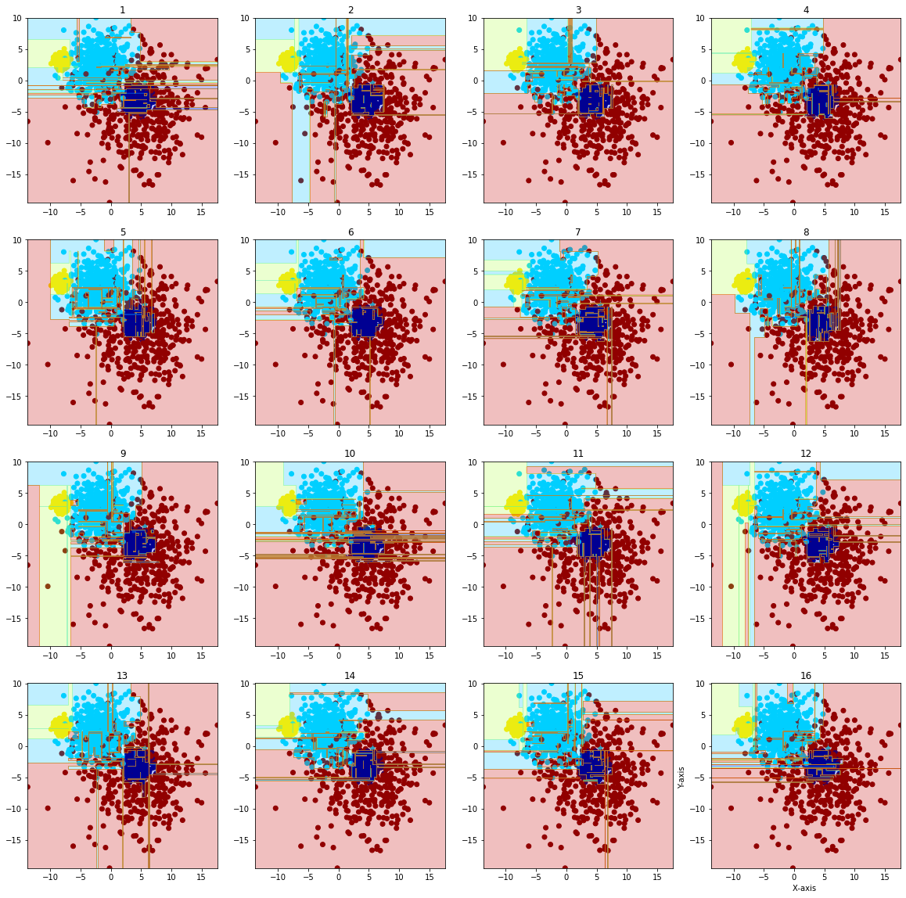

# Decision Trees

Dataset has blobs and spread classes, good to see the boudaries on different depths of the tree.


```python
import pandas as pd

df = pd.read_csv('data.csv')
df.head()
```


<div>
<table border="1" class="dataframe">
  <thead>
    <tr style="text-align: right;">
      <th></th>
      <th>X</th>
      <th>Y</th>
      <th>Class</th>
    </tr>
  </thead>
  <tbody>
    <tr>
      <th>0</th>
      <td>11.971797</td>
      <td>-7.504889</td>
      <td>3</td>
    </tr>
    <tr>
      <th>1</th>
      <td>-8.277160</td>
      <td>3.589366</td>
      <td>2</td>
    </tr>
    <tr>
      <th>2</th>
      <td>6.159895</td>
      <td>-3.174328</td>
      <td>3</td>
    </tr>
    <tr>
      <th>3</th>
      <td>-8.445008</td>
      <td>3.845746</td>
      <td>2</td>
    </tr>
    <tr>
      <th>4</th>
      <td>-8.012580</td>
      <td>2.902211</td>
      <td>2</td>
    </tr>
  </tbody>
</table>
</div>


```python
df.describe()
```


<div>
<table border="1" class="dataframe">
  <thead>
    <tr style="text-align: right;">
      <th></th>
      <th>X</th>
      <th>Y</th>
      <th>Class</th>
    </tr>
  </thead>
  <tbody>
    <tr>
      <th>count</th>
      <td>5000.000000</td>
      <td>5000.000000</td>
      <td>5000.000000</td>
    </tr>
    <tr>
      <th>mean</th>
      <td>-0.178067</td>
      <td>-0.579911</td>
      <td>1.500000</td>
    </tr>
    <tr>
      <th>std</th>
      <td>5.998181</td>
      <td>4.412769</td>
      <td>1.118146</td>
    </tr>
    <tr>
      <th>min</th>
      <td>-13.718486</td>
      <td>-19.716218</td>
      <td>0.000000</td>
    </tr>
    <tr>
      <th>25%</th>
      <td>-7.127540</td>
      <td>-3.457994</td>
      <td>0.750000</td>
    </tr>
    <tr>
      <th>50%</th>
      <td>0.393012</td>
      <td>-0.002115</td>
      <td>1.500000</td>
    </tr>
    <tr>
      <th>75%</th>
      <td>4.487479</td>
      <td>3.094766</td>
      <td>2.250000</td>
    </tr>
    <tr>
      <th>max</th>
      <td>21.494466</td>
      <td>10.981597</td>
      <td>3.000000</td>
    </tr>
  </tbody>
</table>
</div>


```python
import seaborn as sns
import matplotlib.pyplot as plt

plt.figure(figsize = (10, 10))
sns.scatterplot(data=df, x='X', y='Y', hue='Class', palette='viridis')
```


    <AxesSubplot:xlabel='X', ylabel='Y'>


    

    


A different way of splitting, that has more control in case someone needs to perform any operation on the dataset prior to splitting.


```python
import numpy as np

train, test, val = np.split(df.sample(frac=1, random_state=42), [int(.33333 * len(df)), int(.66666 * len(df))])
len(train), len(test), len(val)
```


    (1666, 1667, 1667)


In this case, the split works not only to separate training and test, but also to reduce the amount of data to be used.


```python
plt.figure(figsize = (10, 10))
sns.scatterplot(data=train, x='X', y='Y', hue='Class', palette='viridis')
```


    <AxesSubplot:xlabel='X', ylabel='Y'>


    

    


```python
xTrain = train[['X', 'Y']].values
yTrain = train['Class'].values
xTest = test[['X', 'Y']].values
yTest = test['Class'].values
xVal = val[['X', 'Y']].values
yVal = val['Class'].values

print(xTrain.shape)
```

    (1666, 2)


```python
from sklearn.tree import DecisionTreeClassifier
from sklearn.metrics import accuracy_score

accuracy_scores = []
max_depths = []

for max_depth in range(1, 16):
    model = DecisionTreeClassifier(max_depth=max_depth)
    model.fit(xTrain, yTrain)
    
    test_predictions = model.predict(xTest)
    test_accuracy = accuracy_score(yTest, test_predictions)
    
    max_depths.append(max_depth)
    accuracy_scores.append(test_accuracy)
    
plt.figure(figsize = (10, 10))
ax = sns.lineplot(x=max_depths, y=accuracy_scores)
ax.set(xlabel='Max Depth', ylabel='Accuracy')
print(f'Best accuracy score {max(accuracy_scores)} achieved at max depth {max_depths[np.argmax(accuracy_scores)]}')

dt = DecisionTreeClassifier(max_depth=max_depths[np.argmax(accuracy_scores)])
dt.fit(xTrain, yTrain)
```

    Best accuracy score 0.9154169166166767 achieved at max depth 6


    DecisionTreeClassifier(max_depth=6)


    

    


```python
plt.figure(figsize = (10, 10))

fig, ax = plt.subplots(figsize = (10, 10))

ax.scatter(train['X'], train['Y'], c=yTrain, cmap='jet')

X, Y = np.meshgrid(np.linspace(train['X'].min(), train['X'].max(), 1000), 
                np.linspace(train['Y'].min(), train['Y'].max(), 1000))

# ravel flattens, c_ combines into matrix
Z = model.predict(np.c_[X.ravel(), Y.ravel()])
Z = Z.reshape(X.shape)

ax.contourf(X, Y, Z, cmap='jet', alpha=0.25)
```


    <matplotlib.contour.QuadContourSet at 0x7ff0603043d0>


    <Figure size 720x720 with 0 Axes>


    

    


```python
fig, axs = plt.subplots(4, 4, figsize = (20, 20))
for i in range (1,5):
     for j in range (1,5):
            depth=4*(i-1)+(j-1)+1
            
            model = DecisionTreeClassifier(max_depth=depth)
            model.fit(xTrain, yTrain)

            axs[i-1, j-1].scatter(train['X'], train['Y'], c=yTrain, cmap='jet')

            X, Y = np.meshgrid(np.linspace(train['X'].min(), train['X'].max(), 1000), 
                np.linspace(train['Y'].min(), train['Y'].max(), 1000))

            Z = model.predict(np.c_[X.ravel(), Y.ravel()])
            Z = Z.reshape(X.shape)

            axs[i-1, j-1].contourf(X, Y, Z, cmap='jet', alpha=0.25)
            axs[i-1, j-1].set_title(depth)

            plt.xlabel('X-axis ')
            plt.ylabel('Y-axis ')

plt.show()
```


    

    


```python
from sklearn.tree import export_text

text_representation = export_text(dt)
print(text_representation)
```

    |--- feature_0 <= -6.97
    |   |--- feature_1 <= 1.27
    |   |   |--- feature_1 <= -2.75
    |   |   |   |--- class: 3
    |   |   |--- feature_1 >  -2.75
    |   |   |   |--- feature_1 <= -0.41
    |   |   |   |   |--- feature_1 <= -1.22
    |   |   |   |   |   |--- class: 1
    |   |   |   |   |--- feature_1 >  -1.22
    |   |   |   |   |   |--- class: 3
    |   |   |   |--- feature_1 >  -0.41
    |   |   |   |   |--- class: 1
    |   |--- feature_1 >  1.27
    |   |   |--- feature_1 <= 6.54
    |   |   |   |--- feature_0 <= -9.27
    |   |   |   |   |--- feature_0 <= -9.37
    |   |   |   |   |   |--- class: 2
    |   |   |   |   |--- feature_0 >  -9.37
    |   |   |   |   |   |--- class: 1
    |   |   |   |--- feature_0 >  -9.27
    |   |   |   |   |--- feature_0 <= -7.23
    |   |   |   |   |   |--- feature_0 <= -7.58
    |   |   |   |   |   |   |--- class: 2
    |   |   |   |   |   |--- feature_0 >  -7.58
    |   |   |   |   |   |   |--- class: 2
    |   |   |   |   |--- feature_0 >  -7.23
    |   |   |   |   |   |--- feature_0 <= -7.21
    |   |   |   |   |   |   |--- class: 1
    |   |   |   |   |   |--- feature_0 >  -7.21
    |   |   |   |   |   |   |--- class: 2
    |   |   |--- feature_1 >  6.54
    |   |   |   |--- class: 1
    |--- feature_0 >  -6.97
    |   |--- feature_0 <= 2.17
    |   |   |--- feature_1 <= -2.01
    |   |   |   |--- feature_1 <= -3.72
    |   |   |   |   |--- feature_1 <= -5.17
    |   |   |   |   |   |--- class: 3
    |   |   |   |   |--- feature_1 >  -5.17
    |   |   |   |   |   |--- feature_1 <= -5.08
    |   |   |   |   |   |   |--- class: 1
    |   |   |   |   |   |--- feature_1 >  -5.08
    |   |   |   |   |   |   |--- class: 3
    |   |   |   |--- feature_1 >  -3.72
    |   |   |   |   |--- feature_1 <= -3.33
    |   |   |   |   |   |--- class: 1
    |   |   |   |   |--- feature_1 >  -3.33
    |   |   |   |   |   |--- feature_0 <= 1.58
    |   |   |   |   |   |   |--- class: 3
    |   |   |   |   |   |--- feature_0 >  1.58
    |   |   |   |   |   |   |--- class: 3
    |   |   |--- feature_1 >  -2.01
    |   |   |   |--- feature_1 <= 2.30
    |   |   |   |   |--- feature_0 <= 1.23
    |   |   |   |   |   |--- feature_1 <= 2.20
    |   |   |   |   |   |   |--- class: 1
    |   |   |   |   |   |--- feature_1 >  2.20
    |   |   |   |   |   |   |--- class: 3
    |   |   |   |   |--- feature_0 >  1.23
    |   |   |   |   |   |--- feature_0 <= 1.50
    |   |   |   |   |   |   |--- class: 3
    |   |   |   |   |   |--- feature_0 >  1.50
    |   |   |   |   |   |   |--- class: 1
    |   |   |   |--- feature_1 >  2.30
    |   |   |   |   |--- feature_0 <= -6.57
    |   |   |   |   |   |--- class: 2
    |   |   |   |   |--- feature_0 >  -6.57
    |   |   |   |   |   |--- feature_1 <= 8.18
    |   |   |   |   |   |   |--- class: 1
    |   |   |   |   |   |--- feature_1 >  8.18
    |   |   |   |   |   |   |--- class: 1
    |   |--- feature_0 >  2.17
    |   |   |--- feature_0 <= 6.33
    |   |   |   |--- feature_1 <= -5.82
    |   |   |   |   |--- feature_1 <= -6.13
    |   |   |   |   |   |--- class: 3
    |   |   |   |   |--- feature_1 >  -6.13
    |   |   |   |   |   |--- feature_0 <= 4.90
    |   |   |   |   |   |   |--- class: 3
    |   |   |   |   |   |--- feature_0 >  4.90
    |   |   |   |   |   |   |--- class: 0
    |   |   |   |--- feature_1 >  -5.82
    |   |   |   |   |--- feature_1 <= -0.75
    |   |   |   |   |   |--- feature_1 <= -5.19
    |   |   |   |   |   |   |--- class: 0
    |   |   |   |   |   |--- feature_1 >  -5.19
    |   |   |   |   |   |   |--- class: 0
    |   |   |   |   |--- feature_1 >  -0.75
    |   |   |   |   |   |--- feature_0 <= 4.09
    |   |   |   |   |   |   |--- class: 1
    |   |   |   |   |   |--- feature_0 >  4.09
    |   |   |   |   |   |   |--- class: 3
    |   |   |--- feature_0 >  6.33
    |   |   |   |--- feature_0 <= 7.22
    |   |   |   |   |--- feature_1 <= -1.80
    |   |   |   |   |   |--- feature_1 <= -4.41
    |   |   |   |   |   |   |--- class: 3
    |   |   |   |   |   |--- feature_1 >  -4.41
    |   |   |   |   |   |   |--- class: 0
    |   |   |   |   |--- feature_1 >  -1.80
    |   |   |   |   |   |--- feature_1 <= -0.89
    |   |   |   |   |   |   |--- class: 3
    |   |   |   |   |   |--- feature_1 >  -0.89
    |   |   |   |   |   |   |--- class: 3
    |   |   |   |--- feature_0 >  7.22
    |   |   |   |   |--- feature_0 <= 7.53
    |   |   |   |   |   |--- feature_0 <= 7.48
    |   |   |   |   |   |   |--- class: 3
    |   |   |   |   |   |--- feature_0 >  7.48
    |   |   |   |   |   |   |--- class: 0
    |   |   |   |   |--- feature_0 >  7.53
    |   |   |   |   |   |--- class: 3
    


```python
from sklearn.tree import plot_tree

plt.figure(figsize = (150, 150))

plot_tree(dt, feature_names=df.columns[:-1], class_names=df['Class'].unique().astype('str'), filled=True)
```


    [Text(0.34270833333333334, 0.9285714285714286, 'X <= -6.965\ngini = 0.75\nsamples = 1666\nvalue = [421, 418, 407, 420]\nclass = 3'),
     Text(0.09583333333333334, 0.7857142857142857, 'Y <= 1.269\ngini = 0.056\nsamples = 417\nvalue = [0, 8, 405, 4]\nclass = 1'),
     Text(0.03333333333333333, 0.6428571428571429, 'Y <= -2.748\ngini = 0.5\nsamples = 8\nvalue = [0, 4, 0, 4]\nclass = 2'),
     Text(0.016666666666666666, 0.5, 'gini = 0.0\nsamples = 3\nvalue = [0, 0, 0, 3]\nclass = 0'),
     Text(0.05, 0.5, 'Y <= -0.406\ngini = 0.32\nsamples = 5\nvalue = [0, 4, 0, 1]\nclass = 2'),
     Text(0.03333333333333333, 0.35714285714285715, 'Y <= -1.22\ngini = 0.5\nsamples = 2\nvalue = [0, 1, 0, 1]\nclass = 2'),
     Text(0.016666666666666666, 0.21428571428571427, 'gini = 0.0\nsamples = 1\nvalue = [0, 1, 0, 0]\nclass = 2'),
     Text(0.05, 0.21428571428571427, 'gini = 0.0\nsamples = 1\nvalue = [0, 0, 0, 1]\nclass = 0'),
     Text(0.06666666666666667, 0.35714285714285715, 'gini = 0.0\nsamples = 3\nvalue = [0, 3, 0, 0]\nclass = 2'),
     Text(0.15833333333333333, 0.6428571428571429, 'Y <= 6.537\ngini = 0.019\nsamples = 409\nvalue = [0, 4, 405, 0]\nclass = 1'),
     Text(0.14166666666666666, 0.5, 'X <= -9.274\ngini = 0.015\nsamples = 408\nvalue = [0, 3, 405, 0]\nclass = 1'),
     Text(0.1, 0.35714285714285715, 'X <= -9.373\ngini = 0.375\nsamples = 4\nvalue = [0, 1, 3, 0]\nclass = 1'),
     Text(0.08333333333333333, 0.21428571428571427, 'gini = 0.0\nsamples = 3\nvalue = [0, 0, 3, 0]\nclass = 1'),
     Text(0.11666666666666667, 0.21428571428571427, 'gini = 0.0\nsamples = 1\nvalue = [0, 1, 0, 0]\nclass = 2'),
     Text(0.18333333333333332, 0.35714285714285715, 'X <= -7.233\ngini = 0.01\nsamples = 404\nvalue = [0, 2, 402, 0]\nclass = 1'),
     Text(0.15, 0.21428571428571427, 'X <= -7.576\ngini = 0.005\nsamples = 393\nvalue = [0, 1, 392, 0]\nclass = 1'),
     Text(0.13333333333333333, 0.07142857142857142, 'gini = 0.0\nsamples = 348\nvalue = [0, 0, 348, 0]\nclass = 1'),
     Text(0.16666666666666666, 0.07142857142857142, 'gini = 0.043\nsamples = 45\nvalue = [0, 1, 44, 0]\nclass = 1'),
     Text(0.21666666666666667, 0.21428571428571427, 'X <= -7.212\ngini = 0.165\nsamples = 11\nvalue = [0, 1, 10, 0]\nclass = 1'),
     Text(0.2, 0.07142857142857142, 'gini = 0.0\nsamples = 1\nvalue = [0, 1, 0, 0]\nclass = 2'),
     Text(0.23333333333333334, 0.07142857142857142, 'gini = 0.0\nsamples = 10\nvalue = [0, 0, 10, 0]\nclass = 1'),
     Text(0.175, 0.5, 'gini = 0.0\nsamples = 1\nvalue = [0, 1, 0, 0]\nclass = 2'),
     Text(0.5895833333333333, 0.7857142857142857, 'X <= 2.166\ngini = 0.668\nsamples = 1249\nvalue = [421, 410, 2, 416]\nclass = 3'),
     Text(0.3958333333333333, 0.6428571428571429, 'Y <= -2.013\ngini = 0.372\nsamples = 514\nvalue = [2, 389, 2, 121]\nclass = 2'),
     Text(0.3, 0.5, 'Y <= -3.718\ngini = 0.26\nsamples = 100\nvalue = [2, 13, 0, 85]\nclass = 0'),
     Text(0.26666666666666666, 0.35714285714285715, 'Y <= -5.169\ngini = 0.029\nsamples = 67\nvalue = [0, 1, 0, 66]\nclass = 0'),
     Text(0.25, 0.21428571428571427, 'gini = 0.0\nsamples = 47\nvalue = [0, 0, 0, 47]\nclass = 0'),
     Text(0.2833333333333333, 0.21428571428571427, 'Y <= -5.078\ngini = 0.095\nsamples = 20\nvalue = [0, 1, 0, 19]\nclass = 0'),
     Text(0.26666666666666666, 0.07142857142857142, 'gini = 0.0\nsamples = 1\nvalue = [0, 1, 0, 0]\nclass = 2'),
     Text(0.3, 0.07142857142857142, 'gini = 0.0\nsamples = 19\nvalue = [0, 0, 0, 19]\nclass = 0'),
     Text(0.3333333333333333, 0.35714285714285715, 'Y <= -3.335\ngini = 0.533\nsamples = 33\nvalue = [2, 12, 0, 19]\nclass = 0'),
     Text(0.31666666666666665, 0.21428571428571427, 'gini = 0.0\nsamples = 3\nvalue = [0, 3, 0, 0]\nclass = 2'),
     Text(0.35, 0.21428571428571427, 'X <= 1.581\ngini = 0.504\nsamples = 30\nvalue = [2, 9, 0, 19]\nclass = 0'),
     Text(0.3333333333333333, 0.07142857142857142, 'gini = 0.423\nsamples = 23\nvalue = [0, 7, 0, 16]\nclass = 0'),
     Text(0.36666666666666664, 0.07142857142857142, 'gini = 0.653\nsamples = 7\nvalue = [2, 2, 0, 3]\nclass = 0'),
     Text(0.49166666666666664, 0.5, 'Y <= 2.3\ngini = 0.168\nsamples = 414\nvalue = [0, 376, 2, 36]\nclass = 2'),
     Text(0.45, 0.35714285714285715, 'X <= 1.23\ngini = 0.25\nsamples = 212\nvalue = [0, 181, 0, 31]\nclass = 2'),
     Text(0.4166666666666667, 0.21428571428571427, 'Y <= 2.197\ngini = 0.217\nsamples = 194\nvalue = [0, 170, 0, 24]\nclass = 2'),
     Text(0.4, 0.07142857142857142, 'gini = 0.204\nsamples = 191\nvalue = [0, 169, 0, 22]\nclass = 2'),
     Text(0.43333333333333335, 0.07142857142857142, 'gini = 0.444\nsamples = 3\nvalue = [0, 1, 0, 2]\nclass = 0'),
     Text(0.48333333333333334, 0.21428571428571427, 'X <= 1.503\ngini = 0.475\nsamples = 18\nvalue = [0, 11, 0, 7]\nclass = 2'),
     Text(0.4666666666666667, 0.07142857142857142, 'gini = 0.486\nsamples = 12\nvalue = [0, 5, 0, 7]\nclass = 0'),
     Text(0.5, 0.07142857142857142, 'gini = 0.0\nsamples = 6\nvalue = [0, 6, 0, 0]\nclass = 2'),
     Text(0.5333333333333333, 0.35714285714285715, 'X <= -6.567\ngini = 0.067\nsamples = 202\nvalue = [0, 195, 2, 5]\nclass = 2'),
     Text(0.5166666666666667, 0.21428571428571427, 'gini = 0.0\nsamples = 2\nvalue = [0, 0, 2, 0]\nclass = 1'),
     Text(0.55, 0.21428571428571427, 'Y <= 8.185\ngini = 0.049\nsamples = 200\nvalue = [0, 195, 0, 5]\nclass = 2'),
     Text(0.5333333333333333, 0.07142857142857142, 'gini = 0.04\nsamples = 196\nvalue = [0, 192, 0, 4]\nclass = 2'),
     Text(0.5666666666666667, 0.07142857142857142, 'gini = 0.375\nsamples = 4\nvalue = [0, 3, 0, 1]\nclass = 2'),
     Text(0.7833333333333333, 0.6428571428571429, 'X <= 6.325\ngini = 0.513\nsamples = 735\nvalue = [419, 21, 0, 295]\nclass = 3'),
     Text(0.6583333333333333, 0.5, 'Y <= -5.82\ngini = 0.41\nsamples = 559\nvalue = [409, 21, 0, 129]\nclass = 3'),
     Text(0.6, 0.35714285714285715, 'Y <= -6.128\ngini = 0.03\nsamples = 65\nvalue = [1, 0, 0, 64]\nclass = 0'),
     Text(0.5833333333333334, 0.21428571428571427, 'gini = 0.0\nsamples = 62\nvalue = [0, 0, 0, 62]\nclass = 0'),
     Text(0.6166666666666667, 0.21428571428571427, 'X <= 4.904\ngini = 0.444\nsamples = 3\nvalue = [1, 0, 0, 2]\nclass = 0'),
     Text(0.6, 0.07142857142857142, 'gini = 0.0\nsamples = 2\nvalue = [0, 0, 0, 2]\nclass = 0'),
     Text(0.6333333333333333, 0.07142857142857142, 'gini = 0.0\nsamples = 1\nvalue = [1, 0, 0, 0]\nclass = 3'),
     Text(0.7166666666666667, 0.35714285714285715, 'Y <= -0.746\ngini = 0.299\nsamples = 494\nvalue = [408, 21, 0, 65]\nclass = 3'),
     Text(0.6833333333333333, 0.21428571428571427, 'Y <= -5.186\ngini = 0.157\nsamples = 446\nvalue = [408, 2, 0, 36]\nclass = 3'),
     Text(0.6666666666666666, 0.07142857142857142, 'gini = 0.496\nsamples = 11\nvalue = [6, 0, 0, 5]\nclass = 3'),
     Text(0.7, 0.07142857142857142, 'gini = 0.141\nsamples = 435\nvalue = [402, 2, 0, 31]\nclass = 3'),
     Text(0.75, 0.21428571428571427, 'X <= 4.086\ngini = 0.478\nsamples = 48\nvalue = [0, 19, 0, 29]\nclass = 0'),
     Text(0.7333333333333333, 0.07142857142857142, 'gini = 0.49\nsamples = 28\nvalue = [0, 16, 0, 12]\nclass = 2'),
     Text(0.7666666666666667, 0.07142857142857142, 'gini = 0.255\nsamples = 20\nvalue = [0, 3, 0, 17]\nclass = 0'),
     Text(0.9083333333333333, 0.5, 'X <= 7.216\ngini = 0.107\nsamples = 176\nvalue = [10, 0, 0, 166]\nclass = 0'),
     Text(0.85, 0.35714285714285715, 'Y <= -1.802\ngini = 0.343\nsamples = 41\nvalue = [9, 0, 0, 32]\nclass = 0'),
     Text(0.8166666666666667, 0.21428571428571427, 'Y <= -4.409\ngini = 0.463\nsamples = 22\nvalue = [8, 0, 0, 14]\nclass = 0'),
     Text(0.8, 0.07142857142857142, 'gini = 0.0\nsamples = 13\nvalue = [0, 0, 0, 13]\nclass = 0'),
     Text(0.8333333333333334, 0.07142857142857142, 'gini = 0.198\nsamples = 9\nvalue = [8, 0, 0, 1]\nclass = 3'),
     Text(0.8833333333333333, 0.21428571428571427, 'Y <= -0.886\ngini = 0.1\nsamples = 19\nvalue = [1, 0, 0, 18]\nclass = 0'),
     Text(0.8666666666666667, 0.07142857142857142, 'gini = 0.245\nsamples = 7\nvalue = [1, 0, 0, 6]\nclass = 0'),
     Text(0.9, 0.07142857142857142, 'gini = 0.0\nsamples = 12\nvalue = [0, 0, 0, 12]\nclass = 0'),
     Text(0.9666666666666667, 0.35714285714285715, 'X <= 7.531\ngini = 0.015\nsamples = 135\nvalue = [1, 0, 0, 134]\nclass = 0'),
     Text(0.95, 0.21428571428571427, 'X <= 7.483\ngini = 0.153\nsamples = 12\nvalue = [1, 0, 0, 11]\nclass = 0'),
     Text(0.9333333333333333, 0.07142857142857142, 'gini = 0.0\nsamples = 11\nvalue = [0, 0, 0, 11]\nclass = 0'),
     Text(0.9666666666666667, 0.07142857142857142, 'gini = 0.0\nsamples = 1\nvalue = [1, 0, 0, 0]\nclass = 3'),
     Text(0.9833333333333333, 0.21428571428571427, 'gini = 0.0\nsamples = 123\nvalue = [0, 0, 0, 123]\nclass = 0')]


    

    


```python
plt.figure(figsize = (150, 150))

plot_tree(model, feature_names=df.columns[:-1], class_names=df['Class'].unique().astype('str'), filled=True)
```


    [Text(0.2887106007543103, 0.9705882352941176, 'X <= -6.965\ngini = 0.75\nsamples = 1666\nvalue = [421, 418, 407, 420]\nclass = 3'),
     Text(0.039655172413793106, 0.9117647058823529, 'Y <= 1.269\ngini = 0.056\nsamples = 417\nvalue = [0, 8, 405, 4]\nclass = 1'),
     Text(0.013793103448275862, 0.8529411764705882, 'Y <= -2.748\ngini = 0.5\nsamples = 8\nvalue = [0, 4, 0, 4]\nclass = 2'),
     Text(0.006896551724137931, 0.7941176470588235, 'gini = 0.0\nsamples = 3\nvalue = [0, 0, 0, 3]\nclass = 0'),
     Text(0.020689655172413793, 0.7941176470588235, 'Y <= -0.406\ngini = 0.32\nsamples = 5\nvalue = [0, 4, 0, 1]\nclass = 2'),
     Text(0.013793103448275862, 0.7352941176470589, 'Y <= -1.22\ngini = 0.5\nsamples = 2\nvalue = [0, 1, 0, 1]\nclass = 2'),
     Text(0.006896551724137931, 0.6764705882352942, 'gini = 0.0\nsamples = 1\nvalue = [0, 1, 0, 0]\nclass = 2'),
     Text(0.020689655172413793, 0.6764705882352942, 'gini = 0.0\nsamples = 1\nvalue = [0, 0, 0, 1]\nclass = 0'),
     Text(0.027586206896551724, 0.7352941176470589, 'gini = 0.0\nsamples = 3\nvalue = [0, 3, 0, 0]\nclass = 2'),
     Text(0.06551724137931035, 0.8529411764705882, 'Y <= 6.537\ngini = 0.019\nsamples = 409\nvalue = [0, 4, 405, 0]\nclass = 1'),
     Text(0.05862068965517241, 0.7941176470588235, 'X <= -9.274\ngini = 0.015\nsamples = 408\nvalue = [0, 3, 405, 0]\nclass = 1'),
     Text(0.041379310344827586, 0.7352941176470589, 'X <= -9.373\ngini = 0.375\nsamples = 4\nvalue = [0, 1, 3, 0]\nclass = 1'),
     Text(0.034482758620689655, 0.6764705882352942, 'gini = 0.0\nsamples = 3\nvalue = [0, 0, 3, 0]\nclass = 1'),
     Text(0.04827586206896552, 0.6764705882352942, 'gini = 0.0\nsamples = 1\nvalue = [0, 1, 0, 0]\nclass = 2'),
     Text(0.07586206896551724, 0.7352941176470589, 'X <= -7.233\ngini = 0.01\nsamples = 404\nvalue = [0, 2, 402, 0]\nclass = 1'),
     Text(0.06206896551724138, 0.6764705882352942, 'X <= -7.576\ngini = 0.005\nsamples = 393\nvalue = [0, 1, 392, 0]\nclass = 1'),
     Text(0.05517241379310345, 0.6176470588235294, 'gini = 0.0\nsamples = 348\nvalue = [0, 0, 348, 0]\nclass = 1'),
     Text(0.06896551724137931, 0.6176470588235294, 'X <= -7.557\ngini = 0.043\nsamples = 45\nvalue = [0, 1, 44, 0]\nclass = 1'),
     Text(0.06206896551724138, 0.5588235294117647, 'gini = 0.0\nsamples = 1\nvalue = [0, 1, 0, 0]\nclass = 2'),
     Text(0.07586206896551724, 0.5588235294117647, 'gini = 0.0\nsamples = 44\nvalue = [0, 0, 44, 0]\nclass = 1'),
     Text(0.0896551724137931, 0.6764705882352942, 'X <= -7.212\ngini = 0.165\nsamples = 11\nvalue = [0, 1, 10, 0]\nclass = 1'),
     Text(0.08275862068965517, 0.6176470588235294, 'gini = 0.0\nsamples = 1\nvalue = [0, 1, 0, 0]\nclass = 2'),
     Text(0.09655172413793103, 0.6176470588235294, 'gini = 0.0\nsamples = 10\nvalue = [0, 0, 10, 0]\nclass = 1'),
     Text(0.07241379310344828, 0.7941176470588235, 'gini = 0.0\nsamples = 1\nvalue = [0, 1, 0, 0]\nclass = 2'),
     Text(0.5377660290948276, 0.9117647058823529, 'X <= 2.166\ngini = 0.668\nsamples = 1249\nvalue = [421, 410, 2, 416]\nclass = 3'),
     Text(0.2765625, 0.8529411764705882, 'Y <= -2.013\ngini = 0.372\nsamples = 514\nvalue = [2, 389, 2, 121]\nclass = 2'),
     Text(0.1396551724137931, 0.7941176470588235, 'Y <= -3.718\ngini = 0.26\nsamples = 100\nvalue = [2, 13, 0, 85]\nclass = 0'),
     Text(0.12413793103448276, 0.7352941176470589, 'X <= -2.285\ngini = 0.029\nsamples = 67\nvalue = [0, 1, 0, 66]\nclass = 0'),
     Text(0.11724137931034483, 0.6764705882352942, 'X <= -2.334\ngini = 0.095\nsamples = 20\nvalue = [0, 1, 0, 19]\nclass = 0'),
     Text(0.1103448275862069, 0.6176470588235294, 'gini = 0.0\nsamples = 19\nvalue = [0, 0, 0, 19]\nclass = 0'),
     Text(0.12413793103448276, 0.6176470588235294, 'gini = 0.0\nsamples = 1\nvalue = [0, 1, 0, 0]\nclass = 2'),
     Text(0.1310344827586207, 0.6764705882352942, 'gini = 0.0\nsamples = 47\nvalue = [0, 0, 0, 47]\nclass = 0'),
     Text(0.15517241379310345, 0.7352941176470589, 'Y <= -3.335\ngini = 0.533\nsamples = 33\nvalue = [2, 12, 0, 19]\nclass = 0'),
     Text(0.1482758620689655, 0.6764705882352942, 'gini = 0.0\nsamples = 3\nvalue = [0, 3, 0, 0]\nclass = 2'),
     Text(0.16206896551724137, 0.6764705882352942, 'X <= 1.581\ngini = 0.504\nsamples = 30\nvalue = [2, 9, 0, 19]\nclass = 0'),
     Text(0.13793103448275862, 0.6176470588235294, 'X <= 0.63\ngini = 0.423\nsamples = 23\nvalue = [0, 7, 0, 16]\nclass = 0'),
     Text(0.1310344827586207, 0.5588235294117647, 'X <= -1.106\ngini = 0.484\nsamples = 17\nvalue = [0, 7, 0, 10]\nclass = 0'),
     Text(0.11724137931034483, 0.5, 'X <= -2.829\ngini = 0.32\nsamples = 10\nvalue = [0, 2, 0, 8]\nclass = 0'),
     Text(0.1103448275862069, 0.4411764705882353, 'Y <= -2.551\ngini = 0.48\nsamples = 5\nvalue = [0, 2, 0, 3]\nclass = 0'),
     Text(0.10344827586206896, 0.38235294117647056, 'Y <= -2.861\ngini = 0.444\nsamples = 3\nvalue = [0, 2, 0, 1]\nclass = 2'),
     Text(0.09655172413793103, 0.3235294117647059, 'gini = 0.0\nsamples = 1\nvalue = [0, 0, 0, 1]\nclass = 0'),
     Text(0.1103448275862069, 0.3235294117647059, 'gini = 0.0\nsamples = 2\nvalue = [0, 2, 0, 0]\nclass = 2'),
     Text(0.11724137931034483, 0.38235294117647056, 'gini = 0.0\nsamples = 2\nvalue = [0, 0, 0, 2]\nclass = 0'),
     Text(0.12413793103448276, 0.4411764705882353, 'gini = 0.0\nsamples = 5\nvalue = [0, 0, 0, 5]\nclass = 0'),
     Text(0.14482758620689656, 0.5, 'Y <= -2.051\ngini = 0.408\nsamples = 7\nvalue = [0, 5, 0, 2]\nclass = 2'),
     Text(0.13793103448275862, 0.4411764705882353, 'Y <= -2.83\ngini = 0.278\nsamples = 6\nvalue = [0, 5, 0, 1]\nclass = 2'),
     Text(0.1310344827586207, 0.38235294117647056, 'Y <= -3.14\ngini = 0.5\nsamples = 2\nvalue = [0, 1, 0, 1]\nclass = 2'),
     Text(0.12413793103448276, 0.3235294117647059, 'gini = 0.0\nsamples = 1\nvalue = [0, 1, 0, 0]\nclass = 2'),
     Text(0.13793103448275862, 0.3235294117647059, 'gini = 0.0\nsamples = 1\nvalue = [0, 0, 0, 1]\nclass = 0'),
     Text(0.14482758620689656, 0.38235294117647056, 'gini = 0.0\nsamples = 4\nvalue = [0, 4, 0, 0]\nclass = 2'),
     Text(0.15172413793103448, 0.4411764705882353, 'gini = 0.0\nsamples = 1\nvalue = [0, 0, 0, 1]\nclass = 0'),
     Text(0.14482758620689656, 0.5588235294117647, 'gini = 0.0\nsamples = 6\nvalue = [0, 0, 0, 6]\nclass = 0'),
     Text(0.18620689655172415, 0.6176470588235294, 'X <= 2.065\ngini = 0.653\nsamples = 7\nvalue = [2, 2, 0, 3]\nclass = 0'),
     Text(0.1793103448275862, 0.5588235294117647, 'Y <= -2.544\ngini = 0.64\nsamples = 5\nvalue = [2, 2, 0, 1]\nclass = 3'),
     Text(0.1724137931034483, 0.5, 'Y <= -2.943\ngini = 0.444\nsamples = 3\nvalue = [0, 2, 0, 1]\nclass = 2'),
     Text(0.16551724137931034, 0.4411764705882353, 'gini = 0.0\nsamples = 1\nvalue = [0, 0, 0, 1]\nclass = 0'),
     Text(0.1793103448275862, 0.4411764705882353, 'gini = 0.0\nsamples = 2\nvalue = [0, 2, 0, 0]\nclass = 2'),
     Text(0.18620689655172415, 0.5, 'gini = 0.0\nsamples = 2\nvalue = [2, 0, 0, 0]\nclass = 3'),
     Text(0.19310344827586207, 0.5588235294117647, 'gini = 0.0\nsamples = 2\nvalue = [0, 0, 0, 2]\nclass = 0'),
     Text(0.4134698275862069, 0.7941176470588235, 'Y <= 2.3\ngini = 0.168\nsamples = 414\nvalue = [0, 376, 2, 36]\nclass = 2'),
     Text(0.3579741379310345, 0.7352941176470589, 'X <= 1.23\ngini = 0.25\nsamples = 212\nvalue = [0, 181, 0, 31]\nclass = 2'),
     Text(0.2987068965517241, 0.6764705882352942, 'Y <= 2.197\ngini = 0.217\nsamples = 194\nvalue = [0, 170, 0, 24]\nclass = 2'),
     Text(0.26120689655172413, 0.6176470588235294, 'X <= -5.62\ngini = 0.204\nsamples = 191\nvalue = [0, 169, 0, 22]\nclass = 2'),
     Text(0.20689655172413793, 0.5588235294117647, 'X <= -6.402\ngini = 0.426\nsamples = 13\nvalue = [0, 9, 0, 4]\nclass = 2'),
     Text(0.2, 0.5, 'gini = 0.0\nsamples = 5\nvalue = [0, 5, 0, 0]\nclass = 2'),
     Text(0.21379310344827587, 0.5, 'Y <= 0.152\ngini = 0.5\nsamples = 8\nvalue = [0, 4, 0, 4]\nclass = 2'),
     Text(0.20689655172413793, 0.4411764705882353, 'gini = 0.0\nsamples = 2\nvalue = [0, 0, 0, 2]\nclass = 0'),
     Text(0.2206896551724138, 0.4411764705882353, 'Y <= 0.916\ngini = 0.444\nsamples = 6\nvalue = [0, 4, 0, 2]\nclass = 2'),
     Text(0.21379310344827587, 0.38235294117647056, 'gini = 0.0\nsamples = 3\nvalue = [0, 3, 0, 0]\nclass = 2'),
     Text(0.22758620689655173, 0.38235294117647056, 'Y <= 1.298\ngini = 0.444\nsamples = 3\nvalue = [0, 1, 0, 2]\nclass = 0'),
     Text(0.2206896551724138, 0.3235294117647059, 'gini = 0.0\nsamples = 2\nvalue = [0, 0, 0, 2]\nclass = 0'),
     Text(0.23448275862068965, 0.3235294117647059, 'gini = 0.0\nsamples = 1\nvalue = [0, 1, 0, 0]\nclass = 2'),
     Text(0.31551724137931036, 0.5588235294117647, 'Y <= -0.821\ngini = 0.182\nsamples = 178\nvalue = [0, 160, 0, 18]\nclass = 2'),
     Text(0.27586206896551724, 0.5, 'Y <= -0.904\ngini = 0.346\nsamples = 27\nvalue = [0, 21, 0, 6]\nclass = 2'),
     Text(0.2689655172413793, 0.4411764705882353, 'X <= -2.005\ngini = 0.311\nsamples = 26\nvalue = [0, 21, 0, 5]\nclass = 2'),
     Text(0.25517241379310346, 0.38235294117647056, 'X <= -4.65\ngini = 0.153\nsamples = 12\nvalue = [0, 11, 0, 1]\nclass = 2'),
     Text(0.2482758620689655, 0.3235294117647059, 'X <= -4.952\ngini = 0.444\nsamples = 3\nvalue = [0, 2, 0, 1]\nclass = 2'),
     Text(0.2413793103448276, 0.2647058823529412, 'gini = 0.0\nsamples = 2\nvalue = [0, 2, 0, 0]\nclass = 2'),
     Text(0.25517241379310346, 0.2647058823529412, 'gini = 0.0\nsamples = 1\nvalue = [0, 0, 0, 1]\nclass = 0'),
     Text(0.2620689655172414, 0.3235294117647059, 'gini = 0.0\nsamples = 9\nvalue = [0, 9, 0, 0]\nclass = 2'),
     Text(0.2827586206896552, 0.38235294117647056, 'X <= -1.799\ngini = 0.408\nsamples = 14\nvalue = [0, 10, 0, 4]\nclass = 2'),
     Text(0.27586206896551724, 0.3235294117647059, 'gini = 0.0\nsamples = 1\nvalue = [0, 0, 0, 1]\nclass = 0'),
     Text(0.2896551724137931, 0.3235294117647059, 'X <= -0.928\ngini = 0.355\nsamples = 13\nvalue = [0, 10, 0, 3]\nclass = 2'),
     Text(0.2827586206896552, 0.2647058823529412, 'gini = 0.0\nsamples = 3\nvalue = [0, 3, 0, 0]\nclass = 2'),
     Text(0.296551724137931, 0.2647058823529412, 'X <= -0.733\ngini = 0.42\nsamples = 10\nvalue = [0, 7, 0, 3]\nclass = 2'),
     Text(0.2896551724137931, 0.20588235294117646, 'gini = 0.0\nsamples = 1\nvalue = [0, 0, 0, 1]\nclass = 0'),
     Text(0.30344827586206896, 0.20588235294117646, 'X <= 0.818\ngini = 0.346\nsamples = 9\nvalue = [0, 7, 0, 2]\nclass = 2'),
     Text(0.296551724137931, 0.14705882352941177, 'Y <= -1.067\ngini = 0.444\nsamples = 6\nvalue = [0, 4, 0, 2]\nclass = 2'),
     Text(0.2896551724137931, 0.08823529411764706, 'X <= -0.255\ngini = 0.444\nsamples = 3\nvalue = [0, 1, 0, 2]\nclass = 0'),
     Text(0.2827586206896552, 0.029411764705882353, 'gini = 0.0\nsamples = 1\nvalue = [0, 1, 0, 0]\nclass = 2'),
     Text(0.296551724137931, 0.029411764705882353, 'gini = 0.0\nsamples = 2\nvalue = [0, 0, 0, 2]\nclass = 0'),
     Text(0.30344827586206896, 0.08823529411764706, 'gini = 0.0\nsamples = 3\nvalue = [0, 3, 0, 0]\nclass = 2'),
     Text(0.3103448275862069, 0.14705882352941177, 'gini = 0.0\nsamples = 3\nvalue = [0, 3, 0, 0]\nclass = 2'),
     Text(0.2827586206896552, 0.4411764705882353, 'gini = 0.0\nsamples = 1\nvalue = [0, 0, 0, 1]\nclass = 0'),
     Text(0.35517241379310344, 0.5, 'X <= -4.277\ngini = 0.146\nsamples = 151\nvalue = [0, 139, 0, 12]\nclass = 2'),
     Text(0.3482758620689655, 0.4411764705882353, 'gini = 0.0\nsamples = 14\nvalue = [0, 14, 0, 0]\nclass = 2'),
     Text(0.3620689655172414, 0.4411764705882353, 'X <= -4.269\ngini = 0.16\nsamples = 137\nvalue = [0, 125, 0, 12]\nclass = 2'),
     Text(0.35517241379310344, 0.38235294117647056, 'gini = 0.0\nsamples = 1\nvalue = [0, 0, 0, 1]\nclass = 0'),
     Text(0.3689655172413793, 0.38235294117647056, 'X <= 0.326\ngini = 0.149\nsamples = 136\nvalue = [0, 125, 0, 11]\nclass = 2'),
     Text(0.3620689655172414, 0.3235294117647059, 'X <= 0.306\ngini = 0.164\nsamples = 122\nvalue = [0, 111, 0, 11]\nclass = 2'),
     Text(0.35517241379310344, 0.2647058823529412, 'X <= 0.165\ngini = 0.152\nsamples = 121\nvalue = [0, 111, 0, 10]\nclass = 2'),
     Text(0.33793103448275863, 0.20588235294117646, 'Y <= 2.032\ngini = 0.141\nsamples = 118\nvalue = [0, 109, 0, 9]\nclass = 2'),
     Text(0.32413793103448274, 0.14705882352941177, 'Y <= 1.422\ngini = 0.123\nsamples = 106\nvalue = [0, 99, 0, 7]\nclass = 2'),
     Text(0.31724137931034485, 0.08823529411764706, 'Y <= 1.39\ngini = 0.163\nsamples = 78\nvalue = [0, 71, 0, 7]\nclass = 2'),
     Text(0.3103448275862069, 0.029411764705882353, 'gini = 0.144\nsamples = 77\nvalue = [0, 71, 0, 6]\nclass = 2'),
     Text(0.32413793103448274, 0.029411764705882353, 'gini = 0.0\nsamples = 1\nvalue = [0, 0, 0, 1]\nclass = 0'),
     Text(0.3310344827586207, 0.08823529411764706, 'gini = 0.0\nsamples = 28\nvalue = [0, 28, 0, 0]\nclass = 2'),
     Text(0.35172413793103446, 0.14705882352941177, 'Y <= 2.051\ngini = 0.278\nsamples = 12\nvalue = [0, 10, 0, 2]\nclass = 2'),
     Text(0.3448275862068966, 0.08823529411764706, 'gini = 0.0\nsamples = 1\nvalue = [0, 0, 0, 1]\nclass = 0'),
     Text(0.3586206896551724, 0.08823529411764706, 'Y <= 2.093\ngini = 0.165\nsamples = 11\nvalue = [0, 10, 0, 1]\nclass = 2'),
     Text(0.35172413793103446, 0.029411764705882353, 'gini = 0.444\nsamples = 3\nvalue = [0, 2, 0, 1]\nclass = 2'),
     Text(0.36551724137931035, 0.029411764705882353, 'gini = 0.0\nsamples = 8\nvalue = [0, 8, 0, 0]\nclass = 2'),
     Text(0.3724137931034483, 0.20588235294117646, 'X <= 0.228\ngini = 0.444\nsamples = 3\nvalue = [0, 2, 0, 1]\nclass = 2'),
     Text(0.36551724137931035, 0.14705882352941177, 'gini = 0.0\nsamples = 1\nvalue = [0, 0, 0, 1]\nclass = 0'),
     Text(0.3793103448275862, 0.14705882352941177, 'gini = 0.0\nsamples = 2\nvalue = [0, 2, 0, 0]\nclass = 2'),
     Text(0.3689655172413793, 0.2647058823529412, 'gini = 0.0\nsamples = 1\nvalue = [0, 0, 0, 1]\nclass = 0'),
     Text(0.3758620689655172, 0.3235294117647059, 'gini = 0.0\nsamples = 14\nvalue = [0, 14, 0, 0]\nclass = 2'),
     Text(0.33620689655172414, 0.6176470588235294, 'X <= -3.732\ngini = 0.444\nsamples = 3\nvalue = [0, 1, 0, 2]\nclass = 0'),
     Text(0.3293103448275862, 0.5588235294117647, 'gini = 0.0\nsamples = 1\nvalue = [0, 1, 0, 0]\nclass = 2'),
     Text(0.3431034482758621, 0.5588235294117647, 'gini = 0.0\nsamples = 2\nvalue = [0, 0, 0, 2]\nclass = 0'),
     Text(0.41724137931034483, 0.6764705882352942, 'X <= 1.503\ngini = 0.475\nsamples = 18\nvalue = [0, 11, 0, 7]\nclass = 2'),
     Text(0.4103448275862069, 0.6176470588235294, 'Y <= -0.205\ngini = 0.486\nsamples = 12\nvalue = [0, 5, 0, 7]\nclass = 0'),
     Text(0.40344827586206894, 0.5588235294117647, 'gini = 0.0\nsamples = 3\nvalue = [0, 0, 0, 3]\nclass = 0'),
     Text(0.41724137931034483, 0.5588235294117647, 'X <= 1.482\ngini = 0.494\nsamples = 9\nvalue = [0, 5, 0, 4]\nclass = 2'),
     Text(0.4103448275862069, 0.5, 'Y <= 1.595\ngini = 0.408\nsamples = 7\nvalue = [0, 5, 0, 2]\nclass = 2'),
     Text(0.40344827586206894, 0.4411764705882353, 'X <= 1.362\ngini = 0.278\nsamples = 6\nvalue = [0, 5, 0, 1]\nclass = 2'),
     Text(0.39655172413793105, 0.38235294117647056, 'X <= 1.309\ngini = 0.444\nsamples = 3\nvalue = [0, 2, 0, 1]\nclass = 2'),
     Text(0.3896551724137931, 0.3235294117647059, 'gini = 0.0\nsamples = 2\nvalue = [0, 2, 0, 0]\nclass = 2'),
     Text(0.40344827586206894, 0.3235294117647059, 'gini = 0.0\nsamples = 1\nvalue = [0, 0, 0, 1]\nclass = 0'),
     Text(0.4103448275862069, 0.38235294117647056, 'gini = 0.0\nsamples = 3\nvalue = [0, 3, 0, 0]\nclass = 2'),
     Text(0.41724137931034483, 0.4411764705882353, 'gini = 0.0\nsamples = 1\nvalue = [0, 0, 0, 1]\nclass = 0'),
     Text(0.4241379310344828, 0.5, 'gini = 0.0\nsamples = 2\nvalue = [0, 0, 0, 2]\nclass = 0'),
     Text(0.4241379310344828, 0.6176470588235294, 'gini = 0.0\nsamples = 6\nvalue = [0, 6, 0, 0]\nclass = 2'),
     Text(0.4689655172413793, 0.7352941176470589, 'X <= -6.567\ngini = 0.067\nsamples = 202\nvalue = [0, 195, 2, 5]\nclass = 2'),
     Text(0.46206896551724136, 0.6764705882352942, 'gini = 0.0\nsamples = 2\nvalue = [0, 0, 2, 0]\nclass = 1'),
     Text(0.47586206896551725, 0.6764705882352942, 'Y <= 8.185\ngini = 0.049\nsamples = 200\nvalue = [0, 195, 0, 5]\nclass = 2'),
     Text(0.4586206896551724, 0.6176470588235294, 'X <= -0.489\ngini = 0.04\nsamples = 196\nvalue = [0, 192, 0, 4]\nclass = 2'),
     Text(0.44482758620689655, 0.5588235294117647, 'X <= -5.345\ngini = 0.014\nsamples = 143\nvalue = [0, 142, 0, 1]\nclass = 2'),
     Text(0.4379310344827586, 0.5, 'X <= -5.442\ngini = 0.198\nsamples = 9\nvalue = [0, 8, 0, 1]\nclass = 2'),
     Text(0.43103448275862066, 0.4411764705882353, 'gini = 0.0\nsamples = 8\nvalue = [0, 8, 0, 0]\nclass = 2'),
     Text(0.44482758620689655, 0.4411764705882353, 'gini = 0.0\nsamples = 1\nvalue = [0, 0, 0, 1]\nclass = 0'),
     Text(0.4517241379310345, 0.5, 'gini = 0.0\nsamples = 134\nvalue = [0, 134, 0, 0]\nclass = 2'),
     Text(0.4724137931034483, 0.5588235294117647, 'X <= -0.428\ngini = 0.107\nsamples = 53\nvalue = [0, 50, 0, 3]\nclass = 2'),
     Text(0.46551724137931033, 0.5, 'gini = 0.0\nsamples = 1\nvalue = [0, 0, 0, 1]\nclass = 0'),
     Text(0.4793103448275862, 0.5, 'X <= 0.646\ngini = 0.074\nsamples = 52\nvalue = [0, 50, 0, 2]\nclass = 2'),
     Text(0.4724137931034483, 0.4411764705882353, 'gini = 0.0\nsamples = 25\nvalue = [0, 25, 0, 0]\nclass = 2'),
     Text(0.4862068965517241, 0.4411764705882353, 'X <= 0.701\ngini = 0.137\nsamples = 27\nvalue = [0, 25, 0, 2]\nclass = 2'),
     Text(0.4793103448275862, 0.38235294117647056, 'gini = 0.0\nsamples = 1\nvalue = [0, 0, 0, 1]\nclass = 0'),
     Text(0.49310344827586206, 0.38235294117647056, 'X <= 0.916\ngini = 0.074\nsamples = 26\nvalue = [0, 25, 0, 1]\nclass = 2'),
     Text(0.4862068965517241, 0.3235294117647059, 'X <= 0.866\ngini = 0.32\nsamples = 5\nvalue = [0, 4, 0, 1]\nclass = 2'),
     Text(0.4793103448275862, 0.2647058823529412, 'gini = 0.0\nsamples = 4\nvalue = [0, 4, 0, 0]\nclass = 2'),
     Text(0.49310344827586206, 0.2647058823529412, 'gini = 0.0\nsamples = 1\nvalue = [0, 0, 0, 1]\nclass = 0'),
     Text(0.5, 0.3235294117647059, 'gini = 0.0\nsamples = 21\nvalue = [0, 21, 0, 0]\nclass = 2'),
     Text(0.49310344827586206, 0.6176470588235294, 'Y <= 8.348\ngini = 0.375\nsamples = 4\nvalue = [0, 3, 0, 1]\nclass = 2'),
     Text(0.4862068965517241, 0.5588235294117647, 'gini = 0.0\nsamples = 1\nvalue = [0, 0, 0, 1]\nclass = 0'),
     Text(0.5, 0.5588235294117647, 'gini = 0.0\nsamples = 3\nvalue = [0, 3, 0, 0]\nclass = 2'),
     Text(0.7989695581896552, 0.8529411764705882, 'X <= 6.325\ngini = 0.513\nsamples = 735\nvalue = [419, 21, 0, 295]\nclass = 3'),
     Text(0.635870150862069, 0.7941176470588235, 'Y <= -5.82\ngini = 0.41\nsamples = 559\nvalue = [409, 21, 0, 129]\nclass = 3'),
     Text(0.5254310344827586, 0.7352941176470589, 'Y <= -6.128\ngini = 0.03\nsamples = 65\nvalue = [1, 0, 0, 64]\nclass = 0'),
     Text(0.5185344827586207, 0.6764705882352942, 'gini = 0.0\nsamples = 62\nvalue = [0, 0, 0, 62]\nclass = 0'),
     Text(0.5323275862068966, 0.6764705882352942, 'Y <= -5.986\ngini = 0.444\nsamples = 3\nvalue = [1, 0, 0, 2]\nclass = 0'),
     Text(0.5254310344827586, 0.6176470588235294, 'gini = 0.0\nsamples = 1\nvalue = [1, 0, 0, 0]\nclass = 3'),
     Text(0.5392241379310345, 0.6176470588235294, 'gini = 0.0\nsamples = 2\nvalue = [0, 0, 0, 2]\nclass = 0'),
     Text(0.7463092672413794, 0.7352941176470589, 'Y <= -0.746\ngini = 0.299\nsamples = 494\nvalue = [408, 21, 0, 65]\nclass = 3'),
     Text(0.6236530172413793, 0.6764705882352942, 'Y <= -5.186\ngini = 0.157\nsamples = 446\nvalue = [408, 2, 0, 36]\nclass = 3'),
     Text(0.5530172413793103, 0.6176470588235294, 'X <= 5.03\ngini = 0.496\nsamples = 11\nvalue = [6, 0, 0, 5]\nclass = 3'),
     Text(0.5461206896551725, 0.5588235294117647, 'X <= 3.985\ngini = 0.469\nsamples = 8\nvalue = [3, 0, 0, 5]\nclass = 0'),
     Text(0.5392241379310345, 0.5, 'Y <= -5.3\ngini = 0.375\nsamples = 4\nvalue = [3, 0, 0, 1]\nclass = 3'),
     Text(0.5323275862068966, 0.4411764705882353, 'gini = 0.0\nsamples = 3\nvalue = [3, 0, 0, 0]\nclass = 3'),
     Text(0.5461206896551725, 0.4411764705882353, 'gini = 0.0\nsamples = 1\nvalue = [0, 0, 0, 1]\nclass = 0'),
     Text(0.5530172413793103, 0.5, 'gini = 0.0\nsamples = 4\nvalue = [0, 0, 0, 4]\nclass = 0'),
     Text(0.5599137931034482, 0.5588235294117647, 'gini = 0.0\nsamples = 3\nvalue = [3, 0, 0, 0]\nclass = 3'),
     Text(0.6942887931034483, 0.6176470588235294, 'Y <= -1.81\ngini = 0.141\nsamples = 435\nvalue = [402, 2, 0, 31]\nclass = 3'),
     Text(0.6265086206896552, 0.5588235294117647, 'X <= 2.172\ngini = 0.106\nsamples = 394\nvalue = [372, 1, 0, 21]\nclass = 3'),
     Text(0.6196120689655172, 0.5, 'gini = 0.0\nsamples = 1\nvalue = [0, 0, 0, 1]\nclass = 0'),
     Text(0.6334051724137931, 0.5, 'X <= 5.658\ngini = 0.101\nsamples = 393\nvalue = [372, 1, 0, 20]\nclass = 3'),
     Text(0.5599137931034482, 0.4411764705882353, 'Y <= -4.413\ngini = 0.083\nsamples = 370\nvalue = [354, 1, 0, 15]\nclass = 3'),
     Text(0.5206896551724138, 0.38235294117647056, 'Y <= -4.427\ngini = 0.18\nsamples = 40\nvalue = [36, 0, 0, 4]\nclass = 3'),
     Text(0.5137931034482759, 0.3235294117647059, 'Y <= -4.69\ngini = 0.142\nsamples = 39\nvalue = [36, 0, 0, 3]\nclass = 3'),
     Text(0.506896551724138, 0.2647058823529412, 'Y <= -4.694\ngini = 0.204\nsamples = 26\nvalue = [23, 0, 0, 3]\nclass = 3'),
     Text(0.5, 0.20588235294117646, 'Y <= -4.802\ngini = 0.147\nsamples = 25\nvalue = [23, 0, 0, 2]\nclass = 3'),
     Text(0.4862068965517241, 0.14705882352941177, 'Y <= -4.903\ngini = 0.087\nsamples = 22\nvalue = [21, 0, 0, 1]\nclass = 3'),
     Text(0.4793103448275862, 0.08823529411764706, 'gini = 0.0\nsamples = 12\nvalue = [12, 0, 0, 0]\nclass = 3'),
     Text(0.49310344827586206, 0.08823529411764706, 'Y <= -4.866\ngini = 0.18\nsamples = 10\nvalue = [9, 0, 0, 1]\nclass = 3'),
     Text(0.4862068965517241, 0.029411764705882353, 'gini = 0.0\nsamples = 1\nvalue = [0, 0, 0, 1]\nclass = 0'),
     Text(0.5, 0.029411764705882353, 'gini = 0.0\nsamples = 9\nvalue = [9, 0, 0, 0]\nclass = 3'),
     Text(0.5137931034482759, 0.14705882352941177, 'X <= 4.626\ngini = 0.444\nsamples = 3\nvalue = [2, 0, 0, 1]\nclass = 3'),
     Text(0.506896551724138, 0.08823529411764706, 'gini = 0.0\nsamples = 2\nvalue = [2, 0, 0, 0]\nclass = 3'),
     Text(0.5206896551724138, 0.08823529411764706, 'gini = 0.0\nsamples = 1\nvalue = [0, 0, 0, 1]\nclass = 0'),
     Text(0.5137931034482759, 0.20588235294117646, 'gini = 0.0\nsamples = 1\nvalue = [0, 0, 0, 1]\nclass = 0'),
     Text(0.5206896551724138, 0.2647058823529412, 'gini = 0.0\nsamples = 13\nvalue = [13, 0, 0, 0]\nclass = 3'),
     Text(0.5275862068965518, 0.3235294117647059, 'gini = 0.0\nsamples = 1\nvalue = [0, 0, 0, 1]\nclass = 0'),
     Text(0.5991379310344828, 0.38235294117647056, 'X <= 2.764\ngini = 0.07\nsamples = 330\nvalue = [318, 1, 0, 11]\nclass = 3'),
     Text(0.5551724137931034, 0.3235294117647059, 'X <= 2.749\ngini = 0.226\nsamples = 24\nvalue = [21, 1, 0, 2]\nclass = 3'),
     Text(0.5482758620689655, 0.2647058823529412, 'Y <= -2.077\ngini = 0.163\nsamples = 23\nvalue = [21, 1, 0, 1]\nclass = 3'),
     Text(0.5344827586206896, 0.20588235294117646, 'Y <= -2.97\ngini = 0.091\nsamples = 21\nvalue = [20, 0, 0, 1]\nclass = 3'),
     Text(0.5275862068965518, 0.14705882352941177, 'gini = 0.0\nsamples = 15\nvalue = [15, 0, 0, 0]\nclass = 3'),
     Text(0.5413793103448276, 0.14705882352941177, 'Y <= -2.701\ngini = 0.278\nsamples = 6\nvalue = [5, 0, 0, 1]\nclass = 3'),
     Text(0.5344827586206896, 0.08823529411764706, 'gini = 0.0\nsamples = 1\nvalue = [0, 0, 0, 1]\nclass = 0'),
     Text(0.5482758620689655, 0.08823529411764706, 'gini = 0.0\nsamples = 5\nvalue = [5, 0, 0, 0]\nclass = 3'),
     Text(0.5620689655172414, 0.20588235294117646, 'X <= 2.531\ngini = 0.5\nsamples = 2\nvalue = [1, 1, 0, 0]\nclass = 3'),
     Text(0.5551724137931034, 0.14705882352941177, 'gini = 0.0\nsamples = 1\nvalue = [0, 1, 0, 0]\nclass = 2'),
     Text(0.5689655172413793, 0.14705882352941177, 'gini = 0.0\nsamples = 1\nvalue = [1, 0, 0, 0]\nclass = 3'),
     Text(0.5620689655172414, 0.2647058823529412, 'gini = 0.0\nsamples = 1\nvalue = [0, 0, 0, 1]\nclass = 0'),
     Text(0.6431034482758621, 0.3235294117647059, 'X <= 5.242\ngini = 0.057\nsamples = 306\nvalue = [297, 0, 0, 9]\nclass = 3'),
     Text(0.6206896551724138, 0.2647058823529412, 'X <= 4.149\ngini = 0.038\nsamples = 260\nvalue = [255, 0, 0, 5]\nclass = 3'),
     Text(0.596551724137931, 0.20588235294117646, 'X <= 4.075\ngini = 0.068\nsamples = 113\nvalue = [109, 0, 0, 4]\nclass = 3'),
     Text(0.5827586206896552, 0.14705882352941177, 'Y <= -2.067\ngini = 0.019\nsamples = 105\nvalue = [104, 0, 0, 1]\nclass = 3'),
     Text(0.5758620689655173, 0.08823529411764706, 'gini = 0.0\nsamples = 95\nvalue = [95, 0, 0, 0]\nclass = 3'),
     Text(0.5896551724137931, 0.08823529411764706, 'Y <= -2.059\ngini = 0.18\nsamples = 10\nvalue = [9, 0, 0, 1]\nclass = 3'),
     Text(0.5827586206896552, 0.029411764705882353, 'gini = 0.0\nsamples = 1\nvalue = [0, 0, 0, 1]\nclass = 0'),
     Text(0.596551724137931, 0.029411764705882353, 'gini = 0.0\nsamples = 9\nvalue = [9, 0, 0, 0]\nclass = 3'),
     Text(0.6103448275862069, 0.14705882352941177, 'X <= 4.081\ngini = 0.469\nsamples = 8\nvalue = [5, 0, 0, 3]\nclass = 3'),
     Text(0.603448275862069, 0.08823529411764706, 'gini = 0.0\nsamples = 1\nvalue = [0, 0, 0, 1]\nclass = 0'),
     Text(0.6172413793103448, 0.08823529411764706, 'X <= 4.134\ngini = 0.408\nsamples = 7\nvalue = [5, 0, 0, 2]\nclass = 3'),
     Text(0.6103448275862069, 0.029411764705882353, 'gini = 0.278\nsamples = 6\nvalue = [5, 0, 0, 1]\nclass = 3'),
     Text(0.6241379310344828, 0.029411764705882353, 'gini = 0.0\nsamples = 1\nvalue = [0, 0, 0, 1]\nclass = 0'),
     Text(0.6448275862068965, 0.20588235294117646, 'Y <= -4.279\ngini = 0.014\nsamples = 147\nvalue = [146, 0, 0, 1]\nclass = 3'),
     Text(0.6379310344827587, 0.14705882352941177, 'Y <= -4.292\ngini = 0.165\nsamples = 11\nvalue = [10, 0, 0, 1]\nclass = 3'),
     Text(0.6310344827586207, 0.08823529411764706, 'gini = 0.0\nsamples = 10\nvalue = [10, 0, 0, 0]\nclass = 3'),
     Text(0.6448275862068965, 0.08823529411764706, 'gini = 0.0\nsamples = 1\nvalue = [0, 0, 0, 1]\nclass = 0'),
     Text(0.6517241379310345, 0.14705882352941177, 'gini = 0.0\nsamples = 136\nvalue = [136, 0, 0, 0]\nclass = 3'),
     Text(0.6655172413793103, 0.2647058823529412, 'X <= 5.249\ngini = 0.159\nsamples = 46\nvalue = [42, 0, 0, 4]\nclass = 3'),
     Text(0.6586206896551724, 0.20588235294117646, 'gini = 0.0\nsamples = 1\nvalue = [0, 0, 0, 1]\nclass = 0'),
     Text(0.6724137931034483, 0.20588235294117646, 'X <= 5.416\ngini = 0.124\nsamples = 45\nvalue = [42, 0, 0, 3]\nclass = 3'),
     Text(0.6655172413793103, 0.14705882352941177, 'X <= 5.403\ngini = 0.191\nsamples = 28\nvalue = [25, 0, 0, 3]\nclass = 3'),
     Text(0.6586206896551724, 0.08823529411764706, 'X <= 5.317\ngini = 0.137\nsamples = 27\nvalue = [25, 0, 0, 2]\nclass = 3'),
     Text(0.6517241379310345, 0.029411764705882353, 'gini = 0.0\nsamples = 12\nvalue = [12, 0, 0, 0]\nclass = 3'),
     Text(0.6655172413793103, 0.029411764705882353, 'gini = 0.231\nsamples = 15\nvalue = [13, 0, 0, 2]\nclass = 3'),
     Text(0.6724137931034483, 0.08823529411764706, 'gini = 0.0\nsamples = 1\nvalue = [0, 0, 0, 1]\nclass = 0'),
     Text(0.6793103448275862, 0.14705882352941177, 'gini = 0.0\nsamples = 17\nvalue = [17, 0, 0, 0]\nclass = 3'),
     Text(0.7068965517241379, 0.4411764705882353, 'Y <= -2.482\ngini = 0.34\nsamples = 23\nvalue = [18, 0, 0, 5]\nclass = 3'),
     Text(0.6931034482758621, 0.38235294117647056, 'X <= 5.994\ngini = 0.198\nsamples = 18\nvalue = [16, 0, 0, 2]\nclass = 3'),
     Text(0.6862068965517242, 0.3235294117647059, 'gini = 0.0\nsamples = 10\nvalue = [10, 0, 0, 0]\nclass = 3'),
     Text(0.7, 0.3235294117647059, 'X <= 6.027\ngini = 0.375\nsamples = 8\nvalue = [6, 0, 0, 2]\nclass = 3'),
     Text(0.6931034482758621, 0.2647058823529412, 'gini = 0.0\nsamples = 1\nvalue = [0, 0, 0, 1]\nclass = 0'),
     Text(0.7068965517241379, 0.2647058823529412, 'Y <= -3.857\ngini = 0.245\nsamples = 7\nvalue = [6, 0, 0, 1]\nclass = 3'),
     Text(0.7, 0.20588235294117646, 'Y <= -4.092\ngini = 0.5\nsamples = 2\nvalue = [1, 0, 0, 1]\nclass = 3'),
     Text(0.6931034482758621, 0.14705882352941177, 'gini = 0.0\nsamples = 1\nvalue = [1, 0, 0, 0]\nclass = 3'),
     Text(0.7068965517241379, 0.14705882352941177, 'gini = 0.0\nsamples = 1\nvalue = [0, 0, 0, 1]\nclass = 0'),
     Text(0.7137931034482758, 0.20588235294117646, 'gini = 0.0\nsamples = 5\nvalue = [5, 0, 0, 0]\nclass = 3'),
     Text(0.7206896551724138, 0.38235294117647056, 'Y <= -2.365\ngini = 0.48\nsamples = 5\nvalue = [2, 0, 0, 3]\nclass = 0'),
     Text(0.7137931034482758, 0.3235294117647059, 'gini = 0.0\nsamples = 2\nvalue = [0, 0, 0, 2]\nclass = 0'),
     Text(0.7275862068965517, 0.3235294117647059, 'X <= 6.035\ngini = 0.444\nsamples = 3\nvalue = [2, 0, 0, 1]\nclass = 3'),
     Text(0.7206896551724138, 0.2647058823529412, 'gini = 0.0\nsamples = 1\nvalue = [0, 0, 0, 1]\nclass = 0'),
     Text(0.7344827586206897, 0.2647058823529412, 'gini = 0.0\nsamples = 2\nvalue = [2, 0, 0, 0]\nclass = 3'),
     Text(0.7620689655172413, 0.5588235294117647, 'Y <= -1.773\ngini = 0.405\nsamples = 41\nvalue = [30, 1, 0, 10]\nclass = 3'),
     Text(0.7551724137931034, 0.5, 'gini = 0.0\nsamples = 1\nvalue = [0, 0, 0, 1]\nclass = 0'),
     Text(0.7689655172413793, 0.5, 'X <= 3.106\ngini = 0.386\nsamples = 40\nvalue = [30, 1, 0, 9]\nclass = 3'),
     Text(0.7517241379310344, 0.4411764705882353, 'X <= 2.774\ngini = 0.444\nsamples = 3\nvalue = [1, 0, 0, 2]\nclass = 0'),
     Text(0.7448275862068966, 0.38235294117647056, 'gini = 0.0\nsamples = 1\nvalue = [1, 0, 0, 0]\nclass = 3'),
     Text(0.7586206896551724, 0.38235294117647056, 'gini = 0.0\nsamples = 2\nvalue = [0, 0, 0, 2]\nclass = 0'),
     Text(0.7862068965517242, 0.4411764705882353, 'X <= 5.695\ngini = 0.349\nsamples = 37\nvalue = [29, 1, 0, 7]\nclass = 3'),
     Text(0.7724137931034483, 0.38235294117647056, 'X <= 3.815\ngini = 0.299\nsamples = 34\nvalue = [28, 1, 0, 5]\nclass = 3'),
     Text(0.7655172413793103, 0.3235294117647059, 'gini = 0.0\nsamples = 10\nvalue = [10, 0, 0, 0]\nclass = 3'),
     Text(0.7793103448275862, 0.3235294117647059, 'X <= 4.088\ngini = 0.392\nsamples = 24\nvalue = [18, 1, 0, 5]\nclass = 3'),
     Text(0.7482758620689656, 0.2647058823529412, 'X <= 3.851\ngini = 0.625\nsamples = 4\nvalue = [1, 1, 0, 2]\nclass = 0'),
     Text(0.7413793103448276, 0.20588235294117646, 'gini = 0.0\nsamples = 1\nvalue = [0, 0, 0, 1]\nclass = 0'),
     Text(0.7551724137931034, 0.20588235294117646, 'X <= 3.882\ngini = 0.667\nsamples = 3\nvalue = [1, 1, 0, 1]\nclass = 3'),
     Text(0.7482758620689656, 0.14705882352941177, 'gini = 0.0\nsamples = 1\nvalue = [1, 0, 0, 0]\nclass = 3'),
     Text(0.7620689655172413, 0.14705882352941177, 'Y <= -1.5\ngini = 0.5\nsamples = 2\nvalue = [0, 1, 0, 1]\nclass = 2'),
     Text(0.7551724137931034, 0.08823529411764706, 'gini = 0.0\nsamples = 1\nvalue = [0, 0, 0, 1]\nclass = 0'),
     Text(0.7689655172413793, 0.08823529411764706, 'gini = 0.0\nsamples = 1\nvalue = [0, 1, 0, 0]\nclass = 2'),
     Text(0.8103448275862069, 0.2647058823529412, 'X <= 4.481\ngini = 0.255\nsamples = 20\nvalue = [17, 0, 0, 3]\nclass = 3'),
     Text(0.7965517241379311, 0.20588235294117646, 'X <= 4.415\ngini = 0.444\nsamples = 6\nvalue = [4, 0, 0, 2]\nclass = 3'),
     Text(0.7896551724137931, 0.14705882352941177, 'Y <= -1.007\ngini = 0.32\nsamples = 5\nvalue = [4, 0, 0, 1]\nclass = 3'),
     Text(0.7827586206896552, 0.08823529411764706, 'gini = 0.0\nsamples = 4\nvalue = [4, 0, 0, 0]\nclass = 3'),
     Text(0.7965517241379311, 0.08823529411764706, 'gini = 0.0\nsamples = 1\nvalue = [0, 0, 0, 1]\nclass = 0'),
     Text(0.803448275862069, 0.14705882352941177, 'gini = 0.0\nsamples = 1\nvalue = [0, 0, 0, 1]\nclass = 0'),
     Text(0.8241379310344827, 0.20588235294117646, 'Y <= -1.617\ngini = 0.133\nsamples = 14\nvalue = [13, 0, 0, 1]\nclass = 3'),
     Text(0.8172413793103448, 0.14705882352941177, 'Y <= -1.628\ngini = 0.375\nsamples = 4\nvalue = [3, 0, 0, 1]\nclass = 3'),
     Text(0.8103448275862069, 0.08823529411764706, 'gini = 0.0\nsamples = 3\nvalue = [3, 0, 0, 0]\nclass = 3'),
     Text(0.8241379310344827, 0.08823529411764706, 'gini = 0.0\nsamples = 1\nvalue = [0, 0, 0, 1]\nclass = 0'),
     Text(0.8310344827586207, 0.14705882352941177, 'gini = 0.0\nsamples = 10\nvalue = [10, 0, 0, 0]\nclass = 3'),
     Text(0.8, 0.38235294117647056, 'X <= 5.822\ngini = 0.444\nsamples = 3\nvalue = [1, 0, 0, 2]\nclass = 0'),
     Text(0.7931034482758621, 0.3235294117647059, 'gini = 0.0\nsamples = 2\nvalue = [0, 0, 0, 2]\nclass = 0'),
     Text(0.8068965517241379, 0.3235294117647059, 'gini = 0.0\nsamples = 1\nvalue = [1, 0, 0, 0]\nclass = 3'),
     Text(0.8689655172413793, 0.6764705882352942, 'X <= 4.086\ngini = 0.478\nsamples = 48\nvalue = [0, 19, 0, 29]\nclass = 0'),
     Text(0.8344827586206897, 0.6176470588235294, 'Y <= 0.581\ngini = 0.49\nsamples = 28\nvalue = [0, 16, 0, 12]\nclass = 2'),
     Text(0.8275862068965517, 0.5588235294117647, 'gini = 0.0\nsamples = 7\nvalue = [0, 0, 0, 7]\nclass = 0'),
     Text(0.8413793103448276, 0.5588235294117647, 'X <= 3.4\ngini = 0.363\nsamples = 21\nvalue = [0, 16, 0, 5]\nclass = 2'),
     Text(0.8275862068965517, 0.5, 'Y <= 1.867\ngini = 0.245\nsamples = 14\nvalue = [0, 12, 0, 2]\nclass = 2'),
     Text(0.8206896551724138, 0.4411764705882353, 'Y <= 1.173\ngini = 0.48\nsamples = 5\nvalue = [0, 3, 0, 2]\nclass = 2'),
     Text(0.8137931034482758, 0.38235294117647056, 'gini = 0.0\nsamples = 3\nvalue = [0, 3, 0, 0]\nclass = 2'),
     Text(0.8275862068965517, 0.38235294117647056, 'gini = 0.0\nsamples = 2\nvalue = [0, 0, 0, 2]\nclass = 0'),
     Text(0.8344827586206897, 0.4411764705882353, 'gini = 0.0\nsamples = 9\nvalue = [0, 9, 0, 0]\nclass = 2'),
     Text(0.8551724137931035, 0.5, 'X <= 3.751\ngini = 0.49\nsamples = 7\nvalue = [0, 4, 0, 3]\nclass = 2'),
     Text(0.8482758620689655, 0.4411764705882353, 'Y <= 3.661\ngini = 0.48\nsamples = 5\nvalue = [0, 2, 0, 3]\nclass = 0'),
     Text(0.8413793103448276, 0.38235294117647056, 'gini = 0.0\nsamples = 2\nvalue = [0, 0, 0, 2]\nclass = 0'),
     Text(0.8551724137931035, 0.38235294117647056, 'X <= 3.657\ngini = 0.444\nsamples = 3\nvalue = [0, 2, 0, 1]\nclass = 2'),
     Text(0.8482758620689655, 0.3235294117647059, 'gini = 0.0\nsamples = 2\nvalue = [0, 2, 0, 0]\nclass = 2'),
     Text(0.8620689655172413, 0.3235294117647059, 'gini = 0.0\nsamples = 1\nvalue = [0, 0, 0, 1]\nclass = 0'),
     Text(0.8620689655172413, 0.4411764705882353, 'gini = 0.0\nsamples = 2\nvalue = [0, 2, 0, 0]\nclass = 2'),
     Text(0.903448275862069, 0.6176470588235294, 'Y <= 7.106\ngini = 0.255\nsamples = 20\nvalue = [0, 3, 0, 17]\nclass = 0'),
     Text(0.896551724137931, 0.5588235294117647, 'Y <= -0.011\ngini = 0.188\nsamples = 19\nvalue = [0, 2, 0, 17]\nclass = 0'),
     Text(0.8827586206896552, 0.5, 'X <= 5.031\ngini = 0.5\nsamples = 2\nvalue = [0, 1, 0, 1]\nclass = 2'),
     Text(0.8758620689655172, 0.4411764705882353, 'gini = 0.0\nsamples = 1\nvalue = [0, 0, 0, 1]\nclass = 0'),
     Text(0.8896551724137931, 0.4411764705882353, 'gini = 0.0\nsamples = 1\nvalue = [0, 1, 0, 0]\nclass = 2'),
     Text(0.9103448275862069, 0.5, 'Y <= 4.51\ngini = 0.111\nsamples = 17\nvalue = [0, 1, 0, 16]\nclass = 0'),
     Text(0.903448275862069, 0.4411764705882353, 'gini = 0.0\nsamples = 13\nvalue = [0, 0, 0, 13]\nclass = 0'),
     Text(0.9172413793103448, 0.4411764705882353, 'Y <= 5.421\ngini = 0.375\nsamples = 4\nvalue = [0, 1, 0, 3]\nclass = 0'),
     Text(0.9103448275862069, 0.38235294117647056, 'gini = 0.0\nsamples = 1\nvalue = [0, 1, 0, 0]\nclass = 2'),
     Text(0.9241379310344827, 0.38235294117647056, 'gini = 0.0\nsamples = 3\nvalue = [0, 0, 0, 3]\nclass = 0'),
     Text(0.9103448275862069, 0.5588235294117647, 'gini = 0.0\nsamples = 1\nvalue = [0, 1, 0, 0]\nclass = 2'),
     Text(0.9620689655172414, 0.7941176470588235, 'X <= 7.216\ngini = 0.107\nsamples = 176\nvalue = [10, 0, 0, 166]\nclass = 0'),
     Text(0.9379310344827586, 0.7352941176470589, 'Y <= -1.802\ngini = 0.343\nsamples = 41\nvalue = [9, 0, 0, 32]\nclass = 0'),
     Text(0.9241379310344827, 0.6764705882352942, 'Y <= -4.409\ngini = 0.463\nsamples = 22\nvalue = [8, 0, 0, 14]\nclass = 0'),
     Text(0.9172413793103448, 0.6176470588235294, 'gini = 0.0\nsamples = 13\nvalue = [0, 0, 0, 13]\nclass = 0'),
     Text(0.9310344827586207, 0.6176470588235294, 'Y <= -2.116\ngini = 0.198\nsamples = 9\nvalue = [8, 0, 0, 1]\nclass = 3'),
     Text(0.9241379310344827, 0.5588235294117647, 'gini = 0.0\nsamples = 7\nvalue = [7, 0, 0, 0]\nclass = 3'),
     Text(0.9379310344827586, 0.5588235294117647, 'X <= 6.804\ngini = 0.5\nsamples = 2\nvalue = [1, 0, 0, 1]\nclass = 3'),
     Text(0.9310344827586207, 0.5, 'gini = 0.0\nsamples = 1\nvalue = [0, 0, 0, 1]\nclass = 0'),
     Text(0.9448275862068966, 0.5, 'gini = 0.0\nsamples = 1\nvalue = [1, 0, 0, 0]\nclass = 3'),
     Text(0.9517241379310345, 0.6764705882352942, 'X <= 6.788\ngini = 0.1\nsamples = 19\nvalue = [1, 0, 0, 18]\nclass = 0'),
     Text(0.9448275862068966, 0.6176470588235294, 'gini = 0.0\nsamples = 12\nvalue = [0, 0, 0, 12]\nclass = 0'),
     Text(0.9586206896551724, 0.6176470588235294, 'X <= 6.829\ngini = 0.245\nsamples = 7\nvalue = [1, 0, 0, 6]\nclass = 0'),
     Text(0.9517241379310345, 0.5588235294117647, 'gini = 0.0\nsamples = 1\nvalue = [1, 0, 0, 0]\nclass = 3'),
     Text(0.9655172413793104, 0.5588235294117647, 'gini = 0.0\nsamples = 6\nvalue = [0, 0, 0, 6]\nclass = 0'),
     Text(0.9862068965517241, 0.7352941176470589, 'X <= 7.531\ngini = 0.015\nsamples = 135\nvalue = [1, 0, 0, 134]\nclass = 0'),
     Text(0.9793103448275862, 0.6764705882352942, 'X <= 7.483\ngini = 0.153\nsamples = 12\nvalue = [1, 0, 0, 11]\nclass = 0'),
     Text(0.9724137931034482, 0.6176470588235294, 'gini = 0.0\nsamples = 11\nvalue = [0, 0, 0, 11]\nclass = 0'),
     Text(0.9862068965517241, 0.6176470588235294, 'gini = 0.0\nsamples = 1\nvalue = [1, 0, 0, 0]\nclass = 3'),
     Text(0.993103448275862, 0.6764705882352942, 'gini = 0.0\nsamples = 123\nvalue = [0, 0, 0, 123]\nclass = 0')]


    

    


```python
from sklearn import metrics
from sklearn import model_selection

dtPred = dt.predict(xTest)
dtProb = dt.predict_proba(xTest)

print("Accuracy:",metrics.balanced_accuracy_score(yTest, dtPred))
print("F1:", metrics.f1_score(yTest, dtPred, average='weighted'))
print("Loss:", metrics.log_loss(yTest, dtProb))
print("Cross validation:", model_selection.cross_val_score(dt, df[['X', 'Y']], df['Class']))

print(metrics.classification_report(yTest, dtPred))

metrics.plot_confusion_matrix(dt, xTest, yTest)
```

    Accuracy: 0.9132460644942119
    F1: 0.9133610926576068
    Loss: 0.9259407101270781
    Cross validation: [0.919 0.913 0.919 0.914 0.909]
                  precision    recall  f1-score   support
    
               0       0.89      0.97      0.93       386
               1       0.89      0.92      0.90       424
               2       0.99      0.99      0.99       451
               3       0.89      0.78      0.83       406
    
        accuracy                           0.91      1667
       macro avg       0.91      0.91      0.91      1667
    weighted avg       0.91      0.91      0.91      1667
    


    <sklearn.metrics._plot.confusion_matrix.ConfusionMatrixDisplay at 0x7ff040c4a610>


    

    


# Random Forest


```python
from sklearn.ensemble import RandomForestClassifier

rfc=RandomForestClassifier()

rfc.fit(xTrain, yTrain)

rfcPred = rfc.predict(xTest)
rfcProb = rfc.predict_proba(xTest)

print("Accuracy:",metrics.balanced_accuracy_score(yTest, rfcPred))
print("F1:", metrics.f1_score(yTest, rfcPred, average='weighted'))
print("Loss:", metrics.log_loss(yTest, rfcProb))
print("Cross validation:", model_selection.cross_val_score(rfc, df[['X', 'Y']], df['Class']))

print(metrics.classification_report(yTest, rfcPred))

metrics.plot_confusion_matrix(rfc, xTest, yTest)
```

    Accuracy: 0.9134837096216499
    F1: 0.9143807990646631
    Loss: 0.49815404250220374
    Cross validation: [0.917 0.906 0.915 0.917 0.91 ]
                  precision    recall  f1-score   support
    
               0       0.90      0.95      0.92       386
               1       0.90      0.92      0.91       424
               2       0.99      1.00      0.99       451
               3       0.87      0.79      0.83       406
    
        accuracy                           0.92      1667
       macro avg       0.91      0.91      0.91      1667
    weighted avg       0.91      0.92      0.91      1667
    


    <sklearn.metrics._plot.confusion_matrix.ConfusionMatrixDisplay at 0x7ff05f6e07d0>


    

    


```python
plt.figure(figsize = (150, 150))

plot_tree(rfc.estimators_[5], feature_names=df.columns[:-1], class_names=df['Class'].unique().astype('str'), filled=True)
```


    [Text(0.27468683368869934, 0.975, 'X <= -6.886\ngini = 0.749\nsamples = 1058\nvalue = [440, 446, 368, 412]\nclass = 2'),
     Text(0.0255863539445629, 0.925, 'X <= -9.939\ngini = 0.057\nsamples = 258\nvalue = [0, 5, 367, 6]\nclass = 1'),
     Text(0.017057569296375266, 0.875, 'gini = 0.0\nsamples = 2\nvalue = [0, 0, 0, 5]\nclass = 0'),
     Text(0.03411513859275053, 0.875, 'Y <= 1.269\ngini = 0.032\nsamples = 256\nvalue = [0, 5, 367, 1]\nclass = 1'),
     Text(0.017057569296375266, 0.825, 'Y <= -2.748\ngini = 0.375\nsamples = 3\nvalue = [0, 3, 0, 1]\nclass = 2'),
     Text(0.008528784648187633, 0.775, 'gini = 0.0\nsamples = 1\nvalue = [0, 0, 0, 1]\nclass = 0'),
     Text(0.0255863539445629, 0.775, 'gini = 0.0\nsamples = 2\nvalue = [0, 3, 0, 0]\nclass = 2'),
     Text(0.0511727078891258, 0.825, 'Y <= 6.225\ngini = 0.011\nsamples = 253\nvalue = [0, 2, 367, 0]\nclass = 1'),
     Text(0.042643923240938165, 0.775, 'Y <= 2.965\ngini = 0.005\nsamples = 252\nvalue = [0, 1, 367, 0]\nclass = 1'),
     Text(0.03411513859275053, 0.725, 'X <= -7.249\ngini = 0.018\nsamples = 76\nvalue = [0, 1, 107, 0]\nclass = 1'),
     Text(0.0255863539445629, 0.675, 'gini = 0.0\nsamples = 74\nvalue = [0, 0, 106, 0]\nclass = 1'),
     Text(0.042643923240938165, 0.675, 'X <= -7.099\ngini = 0.5\nsamples = 2\nvalue = [0, 1, 1, 0]\nclass = 2'),
     Text(0.03411513859275053, 0.625, 'gini = 0.0\nsamples = 1\nvalue = [0, 1, 0, 0]\nclass = 2'),
     Text(0.0511727078891258, 0.625, 'gini = 0.0\nsamples = 1\nvalue = [0, 0, 1, 0]\nclass = 1'),
     Text(0.0511727078891258, 0.725, 'gini = 0.0\nsamples = 176\nvalue = [0, 0, 260, 0]\nclass = 1'),
     Text(0.05970149253731343, 0.775, 'gini = 0.0\nsamples = 1\nvalue = [0, 1, 0, 0]\nclass = 2'),
     Text(0.5237873134328358, 0.925, 'X <= 2.078\ngini = 0.667\nsamples = 800\nvalue = [440, 441, 1, 406]\nclass = 2'),
     Text(0.2507995735607676, 0.875, 'Y <= -2.425\ngini = 0.336\nsamples = 338\nvalue = [2, 414, 1, 108]\nclass = 2'),
     Text(0.09808102345415778, 0.825, 'Y <= -3.849\ngini = 0.251\nsamples = 54\nvalue = [1, 10, 0, 65]\nclass = 0'),
     Text(0.0767590618336887, 0.775, 'X <= -2.285\ngini = 0.069\nsamples = 39\nvalue = [0, 2, 0, 54]\nclass = 0'),
     Text(0.06823027718550106, 0.725, 'X <= -2.428\ngini = 0.219\nsamples = 8\nvalue = [0, 2, 0, 14]\nclass = 0'),
     Text(0.05970149253731343, 0.675, 'gini = 0.0\nsamples = 7\nvalue = [0, 0, 0, 14]\nclass = 0'),
     Text(0.0767590618336887, 0.675, 'gini = 0.0\nsamples = 1\nvalue = [0, 2, 0, 0]\nclass = 2'),
     Text(0.08528784648187633, 0.725, 'gini = 0.0\nsamples = 31\nvalue = [0, 0, 0, 40]\nclass = 0'),
     Text(0.11940298507462686, 0.775, 'X <= 0.554\ngini = 0.535\nsamples = 15\nvalue = [1, 8, 0, 11]\nclass = 0'),
     Text(0.1023454157782516, 0.725, 'Y <= -2.551\ngini = 0.346\nsamples = 8\nvalue = [0, 7, 0, 2]\nclass = 2'),
     Text(0.09381663113006397, 0.675, 'Y <= -2.861\ngini = 0.219\nsamples = 7\nvalue = [0, 7, 0, 1]\nclass = 2'),
     Text(0.08528784648187633, 0.625, 'Y <= -3.118\ngini = 0.375\nsamples = 4\nvalue = [0, 3, 0, 1]\nclass = 2'),
     Text(0.0767590618336887, 0.575, 'gini = 0.0\nsamples = 3\nvalue = [0, 3, 0, 0]\nclass = 2'),
     Text(0.09381663113006397, 0.575, 'gini = 0.0\nsamples = 1\nvalue = [0, 0, 0, 1]\nclass = 0'),
     Text(0.1023454157782516, 0.625, 'gini = 0.0\nsamples = 3\nvalue = [0, 4, 0, 0]\nclass = 2'),
     Text(0.11087420042643924, 0.675, 'gini = 0.0\nsamples = 1\nvalue = [0, 0, 0, 1]\nclass = 0'),
     Text(0.13646055437100213, 0.725, 'Y <= -2.447\ngini = 0.314\nsamples = 7\nvalue = [1, 1, 0, 9]\nclass = 0'),
     Text(0.1279317697228145, 0.675, 'X <= 1.883\ngini = 0.18\nsamples = 6\nvalue = [0, 1, 0, 9]\nclass = 0'),
     Text(0.11940298507462686, 0.625, 'gini = 0.0\nsamples = 5\nvalue = [0, 0, 0, 9]\nclass = 0'),
     Text(0.13646055437100213, 0.625, 'gini = 0.0\nsamples = 1\nvalue = [0, 1, 0, 0]\nclass = 2'),
     Text(0.14498933901918976, 0.675, 'gini = 0.0\nsamples = 1\nvalue = [1, 0, 0, 0]\nclass = 3'),
     Text(0.4035181236673774, 0.825, 'Y <= 2.3\ngini = 0.181\nsamples = 284\nvalue = [1, 404, 1, 43]\nclass = 2'),
     Text(0.3208955223880597, 0.775, 'X <= 0.98\ngini = 0.28\nsamples = 156\nvalue = [1, 204, 0, 40]\nclass = 2'),
     Text(0.22388059701492538, 0.725, 'X <= -6.117\ngini = 0.227\nsamples = 137\nvalue = [0, 187, 0, 28]\nclass = 2'),
     Text(0.16204690831556504, 0.675, 'X <= -6.402\ngini = 0.444\nsamples = 7\nvalue = [0, 6, 0, 3]\nclass = 2'),
     Text(0.1535181236673774, 0.625, 'gini = 0.0\nsamples = 3\nvalue = [0, 5, 0, 0]\nclass = 2'),
     Text(0.17057569296375266, 0.625, 'Y <= 0.152\ngini = 0.375\nsamples = 4\nvalue = [0, 1, 0, 3]\nclass = 0'),
     Text(0.16204690831556504, 0.575, 'gini = 0.0\nsamples = 2\nvalue = [0, 0, 0, 2]\nclass = 0'),
     Text(0.1791044776119403, 0.575, 'Y <= 0.676\ngini = 0.5\nsamples = 2\nvalue = [0, 1, 0, 1]\nclass = 2'),
     Text(0.17057569296375266, 0.525, 'gini = 0.0\nsamples = 1\nvalue = [0, 1, 0, 0]\nclass = 2'),
     Text(0.18763326226012794, 0.525, 'gini = 0.0\nsamples = 1\nvalue = [0, 0, 0, 1]\nclass = 0'),
     Text(0.2857142857142857, 0.675, 'Y <= 2.237\ngini = 0.213\nsamples = 130\nvalue = [0, 181, 0, 25]\nclass = 2'),
     Text(0.2771855010660981, 0.625, 'Y <= -0.821\ngini = 0.2\nsamples = 129\nvalue = [0, 181, 0, 23]\nclass = 2'),
     Text(0.22174840085287847, 0.575, 'Y <= -1.091\ngini = 0.401\nsamples = 21\nvalue = [0, 26, 0, 10]\nclass = 2'),
     Text(0.2046908315565032, 0.525, 'Y <= -2.051\ngini = 0.285\nsamples = 18\nvalue = [0, 24, 0, 5]\nclass = 2'),
     Text(0.19616204690831557, 0.475, 'gini = 0.0\nsamples = 3\nvalue = [0, 7, 0, 0]\nclass = 2'),
     Text(0.21321961620469082, 0.475, 'X <= -0.928\ngini = 0.351\nsamples = 15\nvalue = [0, 17, 0, 5]\nclass = 2'),
     Text(0.2046908315565032, 0.425, 'X <= -2.005\ngini = 0.188\nsamples = 12\nvalue = [0, 17, 0, 2]\nclass = 2'),
     Text(0.19616204690831557, 0.375, 'gini = 0.0\nsamples = 8\nvalue = [0, 10, 0, 0]\nclass = 2'),
     Text(0.21321961620469082, 0.375, 'Y <= -1.493\ngini = 0.346\nsamples = 4\nvalue = [0, 7, 0, 2]\nclass = 2'),
     Text(0.2046908315565032, 0.325, 'Y <= -1.693\ngini = 0.444\nsamples = 2\nvalue = [0, 1, 0, 2]\nclass = 0'),
     Text(0.19616204690831557, 0.275, 'gini = 0.0\nsamples = 1\nvalue = [0, 1, 0, 0]\nclass = 2'),
     Text(0.21321961620469082, 0.275, 'gini = 0.0\nsamples = 1\nvalue = [0, 0, 0, 2]\nclass = 0'),
     Text(0.22174840085287847, 0.325, 'gini = 0.0\nsamples = 2\nvalue = [0, 6, 0, 0]\nclass = 2'),
     Text(0.22174840085287847, 0.425, 'gini = 0.0\nsamples = 3\nvalue = [0, 0, 0, 3]\nclass = 0'),
     Text(0.23880597014925373, 0.525, 'Y <= -1.067\ngini = 0.408\nsamples = 3\nvalue = [0, 2, 0, 5]\nclass = 0'),
     Text(0.2302771855010661, 0.475, 'gini = 0.0\nsamples = 1\nvalue = [0, 0, 0, 3]\nclass = 0'),
     Text(0.24733475479744135, 0.475, 'Y <= -0.955\ngini = 0.5\nsamples = 2\nvalue = [0, 2, 0, 2]\nclass = 2'),
     Text(0.23880597014925373, 0.425, 'gini = 0.0\nsamples = 1\nvalue = [0, 2, 0, 0]\nclass = 2'),
     Text(0.255863539445629, 0.425, 'gini = 0.0\nsamples = 1\nvalue = [0, 0, 0, 2]\nclass = 0'),
     Text(0.3326226012793177, 0.575, 'X <= -3.608\ngini = 0.143\nsamples = 108\nvalue = [0, 155, 0, 13]\nclass = 2'),
     Text(0.29850746268656714, 0.525, 'X <= -4.101\ngini = 0.238\nsamples = 19\nvalue = [0, 25, 0, 4]\nclass = 2'),
     Text(0.2814498933901919, 0.475, 'X <= -5.593\ngini = 0.083\nsamples = 15\nvalue = [0, 22, 0, 1]\nclass = 2'),
     Text(0.27292110874200426, 0.425, 'X <= -5.761\ngini = 0.245\nsamples = 4\nvalue = [0, 6, 0, 1]\nclass = 2'),
     Text(0.26439232409381663, 0.375, 'gini = 0.0\nsamples = 3\nvalue = [0, 6, 0, 0]\nclass = 2'),
     Text(0.2814498933901919, 0.375, 'gini = 0.0\nsamples = 1\nvalue = [0, 0, 0, 1]\nclass = 0'),
     Text(0.2899786780383795, 0.425, 'gini = 0.0\nsamples = 11\nvalue = [0, 16, 0, 0]\nclass = 2'),
     Text(0.31556503198294245, 0.475, 'Y <= 1.582\ngini = 0.5\nsamples = 4\nvalue = [0, 3, 0, 3]\nclass = 2'),
     Text(0.3070362473347548, 0.425, 'Y <= 0.917\ngini = 0.375\nsamples = 3\nvalue = [0, 1, 0, 3]\nclass = 0'),
     Text(0.29850746268656714, 0.375, 'X <= -3.786\ngini = 0.5\nsamples = 2\nvalue = [0, 1, 0, 1]\nclass = 2'),
     Text(0.2899786780383795, 0.325, 'gini = 0.0\nsamples = 1\nvalue = [0, 1, 0, 0]\nclass = 2'),
     Text(0.3070362473347548, 0.325, 'gini = 0.0\nsamples = 1\nvalue = [0, 0, 0, 1]\nclass = 0'),
     Text(0.31556503198294245, 0.375, 'gini = 0.0\nsamples = 1\nvalue = [0, 0, 0, 2]\nclass = 0'),
     Text(0.32409381663113007, 0.425, 'gini = 0.0\nsamples = 1\nvalue = [0, 2, 0, 0]\nclass = 2'),
     Text(0.36673773987206826, 0.525, 'X <= -1.503\ngini = 0.121\nsamples = 89\nvalue = [0, 130, 0, 9]\nclass = 2'),
     Text(0.34968017057569295, 0.475, 'Y <= 2.032\ngini = 0.033\nsamples = 44\nvalue = [0, 59, 0, 1]\nclass = 2'),
     Text(0.3411513859275053, 0.425, 'gini = 0.0\nsamples = 41\nvalue = [0, 56, 0, 0]\nclass = 2'),
     Text(0.3582089552238806, 0.425, 'Y <= 2.078\ngini = 0.375\nsamples = 3\nvalue = [0, 3, 0, 1]\nclass = 2'),
     Text(0.34968017057569295, 0.375, 'gini = 0.0\nsamples = 1\nvalue = [0, 0, 0, 1]\nclass = 0'),
     Text(0.36673773987206826, 0.375, 'gini = 0.0\nsamples = 2\nvalue = [0, 3, 0, 0]\nclass = 2'),
     Text(0.3837953091684435, 0.475, 'X <= -1.471\ngini = 0.182\nsamples = 45\nvalue = [0, 71, 0, 8]\nclass = 2'),
     Text(0.3752665245202559, 0.425, 'gini = 0.0\nsamples = 1\nvalue = [0, 0, 0, 1]\nclass = 0'),
     Text(0.39232409381663114, 0.425, 'Y <= 0.016\ngini = 0.163\nsamples = 44\nvalue = [0, 71, 0, 7]\nclass = 2'),
     Text(0.3837953091684435, 0.375, 'gini = 0.0\nsamples = 10\nvalue = [0, 14, 0, 0]\nclass = 2'),
     Text(0.40085287846481876, 0.375, 'X <= 0.326\ngini = 0.195\nsamples = 34\nvalue = [0, 57, 0, 7]\nclass = 2'),
     Text(0.39232409381663114, 0.325, 'Y <= 0.081\ngini = 0.237\nsamples = 27\nvalue = [0, 44, 0, 7]\nclass = 2'),
     Text(0.3837953091684435, 0.275, 'gini = 0.0\nsamples = 1\nvalue = [0, 0, 0, 2]\nclass = 0'),
     Text(0.40085287846481876, 0.275, 'Y <= 0.668\ngini = 0.183\nsamples = 26\nvalue = [0, 44, 0, 5]\nclass = 2'),
     Text(0.39232409381663114, 0.225, 'gini = 0.0\nsamples = 8\nvalue = [0, 13, 0, 0]\nclass = 2'),
     Text(0.4093816631130064, 0.225, 'Y <= 0.756\ngini = 0.239\nsamples = 18\nvalue = [0, 31, 0, 5]\nclass = 2'),
     Text(0.40085287846481876, 0.175, 'gini = 0.0\nsamples = 1\nvalue = [0, 0, 0, 1]\nclass = 0'),
     Text(0.417910447761194, 0.175, 'X <= 0.165\ngini = 0.202\nsamples = 17\nvalue = [0, 31, 0, 4]\nclass = 2'),
     Text(0.40085287846481876, 0.125, 'X <= -0.343\ngini = 0.121\nsamples = 15\nvalue = [0, 29, 0, 2]\nclass = 2'),
     Text(0.39232409381663114, 0.075, 'X <= -0.379\ngini = 0.231\nsamples = 8\nvalue = [0, 13, 0, 2]\nclass = 2'),
     Text(0.3837953091684435, 0.025, 'gini = 0.0\nsamples = 7\nvalue = [0, 13, 0, 0]\nclass = 2'),
     Text(0.40085287846481876, 0.025, 'gini = 0.0\nsamples = 1\nvalue = [0, 0, 0, 2]\nclass = 0'),
     Text(0.4093816631130064, 0.075, 'gini = 0.0\nsamples = 7\nvalue = [0, 16, 0, 0]\nclass = 2'),
     Text(0.4349680170575693, 0.125, 'Y <= 1.204\ngini = 0.5\nsamples = 2\nvalue = [0, 2, 0, 2]\nclass = 2'),
     Text(0.42643923240938164, 0.075, 'gini = 0.0\nsamples = 1\nvalue = [0, 2, 0, 0]\nclass = 2'),
     Text(0.44349680170575695, 0.075, 'gini = 0.0\nsamples = 1\nvalue = [0, 0, 0, 2]\nclass = 0'),
     Text(0.4093816631130064, 0.325, 'gini = 0.0\nsamples = 7\nvalue = [0, 13, 0, 0]\nclass = 2'),
     Text(0.2942430703624733, 0.625, 'gini = 0.0\nsamples = 1\nvalue = [0, 0, 0, 2]\nclass = 0'),
     Text(0.417910447761194, 0.725, 'X <= 1.503\ngini = 0.518\nsamples = 19\nvalue = [1, 17, 0, 12]\nclass = 2'),
     Text(0.40085287846481876, 0.675, 'Y <= -1.138\ngini = 0.496\nsamples = 14\nvalue = [0, 10, 0, 12]\nclass = 0'),
     Text(0.39232409381663114, 0.625, 'gini = 0.0\nsamples = 3\nvalue = [0, 4, 0, 0]\nclass = 2'),
     Text(0.4093816631130064, 0.625, 'Y <= -0.205\ngini = 0.444\nsamples = 11\nvalue = [0, 6, 0, 12]\nclass = 0'),
     Text(0.40085287846481876, 0.575, 'gini = 0.0\nsamples = 3\nvalue = [0, 0, 0, 4]\nclass = 0'),
     Text(0.417910447761194, 0.575, 'X <= 1.448\ngini = 0.49\nsamples = 8\nvalue = [0, 6, 0, 8]\nclass = 0'),
     Text(0.4093816631130064, 0.525, 'X <= 1.089\ngini = 0.48\nsamples = 6\nvalue = [0, 6, 0, 4]\nclass = 2'),
     Text(0.40085287846481876, 0.475, 'gini = 0.0\nsamples = 1\nvalue = [0, 0, 0, 3]\nclass = 0'),
     Text(0.417910447761194, 0.475, 'X <= 1.314\ngini = 0.245\nsamples = 5\nvalue = [0, 6, 0, 1]\nclass = 2'),
     Text(0.4093816631130064, 0.425, 'gini = 0.0\nsamples = 3\nvalue = [0, 4, 0, 0]\nclass = 2'),
     Text(0.42643923240938164, 0.425, 'Y <= 0.976\ngini = 0.444\nsamples = 2\nvalue = [0, 2, 0, 1]\nclass = 2'),
     Text(0.417910447761194, 0.375, 'gini = 0.0\nsamples = 1\nvalue = [0, 2, 0, 0]\nclass = 2'),
     Text(0.4349680170575693, 0.375, 'gini = 0.0\nsamples = 1\nvalue = [0, 0, 0, 1]\nclass = 0'),
     Text(0.42643923240938164, 0.525, 'gini = 0.0\nsamples = 2\nvalue = [0, 0, 0, 4]\nclass = 0'),
     Text(0.4349680170575693, 0.675, 'Y <= -1.944\ngini = 0.219\nsamples = 5\nvalue = [1, 7, 0, 0]\nclass = 2'),
     Text(0.42643923240938164, 0.625, 'gini = 0.0\nsamples = 1\nvalue = [1, 0, 0, 0]\nclass = 3'),
     Text(0.44349680170575695, 0.625, 'gini = 0.0\nsamples = 4\nvalue = [0, 7, 0, 0]\nclass = 2'),
     Text(0.4861407249466951, 0.775, 'Y <= 8.158\ngini = 0.039\nsamples = 128\nvalue = [0, 200, 1, 3]\nclass = 2'),
     Text(0.4605543710021322, 0.725, 'X <= -6.619\ngini = 0.03\nsamples = 124\nvalue = [0, 195, 1, 2]\nclass = 2'),
     Text(0.4520255863539446, 0.675, 'gini = 0.0\nsamples = 1\nvalue = [0, 0, 1, 0]\nclass = 1'),
     Text(0.4690831556503198, 0.675, 'X <= -5.345\ngini = 0.02\nsamples = 123\nvalue = [0, 195, 0, 2]\nclass = 2'),
     Text(0.4605543710021322, 0.625, 'X <= -5.468\ngini = 0.346\nsamples = 7\nvalue = [0, 7, 0, 2]\nclass = 2'),
     Text(0.4520255863539446, 0.575, 'gini = 0.0\nsamples = 6\nvalue = [0, 7, 0, 0]\nclass = 2'),
     Text(0.4690831556503198, 0.575, 'gini = 0.0\nsamples = 1\nvalue = [0, 0, 0, 2]\nclass = 0'),
     Text(0.47761194029850745, 0.625, 'gini = 0.0\nsamples = 116\nvalue = [0, 188, 0, 0]\nclass = 2'),
     Text(0.511727078891258, 0.725, 'X <= 0.475\ngini = 0.278\nsamples = 4\nvalue = [0, 5, 0, 1]\nclass = 2'),
     Text(0.5031982942430704, 0.675, 'X <= -1.05\ngini = 0.444\nsamples = 3\nvalue = [0, 2, 0, 1]\nclass = 2'),
     Text(0.4946695095948827, 0.625, 'gini = 0.0\nsamples = 2\nvalue = [0, 2, 0, 0]\nclass = 2'),
     Text(0.511727078891258, 0.625, 'gini = 0.0\nsamples = 1\nvalue = [0, 0, 0, 1]\nclass = 0'),
     Text(0.5202558635394456, 0.675, 'gini = 0.0\nsamples = 1\nvalue = [0, 3, 0, 0]\nclass = 2'),
     Text(0.7967750533049041, 0.875, 'X <= 5.708\ngini = 0.517\nsamples = 462\nvalue = [438, 27, 0, 298]\nclass = 3'),
     Text(0.6447228144989339, 0.825, 'Y <= -5.51\ngini = 0.388\nsamples = 322\nvalue = [412, 27, 0, 106]\nclass = 3'),
     Text(0.6361940298507462, 0.775, 'gini = 0.0\nsamples = 30\nvalue = [0, 0, 0, 51]\nclass = 0'),
     Text(0.6532515991471215, 0.775, 'X <= 2.172\ngini = 0.289\nsamples = 292\nvalue = [412, 27, 0, 55]\nclass = 3'),
     Text(0.5458422174840085, 0.725, 'X <= 2.149\ngini = 0.346\nsamples = 7\nvalue = [0, 2, 0, 7]\nclass = 0'),
     Text(0.5373134328358209, 0.675, 'gini = 0.0\nsamples = 4\nvalue = [0, 0, 0, 6]\nclass = 0'),
     Text(0.5543710021321961, 0.675, 'Y <= -1.69\ngini = 0.444\nsamples = 3\nvalue = [0, 2, 0, 1]\nclass = 2'),
     Text(0.5458422174840085, 0.625, 'gini = 0.0\nsamples = 1\nvalue = [0, 0, 0, 1]\nclass = 0'),
     Text(0.5628997867803838, 0.625, 'gini = 0.0\nsamples = 2\nvalue = [0, 2, 0, 0]\nclass = 2'),
     Text(0.7606609808102346, 0.725, 'X <= 5.124\ngini = 0.266\nsamples = 285\nvalue = [412, 25, 0, 48]\nclass = 3'),
     Text(0.662046908315565, 0.675, 'Y <= -1.171\ngini = 0.225\nsamples = 232\nvalue = [346, 20, 0, 29]\nclass = 3'),
     Text(0.579957356076759, 0.625, 'Y <= -1.976\ngini = 0.081\nsamples = 212\nvalue = [343, 3, 0, 12]\nclass = 3'),
     Text(0.509594882729211, 0.575, 'X <= 4.075\ngini = 0.054\nsamples = 189\nvalue = [314, 0, 0, 9]\nclass = 3'),
     Text(0.47121535181236673, 0.525, 'Y <= -2.962\ngini = 0.023\nsamples = 97\nvalue = [170, 0, 0, 2]\nclass = 3'),
     Text(0.4626865671641791, 0.475, 'gini = 0.0\nsamples = 60\nvalue = [100, 0, 0, 0]\nclass = 3'),
     Text(0.47974413646055436, 0.475, 'X <= 2.605\ngini = 0.054\nsamples = 37\nvalue = [70, 0, 0, 2]\nclass = 3'),
     Text(0.47121535181236673, 0.425, 'Y <= -2.701\ngini = 0.375\nsamples = 4\nvalue = [6, 0, 0, 2]\nclass = 3'),
     Text(0.4626865671641791, 0.375, 'gini = 0.0\nsamples = 1\nvalue = [0, 0, 0, 2]\nclass = 0'),
     Text(0.47974413646055436, 0.375, 'gini = 0.0\nsamples = 3\nvalue = [6, 0, 0, 0]\nclass = 3'),
     Text(0.488272921108742, 0.425, 'gini = 0.0\nsamples = 33\nvalue = [64, 0, 0, 0]\nclass = 3'),
     Text(0.5479744136460555, 0.525, 'X <= 4.112\ngini = 0.088\nsamples = 92\nvalue = [144, 0, 0, 7]\nclass = 3'),
     Text(0.5138592750533049, 0.475, 'Y <= -3.72\ngini = 0.444\nsamples = 3\nvalue = [2, 0, 0, 4]\nclass = 0'),
     Text(0.5053304904051172, 0.425, 'gini = 0.0\nsamples = 1\nvalue = [0, 0, 0, 3]\nclass = 0'),
     Text(0.5223880597014925, 0.425, 'Y <= -3.217\ngini = 0.444\nsamples = 2\nvalue = [2, 0, 0, 1]\nclass = 3'),
     Text(0.5138592750533049, 0.375, 'gini = 0.0\nsamples = 1\nvalue = [2, 0, 0, 0]\nclass = 3'),
     Text(0.5309168443496801, 0.375, 'gini = 0.0\nsamples = 1\nvalue = [0, 0, 0, 1]\nclass = 0'),
     Text(0.582089552238806, 0.475, 'Y <= -4.784\ngini = 0.041\nsamples = 89\nvalue = [142, 0, 0, 3]\nclass = 3'),
     Text(0.5565031982942431, 0.425, 'X <= 4.322\ngini = 0.444\nsamples = 6\nvalue = [4, 0, 0, 2]\nclass = 3'),
     Text(0.5479744136460555, 0.375, 'gini = 0.0\nsamples = 1\nvalue = [1, 0, 0, 0]\nclass = 3'),
     Text(0.5650319829424307, 0.375, 'X <= 4.457\ngini = 0.48\nsamples = 5\nvalue = [3, 0, 0, 2]\nclass = 3'),
     Text(0.5565031982942431, 0.325, 'gini = 0.0\nsamples = 1\nvalue = [0, 0, 0, 1]\nclass = 0'),
     Text(0.5735607675906184, 0.325, 'X <= 4.855\ngini = 0.375\nsamples = 4\nvalue = [3, 0, 0, 1]\nclass = 3'),
     Text(0.5650319829424307, 0.275, 'gini = 0.0\nsamples = 2\nvalue = [2, 0, 0, 0]\nclass = 3'),
     Text(0.582089552238806, 0.275, 'X <= 5.014\ngini = 0.5\nsamples = 2\nvalue = [1, 0, 0, 1]\nclass = 3'),
     Text(0.5735607675906184, 0.225, 'gini = 0.0\nsamples = 1\nvalue = [0, 0, 0, 1]\nclass = 0'),
     Text(0.5906183368869936, 0.225, 'gini = 0.0\nsamples = 1\nvalue = [1, 0, 0, 0]\nclass = 3'),
     Text(0.6076759061833689, 0.425, 'X <= 4.153\ngini = 0.014\nsamples = 83\nvalue = [138, 0, 0, 1]\nclass = 3'),
     Text(0.5991471215351812, 0.375, 'X <= 4.134\ngini = 0.375\nsamples = 3\nvalue = [3, 0, 0, 1]\nclass = 3'),
     Text(0.5906183368869936, 0.325, 'gini = 0.0\nsamples = 2\nvalue = [3, 0, 0, 0]\nclass = 3'),
     Text(0.6076759061833689, 0.325, 'gini = 0.0\nsamples = 1\nvalue = [0, 0, 0, 1]\nclass = 0'),
     Text(0.6162046908315565, 0.375, 'gini = 0.0\nsamples = 80\nvalue = [135, 0, 0, 0]\nclass = 3'),
     Text(0.650319829424307, 0.575, 'Y <= -1.937\ngini = 0.299\nsamples = 23\nvalue = [29, 3, 0, 3]\nclass = 3'),
     Text(0.6417910447761194, 0.525, 'gini = 0.0\nsamples = 1\nvalue = [0, 2, 0, 0]\nclass = 2'),
     Text(0.6588486140724946, 0.525, 'Y <= -1.59\ngini = 0.219\nsamples = 22\nvalue = [29, 1, 0, 3]\nclass = 3'),
     Text(0.6332622601279317, 0.475, 'X <= 4.022\ngini = 0.291\nsamples = 11\nvalue = [14, 0, 0, 3]\nclass = 3'),
     Text(0.6247334754797441, 0.425, 'gini = 0.0\nsamples = 4\nvalue = [8, 0, 0, 0]\nclass = 3'),
     Text(0.6417910447761194, 0.425, 'Y <= -1.718\ngini = 0.444\nsamples = 7\nvalue = [6, 0, 0, 3]\nclass = 3'),
     Text(0.6332622601279317, 0.375, 'gini = 0.0\nsamples = 4\nvalue = [5, 0, 0, 0]\nclass = 3'),
     Text(0.650319829424307, 0.375, 'Y <= -1.619\ngini = 0.375\nsamples = 3\nvalue = [1, 0, 0, 3]\nclass = 0'),
     Text(0.6417910447761194, 0.325, 'X <= 4.337\ngini = 0.5\nsamples = 2\nvalue = [1, 0, 0, 1]\nclass = 3'),
     Text(0.6332622601279317, 0.275, 'gini = 0.0\nsamples = 1\nvalue = [0, 0, 0, 1]\nclass = 0'),
     Text(0.650319829424307, 0.275, 'gini = 0.0\nsamples = 1\nvalue = [1, 0, 0, 0]\nclass = 3'),
     Text(0.6588486140724946, 0.325, 'gini = 0.0\nsamples = 1\nvalue = [0, 0, 0, 2]\nclass = 0'),
     Text(0.6844349680170576, 0.475, 'Y <= -1.304\ngini = 0.117\nsamples = 11\nvalue = [15, 1, 0, 0]\nclass = 3'),
     Text(0.67590618336887, 0.425, 'X <= 3.784\ngini = 0.245\nsamples = 6\nvalue = [6, 1, 0, 0]\nclass = 3'),
     Text(0.6673773987206824, 0.375, 'gini = 0.0\nsamples = 2\nvalue = [3, 0, 0, 0]\nclass = 3'),
     Text(0.6844349680170576, 0.375, 'Y <= -1.32\ngini = 0.375\nsamples = 4\nvalue = [3, 1, 0, 0]\nclass = 3'),
     Text(0.67590618336887, 0.325, 'gini = 0.0\nsamples = 3\nvalue = [3, 0, 0, 0]\nclass = 3'),
     Text(0.6929637526652452, 0.325, 'gini = 0.0\nsamples = 1\nvalue = [0, 1, 0, 0]\nclass = 2'),
     Text(0.6929637526652452, 0.425, 'gini = 0.0\nsamples = 5\nvalue = [9, 0, 0, 0]\nclass = 3'),
     Text(0.744136460554371, 0.625, 'X <= 3.069\ngini = 0.571\nsamples = 20\nvalue = [3, 17, 0, 17]\nclass = 2'),
     Text(0.7356076759061834, 0.575, 'gini = 0.0\nsamples = 4\nvalue = [0, 5, 0, 0]\nclass = 2'),
     Text(0.7526652452025586, 0.575, 'Y <= 0.528\ngini = 0.568\nsamples = 16\nvalue = [3, 12, 0, 17]\nclass = 0'),
     Text(0.7356076759061834, 0.525, 'X <= 4.544\ngini = 0.355\nsamples = 7\nvalue = [3, 0, 0, 10]\nclass = 0'),
     Text(0.7270788912579957, 0.475, 'X <= 3.407\ngini = 0.278\nsamples = 6\nvalue = [2, 0, 0, 10]\nclass = 0'),
     Text(0.7100213219616205, 0.425, 'Y <= -0.98\ngini = 0.5\nsamples = 2\nvalue = [1, 0, 0, 1]\nclass = 3'),
     Text(0.7014925373134329, 0.375, 'gini = 0.0\nsamples = 1\nvalue = [0, 0, 0, 1]\nclass = 0'),
     Text(0.7185501066098081, 0.375, 'gini = 0.0\nsamples = 1\nvalue = [1, 0, 0, 0]\nclass = 3'),
     Text(0.744136460554371, 0.425, 'X <= 3.59\ngini = 0.18\nsamples = 4\nvalue = [1, 0, 0, 9]\nclass = 0'),
     Text(0.7356076759061834, 0.375, 'gini = 0.0\nsamples = 2\nvalue = [0, 0, 0, 5]\nclass = 0'),
     Text(0.7526652452025586, 0.375, 'X <= 3.953\ngini = 0.32\nsamples = 2\nvalue = [1, 0, 0, 4]\nclass = 0'),
     Text(0.744136460554371, 0.325, 'gini = 0.0\nsamples = 1\nvalue = [1, 0, 0, 0]\nclass = 3'),
     Text(0.7611940298507462, 0.325, 'gini = 0.0\nsamples = 1\nvalue = [0, 0, 0, 4]\nclass = 0'),
     Text(0.744136460554371, 0.475, 'gini = 0.0\nsamples = 1\nvalue = [1, 0, 0, 0]\nclass = 3'),
     Text(0.7697228144989339, 0.525, 'X <= 3.657\ngini = 0.465\nsamples = 9\nvalue = [0, 12, 0, 7]\nclass = 2'),
     Text(0.7611940298507462, 0.475, 'gini = 0.0\nsamples = 2\nvalue = [0, 6, 0, 0]\nclass = 2'),
     Text(0.7782515991471215, 0.475, 'X <= 3.853\ngini = 0.497\nsamples = 7\nvalue = [0, 6, 0, 7]\nclass = 0'),
     Text(0.7697228144989339, 0.425, 'gini = 0.0\nsamples = 1\nvalue = [0, 0, 0, 3]\nclass = 0'),
     Text(0.7867803837953091, 0.425, 'Y <= 1.882\ngini = 0.48\nsamples = 6\nvalue = [0, 6, 0, 4]\nclass = 2'),
     Text(0.7782515991471215, 0.375, 'gini = 0.0\nsamples = 1\nvalue = [0, 2, 0, 0]\nclass = 2'),
     Text(0.7953091684434968, 0.375, 'X <= 4.664\ngini = 0.5\nsamples = 5\nvalue = [0, 4, 0, 4]\nclass = 2'),
     Text(0.7867803837953091, 0.325, 'gini = 0.0\nsamples = 2\nvalue = [0, 0, 0, 2]\nclass = 0'),
     Text(0.8038379530916845, 0.325, 'X <= 4.911\ngini = 0.444\nsamples = 3\nvalue = [0, 4, 0, 2]\nclass = 2'),
     Text(0.7953091684434968, 0.275, 'gini = 0.0\nsamples = 2\nvalue = [0, 4, 0, 0]\nclass = 2'),
     Text(0.8123667377398721, 0.275, 'gini = 0.0\nsamples = 1\nvalue = [0, 0, 0, 2]\nclass = 0'),
     Text(0.8592750533049041, 0.675, 'X <= 5.141\ngini = 0.415\nsamples = 53\nvalue = [66, 5, 0, 19]\nclass = 3'),
     Text(0.8507462686567164, 0.625, 'gini = 0.0\nsamples = 1\nvalue = [0, 0, 0, 2]\nclass = 0'),
     Text(0.8678038379530917, 0.625, 'X <= 5.589\ngini = 0.397\nsamples = 52\nvalue = [66, 5, 0, 17]\nclass = 3'),
     Text(0.8464818763326226, 0.575, 'Y <= -0.89\ngini = 0.34\nsamples = 41\nvalue = [54, 0, 0, 15]\nclass = 3'),
     Text(0.837953091684435, 0.525, 'X <= 5.416\ngini = 0.225\nsamples = 38\nvalue = [54, 0, 0, 8]\nclass = 3'),
     Text(0.8294243070362474, 0.475, 'X <= 5.403\ngini = 0.282\nsamples = 28\nvalue = [39, 0, 0, 8]\nclass = 3'),
     Text(0.8208955223880597, 0.425, 'Y <= -3.879\ngini = 0.201\nsamples = 27\nvalue = [39, 0, 0, 5]\nclass = 3'),
     Text(0.8123667377398721, 0.375, 'gini = 0.0\nsamples = 7\nvalue = [14, 0, 0, 0]\nclass = 3'),
     Text(0.8294243070362474, 0.375, 'X <= 5.242\ngini = 0.278\nsamples = 20\nvalue = [25, 0, 0, 5]\nclass = 3'),
     Text(0.8208955223880597, 0.325, 'gini = 0.0\nsamples = 5\nvalue = [8, 0, 0, 0]\nclass = 3'),
     Text(0.837953091684435, 0.325, 'Y <= -3.769\ngini = 0.351\nsamples = 15\nvalue = [17, 0, 0, 5]\nclass = 3'),
     Text(0.8294243070362474, 0.275, 'gini = 0.0\nsamples = 1\nvalue = [0, 0, 0, 3]\nclass = 0'),
     Text(0.8464818763326226, 0.275, 'Y <= -3.179\ngini = 0.188\nsamples = 14\nvalue = [17, 0, 0, 2]\nclass = 3'),
     Text(0.837953091684435, 0.225, 'gini = 0.0\nsamples = 4\nvalue = [6, 0, 0, 0]\nclass = 3'),
     Text(0.8550106609808102, 0.225, 'X <= 5.251\ngini = 0.26\nsamples = 10\nvalue = [11, 0, 0, 2]\nclass = 3'),
     Text(0.8464818763326226, 0.175, 'gini = 0.0\nsamples = 1\nvalue = [0, 0, 0, 1]\nclass = 0'),
     Text(0.8635394456289979, 0.175, 'Y <= -2.483\ngini = 0.153\nsamples = 9\nvalue = [11, 0, 0, 1]\nclass = 3'),
     Text(0.8550106609808102, 0.125, 'gini = 0.0\nsamples = 5\nvalue = [6, 0, 0, 0]\nclass = 3'),
     Text(0.8720682302771855, 0.125, 'X <= 5.348\ngini = 0.278\nsamples = 4\nvalue = [5, 0, 0, 1]\nclass = 3'),
     Text(0.8635394456289979, 0.075, 'Y <= -2.102\ngini = 0.5\nsamples = 2\nvalue = [1, 0, 0, 1]\nclass = 3'),
     Text(0.8550106609808102, 0.025, 'gini = 0.0\nsamples = 1\nvalue = [0, 0, 0, 1]\nclass = 0'),
     Text(0.8720682302771855, 0.025, 'gini = 0.0\nsamples = 1\nvalue = [1, 0, 0, 0]\nclass = 3'),
     Text(0.8805970149253731, 0.075, 'gini = 0.0\nsamples = 2\nvalue = [4, 0, 0, 0]\nclass = 3'),
     Text(0.837953091684435, 0.425, 'gini = 0.0\nsamples = 1\nvalue = [0, 0, 0, 3]\nclass = 0'),
     Text(0.8464818763326226, 0.475, 'gini = 0.0\nsamples = 10\nvalue = [15, 0, 0, 0]\nclass = 3'),
     Text(0.8550106609808102, 0.525, 'gini = 0.0\nsamples = 3\nvalue = [0, 0, 0, 7]\nclass = 0'),
     Text(0.8891257995735607, 0.575, 'Y <= -0.664\ngini = 0.521\nsamples = 11\nvalue = [12, 5, 0, 2]\nclass = 3'),
     Text(0.8720682302771855, 0.525, 'Y <= -2.53\ngini = 0.142\nsamples = 9\nvalue = [12, 0, 0, 1]\nclass = 3'),
     Text(0.8635394456289979, 0.475, 'gini = 0.0\nsamples = 7\nvalue = [11, 0, 0, 0]\nclass = 3'),
     Text(0.8805970149253731, 0.475, 'X <= 5.67\ngini = 0.5\nsamples = 2\nvalue = [1, 0, 0, 1]\nclass = 3'),
     Text(0.8720682302771855, 0.425, 'gini = 0.0\nsamples = 1\nvalue = [0, 0, 0, 1]\nclass = 0'),
     Text(0.8891257995735607, 0.425, 'gini = 0.0\nsamples = 1\nvalue = [1, 0, 0, 0]\nclass = 3'),
     Text(0.906183368869936, 0.525, 'X <= 5.613\ngini = 0.278\nsamples = 2\nvalue = [0, 5, 0, 1]\nclass = 2'),
     Text(0.8976545842217484, 0.475, 'gini = 0.0\nsamples = 1\nvalue = [0, 5, 0, 0]\nclass = 2'),
     Text(0.9147121535181236, 0.475, 'gini = 0.0\nsamples = 1\nvalue = [0, 0, 0, 1]\nclass = 0'),
     Text(0.9488272921108742, 0.825, 'X <= 7.216\ngini = 0.21\nsamples = 140\nvalue = [26, 0, 0, 192]\nclass = 0'),
     Text(0.9402985074626866, 0.775, 'Y <= -4.915\ngini = 0.425\nsamples = 50\nvalue = [26, 0, 0, 59]\nclass = 0'),
     Text(0.9317697228144989, 0.725, 'gini = 0.0\nsamples = 14\nvalue = [0, 0, 0, 25]\nclass = 0'),
     Text(0.9488272921108742, 0.725, 'X <= 6.5\ngini = 0.491\nsamples = 36\nvalue = [26, 0, 0, 34]\nclass = 0'),
     Text(0.9317697228144989, 0.675, 'Y <= -3.069\ngini = 0.475\nsamples = 19\nvalue = [19, 0, 0, 12]\nclass = 3'),
     Text(0.9232409381663113, 0.625, 'gini = 0.0\nsamples = 8\nvalue = [12, 0, 0, 0]\nclass = 3'),
     Text(0.9402985074626866, 0.625, 'Y <= -1.61\ngini = 0.465\nsamples = 11\nvalue = [7, 0, 0, 12]\nclass = 0'),
     Text(0.9317697228144989, 0.575, 'X <= 6.103\ngini = 0.497\nsamples = 7\nvalue = [7, 0, 0, 6]\nclass = 3'),
     Text(0.9232409381663113, 0.525, 'gini = 0.0\nsamples = 2\nvalue = [0, 0, 0, 5]\nclass = 0'),
     Text(0.9402985074626866, 0.525, 'X <= 6.245\ngini = 0.219\nsamples = 5\nvalue = [7, 0, 0, 1]\nclass = 3'),
     Text(0.9317697228144989, 0.475, 'Y <= -2.273\ngini = 0.444\nsamples = 2\nvalue = [2, 0, 0, 1]\nclass = 3'),
     Text(0.9232409381663113, 0.425, 'gini = 0.0\nsamples = 1\nvalue = [0, 0, 0, 1]\nclass = 0'),
     Text(0.9402985074626866, 0.425, 'gini = 0.0\nsamples = 1\nvalue = [2, 0, 0, 0]\nclass = 3'),
     Text(0.9488272921108742, 0.475, 'gini = 0.0\nsamples = 3\nvalue = [5, 0, 0, 0]\nclass = 3'),
     Text(0.9488272921108742, 0.575, 'gini = 0.0\nsamples = 4\nvalue = [0, 0, 0, 6]\nclass = 0'),
     Text(0.9658848614072495, 0.675, 'X <= 6.785\ngini = 0.366\nsamples = 17\nvalue = [7, 0, 0, 22]\nclass = 0'),
     Text(0.9573560767590619, 0.625, 'gini = 0.0\nsamples = 8\nvalue = [0, 0, 0, 13]\nclass = 0'),
     Text(0.9744136460554371, 0.625, 'X <= 6.829\ngini = 0.492\nsamples = 9\nvalue = [7, 0, 0, 9]\nclass = 0'),
     Text(0.9658848614072495, 0.575, 'gini = 0.0\nsamples = 2\nvalue = [4, 0, 0, 0]\nclass = 3'),
     Text(0.9829424307036247, 0.575, 'Y <= -1.802\ngini = 0.375\nsamples = 7\nvalue = [3, 0, 0, 9]\nclass = 0'),
     Text(0.9744136460554371, 0.525, 'gini = 0.0\nsamples = 3\nvalue = [3, 0, 0, 0]\nclass = 3'),
     Text(0.9914712153518124, 0.525, 'gini = 0.0\nsamples = 4\nvalue = [0, 0, 0, 9]\nclass = 0'),
     Text(0.9573560767590619, 0.775, 'gini = 0.0\nsamples = 90\nvalue = [0, 0, 0, 133]\nclass = 0')]


    

    


Print some of the boundaries from the trees of the random forest.


```python
fig, axs = plt.subplots(4, 4, figsize = (20, 20))
for i in range (1,5):
     for j in range (1,5):
            tree=4*(i-1)+(j-1)+1

            axs[i-1, j-1].scatter(train['X'], train['Y'], c=yTrain, cmap='jet')

            X, Y = np.meshgrid(np.linspace(train['X'].min(), train['X'].max(), 1000), 
                np.linspace(train['Y'].min(), train['Y'].max(), 1000))

            Z = rfc.estimators_[tree].predict(np.c_[X.ravel(), Y.ravel()])
            Z = Z.reshape(X.shape)

            axs[i-1, j-1].contourf(X, Y, Z, cmap='jet', alpha=0.25)
            axs[i-1, j-1].set_title(tree)

            plt.xlabel('X-axis ')
            plt.ylabel('Y-axis ')

plt.show()
```


    

    

```python
import dtreeviz

viz = dtreeviz.model(model, xTrain, yTrain)

viz.view()
```
    

