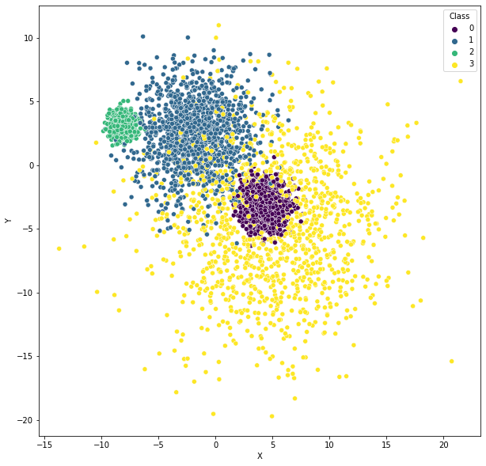
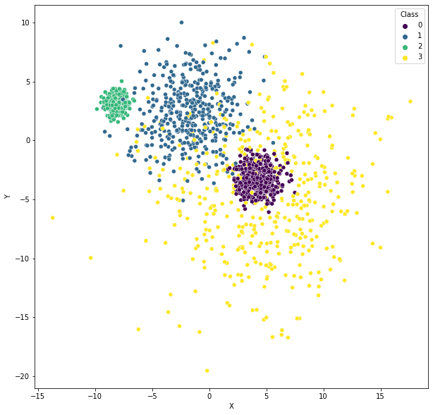
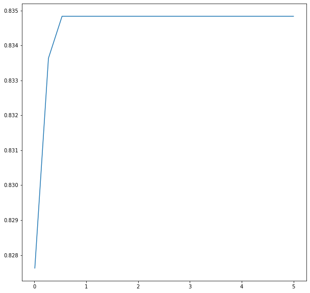
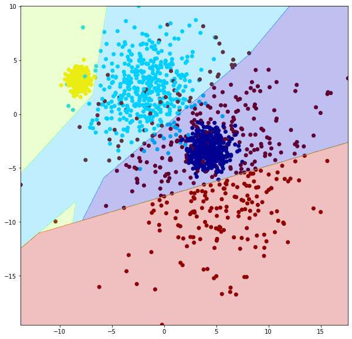
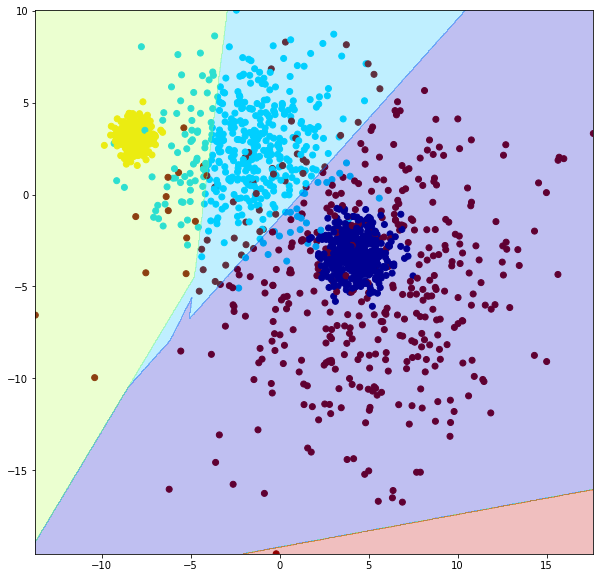
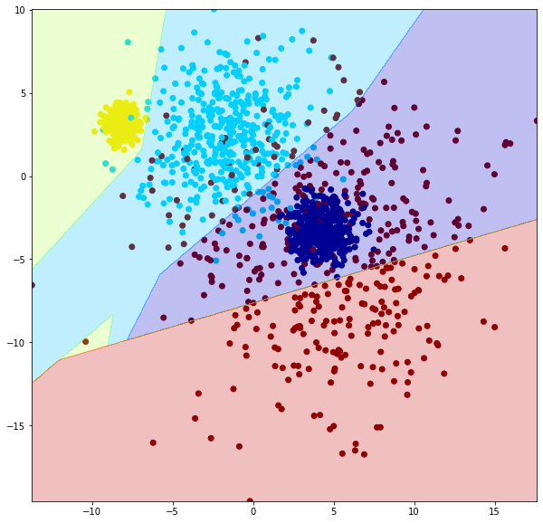
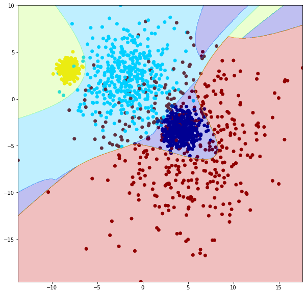
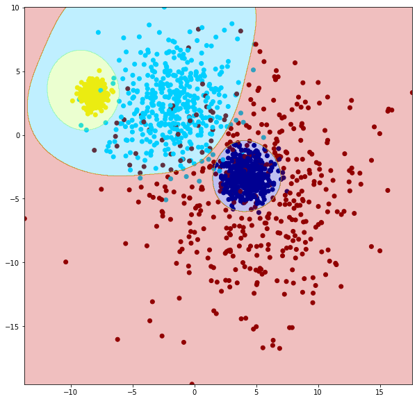
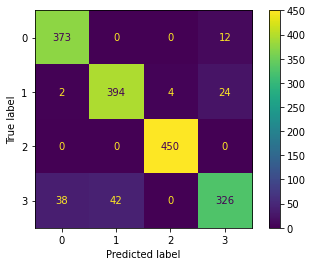

# Support Vector Machine


```python
import pandas as pd

df = pd.read_csv('data.csv')
df.head()
```


<div>
<table border="1" class="dataframe">
  <thead>
    <tr style="text-align: right;">
      <th></th>
      <th>X</th>
      <th>Y</th>
      <th>Class</th>
    </tr>
  </thead>
  <tbody>
    <tr>
      <th>0</th>
      <td>11.971797</td>
      <td>-7.504889</td>
      <td>3</td>
    </tr>
    <tr>
      <th>1</th>
      <td>-8.277160</td>
      <td>3.589366</td>
      <td>2</td>
    </tr>
    <tr>
      <th>2</th>
      <td>6.159895</td>
      <td>-3.174328</td>
      <td>3</td>
    </tr>
    <tr>
      <th>3</th>
      <td>-8.445008</td>
      <td>3.845746</td>
      <td>2</td>
    </tr>
    <tr>
      <th>4</th>
      <td>-8.012580</td>
      <td>2.902211</td>
      <td>2</td>
    </tr>
  </tbody>
</table>
</div>


```python
df.describe()
```


<div>
<table border="1" class="dataframe">
  <thead>
    <tr style="text-align: right;">
      <th></th>
      <th>X</th>
      <th>Y</th>
      <th>Class</th>
    </tr>
  </thead>
  <tbody>
    <tr>
      <th>count</th>
      <td>5000.000000</td>
      <td>5000.000000</td>
      <td>5000.000000</td>
    </tr>
    <tr>
      <th>mean</th>
      <td>-0.178067</td>
      <td>-0.579911</td>
      <td>1.500000</td>
    </tr>
    <tr>
      <th>std</th>
      <td>5.998181</td>
      <td>4.412769</td>
      <td>1.118146</td>
    </tr>
    <tr>
      <th>min</th>
      <td>-13.718486</td>
      <td>-19.716218</td>
      <td>0.000000</td>
    </tr>
    <tr>
      <th>25%</th>
      <td>-7.127540</td>
      <td>-3.457994</td>
      <td>0.750000</td>
    </tr>
    <tr>
      <th>50%</th>
      <td>0.393012</td>
      <td>-0.002115</td>
      <td>1.500000</td>
    </tr>
    <tr>
      <th>75%</th>
      <td>4.487479</td>
      <td>3.094766</td>
      <td>2.250000</td>
    </tr>
    <tr>
      <th>max</th>
      <td>21.494466</td>
      <td>10.981597</td>
      <td>3.000000</td>
    </tr>
  </tbody>
</table>
</div>


```python
import seaborn as sns
import matplotlib.pyplot as plt

plt.figure(figsize=(10,10))
sns.scatterplot(data=df, x='X', y='Y', hue='Class', palette='viridis')
```


    

    


```python
import numpy as np

train, test, val = np.split(df.sample(frac=1, random_state=42), [int(.333*len(df)), int(.666*len(df))])
len(train), len(test), len(val)
```


    (1665, 1665, 1670)


```python
plt.figure(figsize=(10,10))
sns.scatterplot(data=train, x='X', y='Y', hue='Class', palette='viridis')
```


    

    


```python
xTrain = train[['X', 'Y']].values
yTrain = train['Class'].values
xTest = test[['X', 'Y']].values
yTest = test['Class'].values
xVal = val[['X', 'Y']].values
yVal = val['Class'].values
```


```python
from sklearn.svm import SVC
from sklearn.metrics import accuracy_score

accuracies = []
Cs = []

for C in np.linspace(0.01, 5, 20):
    model = SVC(C=C, kernel='linear')
    model.fit(xTrain, yTrain)
    
    test_pred = model.predict(xTest)
    test_acc = accuracy_score(yTest, test_pred)
    
    Cs.append(C)
    accuracies.append(test_acc)
    
plt.figure(figsize=(10,10))
ax = sns.lineplot(x=Cs, y=accuracies)
```


    

    


```python
model2 = SVC(C=Cs[np.argmax(accuracies)], kernel='linear')
model2.fit(xTrain, yTrain)
```


    SVC(C=0.5352631578947369, kernel='linear')


```python
def plot_model(model, train):
    plt.figure(figsize=(10,10))
    
    fig, ax = plt.subplots(figsize=(10, 10))
    
    ax.scatter(train['X'], train['Y'], c=yTrain, cmap='jet')
    
    X, Y = np.meshgrid(np.linspace(train['X'].min(), train['X'].max(), 1000),
                      np.linspace(train['Y'].min(), train['Y'].max(), 1000))
    
    Z = model.predict(np.c_[X.ravel(), Y.ravel()])
    Z = Z.reshape(X.shape)
    
    ax.contourf(X, Y, Z, cmap='jet', alpha=0.25)
    
plot_model(model2, train)
```


    

    


```python
model00 = SVC(C=0.0001, kernel='linear')
model00.fit(xTrain, yTrain)

plot_model(model00, train)
```


    

    


```python
model01 = SVC(C=2, kernel='linear')
model01.fit(xTrain, yTrain)

plot_model(model01, train)
```


    

    


```python
accuracies=[]
params=[]

for C in np.linspace(0.01, 5, 20):
    for degree in range(2, 10):
        model = SVC(C=C, degree=degree, kernel='poly')
        model.fit(xTrain, yTrain)
    
        test_pred = model.predict(xTest)
        test_acc = accuracy_score(yTest, test_pred)
    
        params.append({'C':C, 'degree':degree})
        accuracies.append(test_acc)
        
model3 = SVC(C=params[np.argmax(accuracies)]['C'], degree=params[np.argmax(accuracies)]['degree'], kernel='poly')
model3.fit(xTrain, yTrain)
```


    SVC(C=3.6868421052631577, kernel='poly')


```python
plot_model(model3, train)
```


    

    


```python
accuracies=[]
params=[]

for c in np.linspace(0.01, 5, 20):
    for g in np.linspace(0.001, 2, 40):
        model = SVC(C=c, gamma=g, kernel='rbf') #Radial (radius) basis function
        model.fit(xTrain, yTrain)
    
        test_pred = model.predict(xTest)
        test_acc = accuracy_score(yTest, test_pred)
    
        params.append({'c':c, 'g':g})
        accuracies.append(test_acc)
        
model4 = SVC(C=params[np.argmax(accuracies)]['c'], gamma=params[np.argmax(accuracies)]['g'], kernel='rbf')
model4.fit(xTrain, yTrain)
```


    SVC(C=0.7978947368421053, gamma=0.05225641025641026)


```python
plot_model(model4, train)
```


    

    


```python
model2_pred = model2.predict(xVal)
model2_acc = accuracy_score(yVal, model2_pred)

model3_pred = model3.predict(xVal)
model3_acc = accuracy_score(yVal, model3_pred)

model4_pred = model4.predict(xVal)
model4_acc = accuracy_score(yVal, model4_pred)

print(model2_acc)
print(model3_acc)
print(model4_acc)
```

    0.8167664670658683
    0.8880239520958084
    0.9149700598802395


### Particle swarm optimization


```python
import optunity

print(optunity.__version__)
```

    1.0.0


```python
import optunity.cross_validation
import optunity.metrics

import time
start = time.time()

@optunity.cross_validated(x=xTrain, y=yTrain, num_folds=10, num_iter=1,
                         strata=optunity.cross_validation.strata_by_labels(yTrain))
def PSO(x_train, y_train, x_test, y_test, c, g):
    model = SVC(C=c, gamma=g, kernel='rbf') #Radial (radius) basis function
    model.fit(x_train, y_train)
    predictions = model.predict(x_test)
    return optunity.metrics.accuracy(y_test, predictions)

solver = optunity.solvers.ParticleSwarm(num_particles=100, num_generations=1, c=[0.01, 5], g=[0.001, 2])
hpars, info = optunity.optimize(solver, PSO)

print(time.time()-start)
```

    145.91070103645325


```python
Model = SVC(C=hpars['c'], gamma=hpars['g'], kernel='rbf', probability=True)
Model.fit(xTrain, yTrain)
predictions=Model.predict(xTest)
accuracy_score(yTest, predictions)
```


    0.9267267267267267


```python
from sklearn import metrics
from sklearn import model_selection

probabilities = Model.predict_proba(xTest)

print("Accuracy:",metrics.balanced_accuracy_score(yTest, predictions))
print("F1:", metrics.f1_score(yTest, predictions, average='weighted'))
print("Loss:", metrics.log_loss(yTest, probabilities))
print("Cross validation:", model_selection.cross_val_score(Model, df[['X', 'Y']], df['Class']))

print(metrics.classification_report(yTest, predictions))

metrics.plot_confusion_matrix(Model, xTest, yTest)
```

    Accuracy: 0.9252580292186667
    F1: 0.9255859094138171
    Loss: 0.23429435527970555
    Cross validation: [0.918 0.913 0.929 0.918 0.928]
                  precision    recall  f1-score   support
    
               0       0.90      0.97      0.93       385
               1       0.90      0.93      0.92       424
               2       0.99      1.00      1.00       450
               3       0.90      0.80      0.85       406
    
        accuracy                           0.93      1665
       macro avg       0.92      0.93      0.92      1665
    weighted avg       0.93      0.93      0.93      1665
    


    <sklearn.metrics._plot.confusion_matrix.ConfusionMatrixDisplay at 0x7fa307580b90>


    

